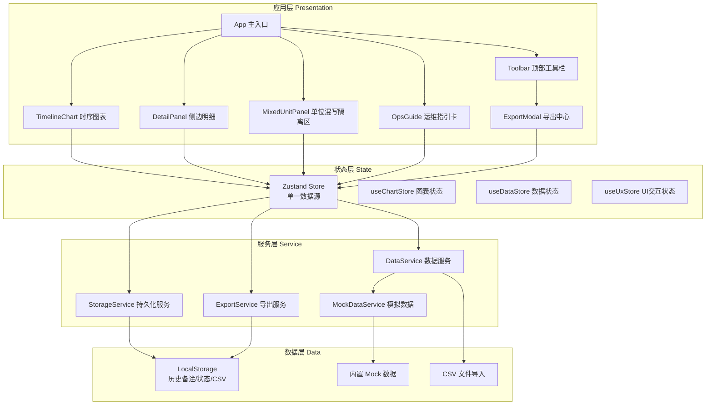
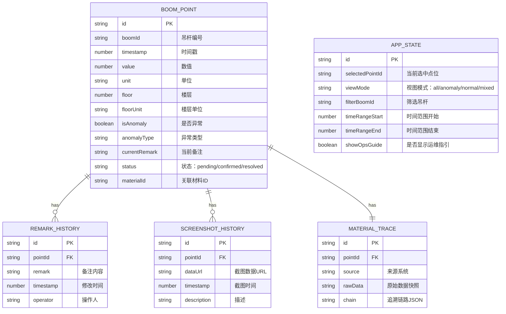

# 剧院吊杆阵列时序回放 - 技术架构文档

## 1. 架构设计



## 2. 技术描述

- **前端框架**：React 18 + TypeScript 5
- **构建工具**：Vite 5
- **样式方案**：TailwindCSS 3 + CSS 变量主题系统
- **状态管理**：Zustand（轻量级，单一数据源，支持持久化中间件）
- **图表库**：ECharts 5（时序折线图、异常点标注、缩放拖拽）
- **数据持久化**：LocalStorage + Zustand Persist 中间件
- **导出工具**：html2canvas（截图导出）、papaparse（CSV 解析/生成）
- **图标库**：Lucide React
- **日期处理**：date-fns
- **代码规范**：ESLint + Prettier

### 2.1 技术选型理由

| 技术 | 选型理由 |
|------|----------|
| React 18 | 组件化开发，生态成熟，并发特性提升大数据量渲染性能 |
| TypeScript | 类型安全，减少数据模型不一致导致的 bug |
| Zustand | 轻量、简洁、支持持久化中间件，完美匹配"单一数据源"需求 |
| ECharts | 功能强大的时序图表，支持大数据量、缩放、自定义标记点 |
| LocalStorage | 无需后端，数据持久化，刷新/重启不丢失状态 |
| TailwindCSS | 快速构建专业级 UI，响应式设计，暗黑主题 |

## 3. 目录结构

```
src/
├── components/          # 组件层
│   ├── layout/         # 布局组件
│   │   ├── AppLayout.tsx
│   │   └── Toolbar.tsx
│   ├── chart/          # 图表组件
│   │   ├── TimelineChart.tsx
│   │   └── AnomalyMarkPoint.tsx
│   ├── detail/         # 侧边明细
│   │   ├── DetailPanel.tsx
│   │   ├── PointInfo.tsx
│   │   ├── RemarkEditor.tsx
│   │   ├── HistoryTimeline.tsx
│   │   └── MaterialTrace.tsx
│   ├── mixed-unit/     # 单位混写隔离
│   │   └── MixedUnitPanel.tsx
│   ├── export/         # 导出中心
│   │   └── ExportModal.tsx
│   └── ops-guide/      # 运维指引
│       └── OpsGuideCard.tsx
├── store/              # 状态层
│   ├── useDataStore.ts     # 数据状态（点位、备注、历史）
│   ├── useChartStore.ts    # 图表状态（选中点、视图、筛选）
│   └── useUxStore.ts       # UX状态（面板开关、指引显示）
├── services/           # 服务层
│   ├── dataService.ts      # 数据处理服务
│   ├── storageService.ts   # 持久化服务
│   ├── exportService.ts    # 导出服务
│   └── mockData.ts         # 模拟数据生成
├── types/              # 类型定义
│   └── index.ts
├── utils/              # 工具函数
│   ├── unit.ts             # 单位检测/转换
│   ├── csv.ts              # CSV 处理
│   └── date.ts             # 日期处理
├── hooks/              # 自定义 Hooks
│   ├── useAnomaly.ts       # 异常检测
│   └── useKeyboard.ts      # 快捷键
├── styles/             # 全局样式
│   └── index.css
├── App.tsx
└── main.tsx
```

## 4. 数据模型

### 4.1 数据模型定义



### 4.2 TypeScript 类型定义

```typescript
// 点位数据
export interface BoomPoint {
  id: string;
  boomId: string;
  timestamp: number;
  value: number;
  unit: string;
  floor: number;
  floorUnit: string;
  isAnomaly: boolean;
  anomalyType?: 'value_out_of_range' | 'unit_mismatch' | 'floor_mismatch' | 'other';
  currentRemark: string;
  status: 'pending' | 'confirmed' | 'resolved';
  materialId: string;
}

// 备注历史
export interface RemarkHistory {
  id: string;
  pointId: string;
  remark: string;
  timestamp: number;
  operator: string;
}

// 截图历史
export interface ScreenshotHistory {
  id: string;
  pointId: string;
  dataUrl: string;
  timestamp: number;
  description: string;
}

// 材料追溯链
export interface MaterialTrace {
  id: string;
  pointId: string;
  source: string;
  rawData: string;
  chain: TraceNode[];
}

export interface TraceNode {
  id: string;
  name: string;
  type: 'system' | 'model' | 'data' | 'point';
  timestamp: number;
}

// 应用状态
export interface AppState {
  selectedPointId: string | null;
  viewMode: 'all' | 'anomaly' | 'normal' | 'mixed';
  filterBoomId: string | null;
  timeRangeStart: number | null;
  timeRangeEnd: number | null;
  showOpsGuide: boolean;
}

// 单位混写检测结果
export interface MixedUnitRecord {
  pointId: string;
  boomId: string;
  floorUnit: string;
  detectedUnit: string;
  confidence: number;
  suggestion: string;
}
```

## 5. 核心模块设计

### 5.1 单一数据源（Zustand Store）

所有 UI 组件共享同一数据源，确保图表标注、侧边明细、导出报告三端一致。

```
useDataStore
  ├── points: BoomPoint[]          # 点位数据
  ├── remarkHistory: RemarkHistory[]  # 备注历史
  ├── screenshotHistory: ScreenshotHistory[] # 截图历史
  ├── materialTraces: MaterialTrace[]  # 材料追溯数据
  └── actions:
      ├── updateRemark(pointId, remark)  # 更新备注（自动存历史）
      ├── updateStatus(pointId, status)  # 更新状态
      ├── addScreenshot(pointId, dataUrl) # 添加截图
      └── resolveMixedUnit(pointId)      # 解决单位混写

useChartStore
  ├── selectedPointId: string | null
  ├── viewMode: ViewMode
  ├── filters: Filters
  └── actions:
      ├── selectPoint(pointId)
      ├── setViewMode(mode)
      └── setFilters(filters)
```

### 5.2 单位混写检测

```typescript
// 检测逻辑：对比同吊杆下所有点位的楼层单位
// - 主流单位作为基准
// - 少数不一致的标记为混写
// - 支持 "米"/"m"/"层"/"楼" 等多种写法识别
```

### 5.3 LocalStorage 持久化

- **存储键名**：`theater-boom-timeline-state`
- **存储内容**：所有数据状态 + UI 状态 + 历史记录
- **持久化时机**：状态变更时自动写入（debounce 100ms）
- **数据版本**：带 version 字段，支持迁移

### 5.4 导出服务

| 导出类型 | 实现方式 | 数据来源 |
|----------|----------|----------|
| CSV 明细 | papaparse 生成 | useDataStore 筛选后数据 |
| 截图导出 | html2canvas 截取图表区域 | DOM 快照 + 当前数据标注 |
| 报告生成 | 基于模板生成文本/JSON | 同一数据源汇总 |

## 6. 性能优化

- **图表渲染**：ECharts 大数据量优化（sampling、dataZoom）
- **状态更新**：Zustand 选择器（selector）避免不必要重渲染
- **历史列表**：虚拟滚动（可选，数据量特别大时）
- **持久化**：debounce + 分片写入，避免阻塞主线程
- **首屏加载**：骨架屏 + 渐进式数据加载
