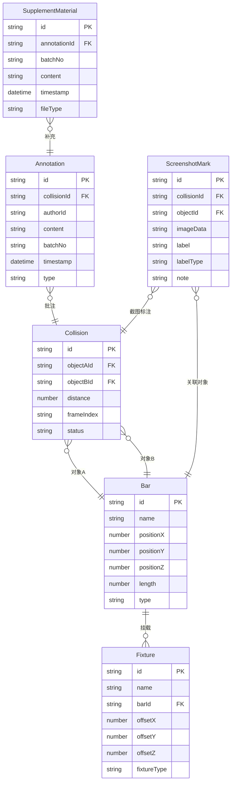

## 1. 架构设计

```mermaid
flowchart TB
    subgraph "前端层"
        "React 18 SPA"
        "Three.js 3D 引擎"
        "状态管理 Zustand"
    end
    subgraph "数据层"
        "Mock 数据服务"
        "碰撞检测引擎"
        "批注版本链存储"
    end
    "React 18 SPA" --> "Three.js 3D 引擎"
    "React 18 SPA" --> "状态管理 Zustand"
    "状态管理 Zustand" --> "Mock 数据服务"
    "状态管理 Zustand" --> "碰撞检测引擎"
    "状态管理 Zustand" --> "批注版本链存储"
    "Three.js 3D 引擎" --> "碰撞检测引擎"
```

## 2. 技术说明

- **前端**：React@18 + TypeScript + TailwindCSS@3 + Vite
- **3D 渲染**：Three.js + @react-three/fiber + @react-three/drei + @react-three/postprocessing
- **状态管理**：Zustand（轻量、支持订阅选择器）
- **初始化工具**：Vite
- **后端**：无（纯前端，Mock 数据）
- **数据库**：无（localStorage 持久化批注数据）

## 3. 路由定义

| 路由 | 用途 |
|------|------|
| / | 3D 场景预审主页面（含时间轴、筛选、属性面板） |
| /annotations | 批注与材料管理页 |
| /export | 导出与报告页 |

## 4. 数据模型

### 4.1 数据模型定义



### 4.2 核心数据结构

**吊杆运动帧数据**：
```typescript
interface BarFrame {
  barId: string
  frameIndex: number
  positionY: number
}
```

**碰撞状态枚举**：
```typescript
type CollisionStatus = 'collision' | 'safe' | 'pending_review'
type LabelType = 'resolved' | 'pending_material' | 'manual_override'
type AnnotationType = 'review_note' | 'supplement' | 'action_hint'
```

**批注版本链**：
```typescript
interface AnnotationChain {
  collisionId: string
  annotations: Annotation[]
  supplements: SupplementMaterial[]
}
```

## 5. 碰撞检测引擎

- 基于 AABB（轴对齐包围盒）进行吊杆间碰撞检测
- 每帧计算所有吊杆对的最小距离
- 阈值可配置（默认 0.3m）
- 检测结果按帧索引存储，支持时间轴回溯

## 6. 批注版本链机制

- 每条批注携带 `batchNo`（批次号）和 `timestamp`
- 补充材料通过 `annotationId` 关联到原批注，使用独立的 `SupplementMaterial` 实体
- 读取批注时，按 `timestamp` 排序展示完整链路
- 补充材料 **追加** 而非覆盖，历史批注始终可见
- 重叠对象检测时自动生成 `action_hint` 类型批注，内容为可操作的行动提示

## 7. 截图说明联动机制

- 点选对象 → 自动关联该对象的所有碰撞记录、批注链、截图标注
- 切换时间轴 → 3D 场景更新对象位置 → 属性面板同步坐标 → 碰撞状态刷新
- 筛选变更 → 碰撞列表过滤 → 3D 场景仅高亮筛选结果 → 截图标注联动过滤
- 导出时：空间位置（从帧数据取）+ 备注（从批注链取）+ 截图（从 ScreenshotMark 取）三者基于同一 `collisionId` 关联，确保对齐
