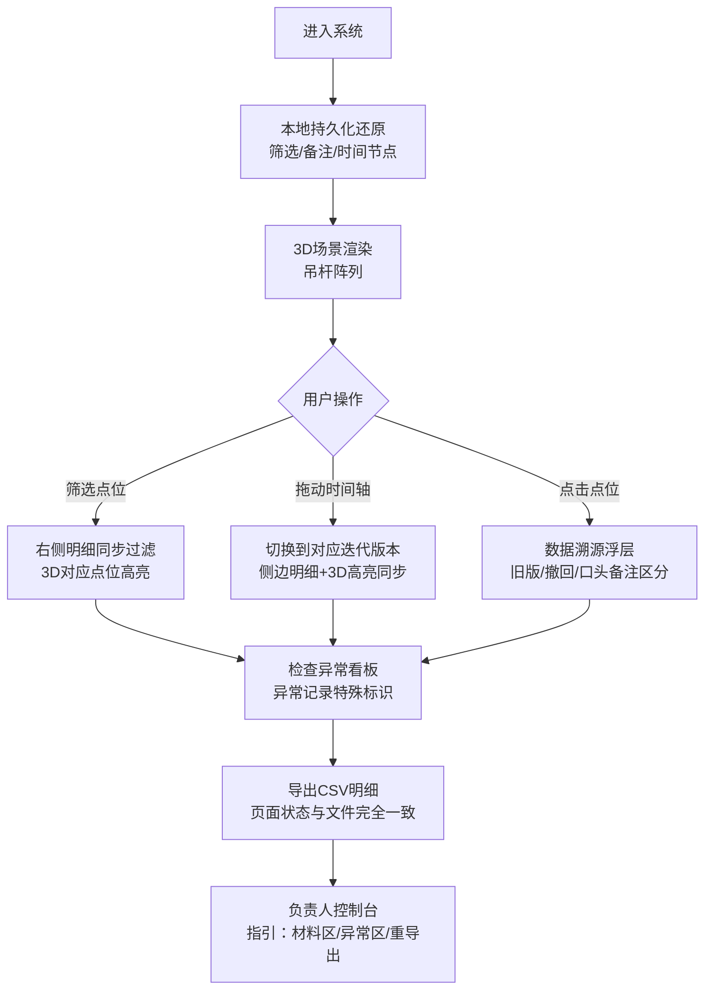

## 1. 产品概述

面向剧院舞台工程领域的吊杆阵列方案数字化评审工具，解决方案比选过程中依赖人工记忆、二维表格缺乏空间感、多源数据混乱难追溯的痛点。
- 核心用户：方案经理（小赵）、现场施工人员、项目负责人
- 核心价值：将吊杆点位坐标、方案备注、审批记录等多维度数据与3D空间可视化绑定，实现数据可追溯、状态可还原、结论可验证

## 2. 核心功能

### 2.1 用户角色

| 角色 | 核心权限 |
|------|----------|
| 方案经理 | 创建方案、编辑点位、添加备注、导出明细、管理版本 |
| 现场人员 | 查看3D空间、筛选点位、查看备注、确认坐标 |
| 项目负责人 | 审批方案、查看异常记录、重新导出数据、整体操作指引 |

### 2.2 功能模块

1. **3D空间可视化主界面**：吊杆阵列三维展示、点位高亮、视角控制、2D/3D联动
2. **方案状态管理**：筛选条件持久化、人工备注关联、刷新后状态还原
3. **数据溯源模块**：旧版坐标标记、撤回记录标识、口头备注区分、结论影响链可视化
4. **时间轴回放系统**：方案迭代时间轴、切换联动侧边明细与3D高亮同步
5. **CSV导出管理**：页面状态与导出文件一致性、异常记录特殊标记
6. **负责人控制台**：材料归档区、异常看板、一键重新导出入口

### 2.3 页面详情

| 页面名称 | 模块名称 | 功能描述 |
|-----------|-------------|---------------------|
| 主工作台 | 顶部工具栏 | 方案切换、筛选器组（吊杆编号/区域/状态/版本）、刷新还原按钮 |
| 主工作台 | 左侧3D画布 | 剧院舞台空间、吊杆阵列渲染、点位交互高亮、视角旋转缩放 |
| 主工作台 | 右侧明细面板 | 点位坐标表格、版本标签列、状态色标记、备注展开、数据溯源链接 |
| 主工作台 | 底部时间轴 | 方案迭代节点、拖拽切换、撤回/异常节点特殊样式 |
| 主工作台 | 数据溯源浮层 | 显示该点位关联的所有版本、备注、撤回记录及结论影响权重 |
| 异常看板 | 异常列表 | 截图条件丢失、坐标冲突、撤回记录等异常条目与处理状态 |
| 导出中心 | 导出预览 | 实时预览CSV内容与页面状态对应关系、异常标记样式 |
| 负责人控制台 | 操作指引 | 材料存放位置、异常查看入口、重新导出步骤高亮指引 |

## 3. 核心流程

用户打开页面 → 系统从本地持久化还原筛选条件/备注/上次查看时间节点 → 3D场景渲染对应状态的吊杆阵列 → 用户筛选/切换时间轴 → 侧边明细与3D高亮同步更新 → 点击点位查看数据溯源（区分旧版/撤回/口头备注对结论的影响） → 检查异常看板 → 导出CSV（自动带上异常标记与当前状态一致） → 项目负责人可通过控制台快速定位所有关键操作区。

## 4. 用户界面设计

### 4.1 设计风格
- 主色调：深空蓝 `#0A1628`（专业工程感）+ 黄铜金 `#C9A962`（剧院文化质感）
- 辅色：安全绿 `#2D8A5E`、警告橙 `#D97706`、异常红 `#DC2626`、撤回灰 `#6B7280`
- 按钮风格：微立体圆角按钮，hover有发光效果，危险按钮带虚线边框
- 字体：标题使用 Playfair Display（剧院古典感），正文使用 JetBrains Mono（坐标等宽对齐）
- 布局风格：三栏式（左3D主区60% + 右明细35% + 底时间轴5%），深色主题毛玻璃面板
- 图标风格：线性工程图标，异常状态使用实心警示图标

### 4.2 页面设计概述

| 页面名称 | 模块名称 | UI元素 |
|-----------|-------------|-------------|
| 主工作台 | 3D画布 | 深空背景+网格地面、吊杆金属质感渲染、选中发光描边、视角控制球形widget |
| 主工作台 | 明细面板 | 斑马纹表格、状态色块标签、可展开备注卡片、溯源按钮锚点 |
| 主工作台 | 时间轴 | 节点圆形标记、撤回节点带删除线、异常节点带红点、拖拽进度条 |
| 溯源浮层 | 影响链 | 时间线卡片、版本色块区分、影响贡献度进度条、结论高亮框 |
| 异常看板 | 异常列表 | 卡片式布局、异常类型徽章、处理状态切换、不可勾选为"正常通过" |
| 导出中心 | 预览区 | 表格镜像、颜色标记与页面一致、异常记录带删除线+备注 |
| 控制台 | 指引区 | 三步流程卡片、箭头动画指引、热区边框脉冲高亮 |

### 4.3 响应性
- 桌面端优先（1440px+）：三栏完整布局
- 平板端（1024-1439px）：上下布局，3D画布上半屏，明细+时间轴下半屏
- 移动端（<1024px）：Tab切换3D视图/明细视图/时间轴视图，触控优化手势缩放旋转

### 4.4 3D场景引导
- **环境**：深色剧院舞台空间，带轻微雾效，地面网格辅助线，墙面轮廓线框
- **光照**：三光源设置（主光模拟舞台顶光+补光减少阴影+轮廓光勾勒吊杆边缘）
- **相机**：默认45°俯视视角，支持轨道控制旋转，点击点位自动拉近聚焦
- **构图**：舞台居中，吊杆阵列按真实比例分布，边缘留空显示坐标轴参考
- **交互动画**：悬停微缩放+描边发光，选中后材质变亮+浮动信息卡，时间轴切换时有淡入淡出过渡
- **后期处理**：Bloom泛光效果（选中状态）、轻微色差增强立体感、暗角聚焦中心
- **性能预算**：单场景吊杆≤200根时稳定60fps，超过时启用LOD简化
