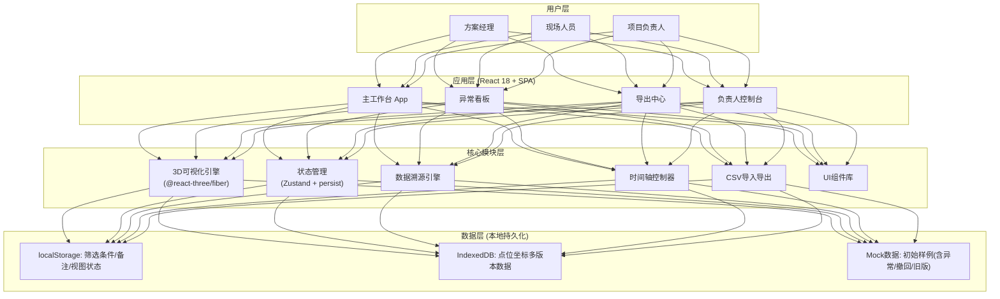
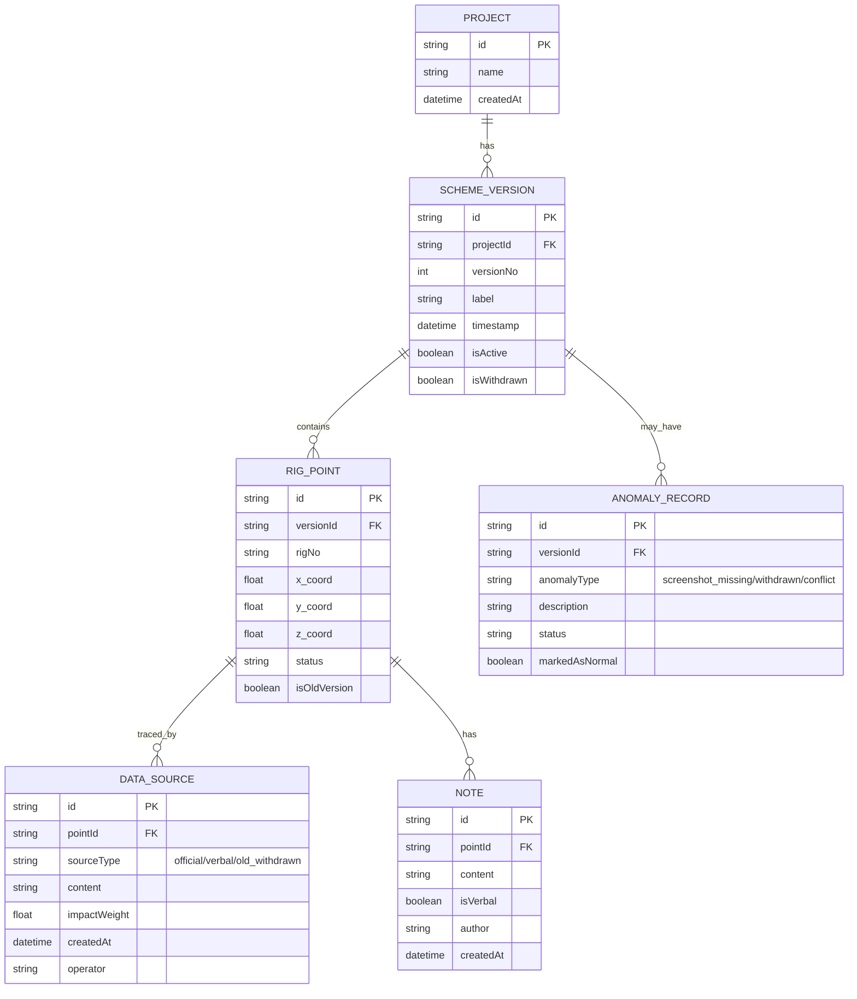

## 1. 架构设计



## 2. 技术说明

- **前端框架**: React@18 + TypeScript@5
- **构建工具**: Vite@5
- **样式方案**: TailwindCSS@3 + CSS Variables 主题系统
- **3D引擎**: three@0.160 + @react-three/fiber@8 + @react-three/drei@9 + @react-three/postprocessing@2
- **状态管理**: Zustand@4 + persist 中间件（筛选/备注/视图状态持久化）
- **路由**: React Router@6（单页面多视图切换）
- **数据存储**: localStorage（小数据）+ IndexedDB（大体积点位多版本）
- **图标**: Lucide React（线性工程风格）
- **动画**: Framer Motion（UI过渡）+ @react-three/drei 内置动画（3D过渡）
- **日期处理**: dayjs（时间轴节点格式化）
- **CSV处理**: Papa Parse@5（导入解析 + 导出格式化）
- **后端**: 无后端，纯前端 Mock 数据演示

## 3. 路由定义

| 路由 | 页面组件 | 用途 |
|-------|---------|------|
| `/` | WorkbenchPage | 主工作台：3D可视化 + 明细面板 + 时间轴 |
| `/anomalies` | AnomaliesPage | 异常看板：撤回/截图丢失/坐标冲突记录 |
| `/export` | ExportPage | 导出中心：CSV预览 + 导出操作 |
| `/console` | ConsolePage | 负责人控制台：操作指引 + 快捷入口 |

## 4. 数据模型

### 4.1 数据模型定义



### 4.2 Zustand Store 核心类型定义

```typescript
interface AppState {
  // 筛选条件 (持久化)
  filters: {
    rigNos: string[];
    zones: string[];
    statuses: string[];
    versionScope: 'current' | 'includeOld' | 'onlyWithdrawn';
  };
  
  // 视图状态 (持久化)
  viewState: {
    activeVersionId: string | null;
    selectedPointIds: string[];
    cameraPosition: [number, number, number];
    expandedNoteIds: string[];
  };
  
  // 人工备注 (持久化)
  notesByPointId: Record<string, Note[]>;
  
  // 操作
  setFilters: (f: Partial<AppState['filters']>) => void;
  setViewState: (v: Partial<AppState['viewState']>) => void;
  addNote: (pointId: string, note: Omit<Note, 'id' | 'createdAt'>) => void;
  togglePointSelect: (pointId: string) => void;
  resetAll: () => void;
}
```

## 5. 核心模块实现策略

### 5.1 3D可视化模块
- 使用 `@react-three/fiber` 声明式创建场景
- 吊杆用 `CylinderGeometry` + 金属 `MeshStandardMaterial`
- 选中效果通过 `useFrame` 实现描边发光 + 材质亮度动画
- 使用 `OrbitControls` 实现视角控制，`TransformControls` 可选编辑坐标
- 后期处理：`EffectComposer` + `Bloom` + `Vignette`

### 5.2 状态持久化模块
- Zustand `persist` middleware 配置 `localStorage` 存储 filters/viewState/notes
- IndexedDB（通过 `idb` 库）存储大体积点位坐标多版本数据
- 页面加载时 `useEffect` 统一恢复状态 → 触发 3D 场景渲染 → 高亮还原

### 5.3 数据溯源模块
- 每个 RIG_POINT 关联多个 DATA_SOURCE，按 `impactWeight` 排序
- 色块映射：`official`→安全绿 / `verbal`→警告橙 / `old_withdrawn`→撤回灰
- 结论影响链：进度条可视化 `impactWeight`，总和 = 100%

### 5.4 时间轴同步机制
- `activeVersionId` 作为核心状态，变更时：
  1. 明细面板重新过滤该版本的点位
  2. 3D场景替换对应版本的几何位置 + 淡入淡出过渡
  3. 已选中的点位若在新版本存在则自动保持选中高亮

### 5.5 CSV导出一致性
- 导出时直接读取当前 Zustand store 中的 filters + notes + activeVersionId
- 异常记录（`anomalyType !== null`）在 CSV 中：
  - 状态列前缀加 `[异常-${type}]`
  - `markedAsNormal` 强制为 `false` 且不可变更
  - 撤回记录附加 `(已撤回)` 后缀，行首加删除线标记说明
- 导出文件名携带版本号 + 时间戳，确保可追溯

### 5.6 负责人操作指引
- 首次进入 `/console` 或点击"开始指引"时，启用 Framer Motion 热区高亮
- 三步骤脉冲动画：①材料归档区 → ②异常看板入口 → ③重新导出按钮
- 每步附带说明气泡 + "下一步/跳过"控制
