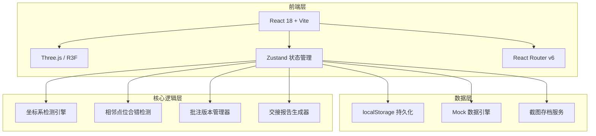
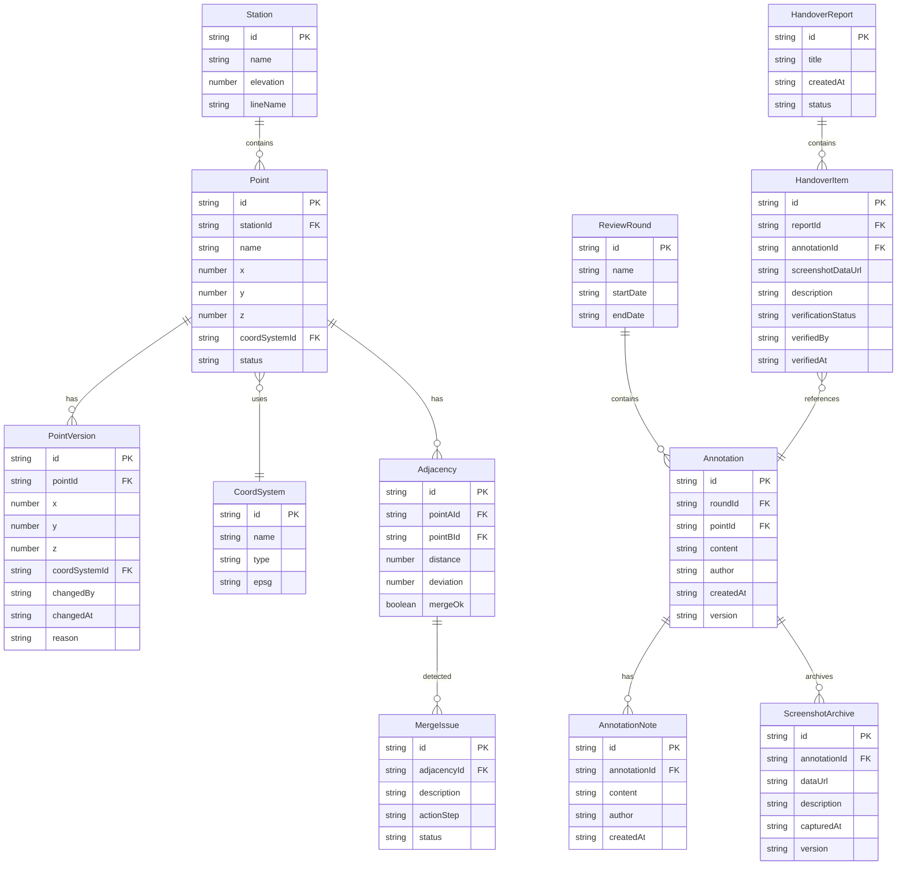

## 1. 架构设计



## 2. 技术说明

- **前端框架**：React 18 + TypeScript + Vite
- **样式方案**：Tailwind CSS 3
- **3D 渲染**：Three.js + @react-three/fiber + @react-three/drei + @react-three/postprocessing
- **状态管理**：Zustand（含 persist 中间件实现 localStorage 持久化）
- **路由**：React Router v6
- **图标**：Lucide React
- **后端**：无后端，全部前端计算 + localStorage 持久化
- **数据**：Mock 数据引擎生成索道站点、点位、坐标系数据

## 3. 路由定义

| 路由 | 用途 |
|------|------|
| `/` | 复核工作台主页面 |
| `/annotations` | 批注与历史页面 |
| `/handover` | 交接报告页面 |

## 4. 数据模型

### 4.1 数据模型定义



### 4.2 数据定义

```sql
-- 核心数据结构（对应 Zustand store 的 TypeScript 类型）

-- 站点
CREATE TABLE station (
    id TEXT PRIMARY KEY,
    name TEXT NOT NULL,
    elevation REAL NOT NULL,
    line_name TEXT NOT NULL
);

-- 点位
CREATE TABLE point (
    id TEXT PRIMARY KEY,
    station_id TEXT REFERENCES station(id),
    name TEXT NOT NULL,
    x REAL, y REAL, z REAL,
    coord_system_id TEXT REFERENCES coord_system(id),
    status TEXT DEFAULT 'normal'  -- normal | warning | error
);

-- 点位版本历史
CREATE TABLE point_version (
    id TEXT PRIMARY KEY,
    point_id TEXT REFERENCES point(id),
    x REAL, y REAL, z REAL,
    coord_system_id TEXT REFERENCES coord_system(id),
    changed_by TEXT,
    changed_at TEXT,
    reason TEXT
);

-- 坐标系
CREATE TABLE coord_system (
    id TEXT PRIMARY KEY,
    name TEXT NOT NULL,
    type TEXT NOT NULL,
    epsg TEXT
);

-- 相邻关系
CREATE TABLE adjacency (
    id TEXT PRIMARY KEY,
    point_a_id TEXT REFERENCES point(id),
    point_b_id TEXT REFERENCES point(id),
    distance REAL,
    deviation REAL,
    merge_ok BOOLEAN DEFAULT TRUE
);

-- 合错问题
CREATE TABLE merge_issue (
    id TEXT PRIMARY KEY,
    adjacency_id TEXT REFERENCES adjacency(id),
    description TEXT,
    action_step TEXT,
    status TEXT DEFAULT 'open'  -- open | processing | resolved
);

-- 复核轮次
CREATE TABLE review_round (
    id TEXT PRIMARY KEY,
    name TEXT NOT NULL,
    start_date TEXT,
    end_date TEXT
);

-- 批注
CREATE TABLE annotation (
    id TEXT PRIMARY KEY,
    round_id TEXT REFERENCES review_round(id),
    point_id TEXT REFERENCES point(id),
    content TEXT,
    author TEXT,
    created_at TEXT,
    version INTEGER DEFAULT 1
);

-- 批注备注（追加）
CREATE TABLE annotation_note (
    id TEXT PRIMARY KEY,
    annotation_id TEXT REFERENCES annotation(id),
    content TEXT,
    author TEXT,
    created_at TEXT
);

-- 截图存档
CREATE TABLE screenshot_archive (
    id TEXT PRIMARY KEY,
    annotation_id TEXT REFERENCES annotation(id),
    data_url TEXT,
    description TEXT,
    captured_at TEXT,
    version INTEGER
);

-- 交接报告
CREATE TABLE handover_report (
    id TEXT PRIMARY KEY,
    title TEXT,
    created_at TEXT,
    status TEXT DEFAULT 'draft'
);

-- 交接条目
CREATE TABLE handover_item (
    id TEXT PRIMARY KEY,
    report_id TEXT REFERENCES handover_report(id),
    annotation_id TEXT REFERENCES annotation(id),
    screenshot_data_url TEXT,
    description TEXT,
    verification_status TEXT DEFAULT 'pending',
    verified_by TEXT,
    verified_at TEXT
);
```

## 5. 关键技术决策

### 5.1 单一数据源原则

所有视图（筛选条件、统计数字、明细表、截图说明）均从 Zustand store 的同一份派生数据生成。筛选条件变更触发 store 更新，所有订阅组件自动重渲染。

### 5.2 批注版本管理

批注采用 append-only 策略：
- 修改批注内容时，旧内容存入 `PointVersion` / `ScreenshotArchive`
- 备注通过 `AnnotationNote` 追加，不修改原文
- 截图修改时，旧截图移入 `ScreenshotArchive`，新截图替换当前

### 5.3 相邻点位合错检测

检测逻辑：
1. 遍历所有 `Adjacency` 记录
2. 若 `merge_ok === false`，生成 `MergeIssue`
3. `MergeIssue.actionStep` 包含具体操作描述（如"重新测量 A3-A4 段，确认坐标系一致后再合并"）
4. 前端展示为可操作提示条

### 5.4 时间轴同步机制

时间轴切换流程：
1. 用户选择某段 → 更新 `currentRoundId`
2. store 派生当前轮次的所有点位、批注、统计
3. 3D 视图根据派生数据更新高亮
4. 侧边明细清空选中状态，等待用户选择
5. 统计面板重新计算

### 5.5 持久化策略

使用 Zustand persist 中间件：
- 存储 key：`cableway-review-store`
- 持久化内容：批注、备注、截图索引、当前轮次、筛选状态、交接报告
- 截图 dataUrl 单独存储于 `cableway-review-screenshots` key，避免主 store 过大
- 启动时校验：版本号一致性检查，不匹配时标记为"需要重新复核"

### 5.6 交接验证流程

交接报告页面：
1. 从批注列表生成交接条目
2. 每条目自动截图并生成说明文字
3. 教学老师逐条点击"已验证/待补充/驳回"
4. 验证状态持久化到 localStorage
5. 导出时汇总所有条目及验证状态
