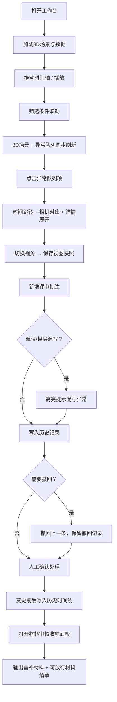

## 1. 产品概述

山地索道站时序回放系统是面向工程评审场景的 Web3D 可视化评审工具。以三维索道站模型为载体，将时间轴驱动的对象状态、异常告警、评审批注、视图快照与历史变更联动呈现，让评审助理阿乔在评审会上无需临时解释截图脱离筛选条件的困境。

- 核心目的：为山地索道站的时序数据回放提供统一的3D评审工作台，解决截图与上下文脱节、评审记录难以追溯、材料放行/补件标准模糊的问题。
- 目标用户：评审助理阿乔（日常操作与收尾）、评审负责人（异常定位与决策）、工程技术人员（材料补件参考）。
- 产品价值：一屏承载 3D 场景 + 时间轴 + 筛选 + 异常队列 + 批注 + 历史，联动逻辑闭环，评审结论可复盘可追溯。

---

## 2. 核心功能

### 2.1 用户角色

| 角色 | 登录方式 | 核心权限 |
|------|----------|----------|
| 评审助理（阿乔） | 本地账号 | 全量操作：筛选、回放、批注、撤回、保存视图、材料审核收尾 |
| 评审负责人 | 本地账号 | 异常定位、视角切换、批注确认、最终放行 |

### 2.2 功能模块

1. **时序回放工作台（主页面）**：Web3D 索道站场景、点选高亮、对象信息面板、时间轴控制器、筛选器面板、异常队列侧栏。
2. **评审批注抽屉**：新增批注、撤回上一条、批注列表（含撤回记录）、楼层/单位混写异常识别。
3. **视图与历史中心**：保存当前视图（含相机+筛选条件+时间点）、人工确认前后变更历史、评审复盘时间线。
4. **材料审核收尾面板**：按条目列出"需补材料"与"可放行材料"，标注原因与负责人，不输出技术说明。

### 2.3 页面详情

| 页面名称 | 模块名称 | 功能描述 |
|----------|----------|----------|
| 时序回放工作台 | Web3D 索道站场景 | Three.js 渲染山地索道站模型，支持轨道控制、点选对象高亮、异常对象脉冲标记 |
| 时序回放工作台 | 时间轴控制器 | 播放/暂停、进度拖拽、关键帧标记（异常点/批注点）、播放速度调节 |
| 时序回放工作台 | 筛选器面板 | 按楼层、单位、设备类型、状态（正常/异常）筛选；筛选变化联动 3D 场景与异常队列 |
| 时序回放工作台 | 异常队列侧栏 | 按严重程度排序的异常列表，点击跳转对应时间点+对象+视角；支持标记已处理 |
| 评审批注抽屉 | 批注录入 | 文本批注、关联对象、关联时间点；提交后联动历史记录 |
| 评审批注抽屉 | 撤回记录 | 最近一条批注可撤回；列表区分"有效"与"已撤回"，撤回记录不可删除 |
| 评审批注抽屉 | 单位混写识别 | 自动检测批注或材料中出现的"楼层/单位"混写异常并高亮提示 |
| 视图与历史中心 | 视图快照保存 | 一键保存当前相机参数、筛选条件、时间点、选中对象；缩略图预览 |
| 视图与历史中心 | 变更历史时间线 | 人工确认前/后状态对比、操作人、操作时间、变更字段 diff |
| 材料审核收尾面板 | 需补材料清单 | 条目化列出缺失/不合格材料，含原因、责任人、截止提示 |
| 材料审核收尾面板 | 可放行材料清单 | 条目化列出通过材料，含通过依据、确认人，供阿乔直接引用 |

---

## 3. 核心流程

评审助理阿乔的典型操作流：

1. 打开工作台 → 加载索道站 3D 场景与当日数据。
2. 拖动时间轴 → 场景对象状态随时间变化；异常点在时间轴上以红点标记。
3. 筛选楼层 + 设备类型 → 3D 场景隐藏非匹配对象，异常队列同步过滤。
4. 在异常队列点击最严重告警 → 时间轴自动跳转、相机自动对准该对象、详情面板展开。
5. 切换视角观察 → 保存当前视图快照（含筛选条件与时间点）。
6. 新增一条批注（测试含"3F 混 第3层"的单位混写）→ 系统识别并高亮提示。
7. 发现批注有误 → 撤回上一条 → 撤回记录保留在列表中。
8. 人工确认异常处理 → 变更前后状态写入历史时间线。
9. 收尾阶段打开材料审核面板 → 按清单确认"需补"与"可放行"条目。

---

## 4. 用户界面设计

### 4.1 设计风格

- **主色调**：深矿蓝 `#0B1F3A`（背景基调）+ 索道橙 `#FF6B35`（异常与重点标记）+ 冷银灰 `#9FB3C8`（文本与辅助）。
- **辅助色**：通行绿 `#2EC4B6`（可放行/正常）、补件黄 `#FFD166`（待补）、撤回灰 `#6C757D`。
- **按钮风格**：扁平+极细边框，hover 时 1px 内发光；危险操作（撤回/删除）带橙色描边脉冲。
- **字体**：标题使用 `Space Grotesk`（几何工业感），正文使用 `JetBrains Mono`（等宽清晰，方便对比编号与楼层）。
- **布局风格**：三栏式工作台，中间 3D 画布占主区域，左筛选右异常，底部时间轴横贯，顶部为工具条与视图保存入口。
- **图标风格**：lucide-react 线性图标， stroke 1.5px，关键图标叠加 1px 橙色发光。
- **整体氛围**：工业监控指挥中心风格，暗底高对比，3D 场景边缘带扫描线呼吸光，体现"时序回放"的科技感。

### 4.2 页面设计概览

| 页面名称 | 模块名称 | UI 元素 |
|----------|----------|---------|
| 时序回放工作台 | 3D 场景画布 | 全屏深矿蓝背景，相机默认俯视索道站；选中对象橙色线框；异常对象橙色脉冲球 |
| 时序回放工作台 | 顶部工具条 | 项目名、视图保存按钮、历史入口、材料审核入口、用户头像；半透明玻璃拟态 |
| 时序回放工作台 | 左侧筛选面板 | 可折叠，楼层多选、单位多选、设备类型、状态筛选；每项带计数徽标 |
| 时序回放工作台 | 右侧异常队列 | 列表卡片，严重度色条（红/黄/绿）、对象编号、时间点、处理状态；滚动容器 |
| 时序回放工作台 | 底部时间轴 | 长条形，渐变橙→蓝，关键帧红点与黄点，悬停显示 tooltip，拖拽反馈高亮 |
| 评审批注抽屉 | 表单区 | 文本域（JetBrains Mono）、关联对象下拉、提交按钮；底部附"撤回上一条"按钮 |
| 评审批注抽屉 | 列表区 | 每条批注带时间戳、操作人、状态标签（有效/已撤回）；撤回记录以斜体灰字显示 |
| 视图与历史中心 | 视图快照网格 | 缩略图卡片（相机视角截图占位），下方显示筛选标签与时间点，点击恢复 |
| 视图与历史中心 | 历史时间线 | 纵向时间线，节点区分"批注/确认/撤回/视图保存"，展开显示前后 diff |
| 材料审核收尾面板 | 双栏清单 | 左侧"需补材料"黄底条，右侧"可放行材料"绿底条；条目带责任人与依据；无技术术语 |

### 4.3 响应式

桌面优先（≥1440px）；≥1024px 三栏压缩；<1024px 侧栏改为底部抽屉，3D 画布保留主视图。触控设备支持双指缩放与旋转。

### 4.4 3D 场景指引

- **环境**：夜间山地 HDRI，低雾效，远处山脊轮廓光；索道钢缆带自发光描边。
- **光照**：主光模拟站台泛光（暖橙），补光冷蓝模拟夜空；异常对象叠加定向聚光。
- **相机**：初始 45° 俯视，允许轨道控制；异常跳转时带 0.6s 缓动过渡。
- **构成**：索道站站房居中、支架分布、吊厢沿钢缆按时间轴位置移动；地面等高线辅助判断地势。
- **交互**：点选对象→线框+脉冲；悬停→tooltip 显示编号与状态。
- **后处理**：Bloom 发光（橙色异常点）、轻微 Vignette、扫描线 shader（可开关）。
- **资产**：Three.js 程序化建模（Box/Cylinder 组合），无外部模型依赖，保证加载性能。
