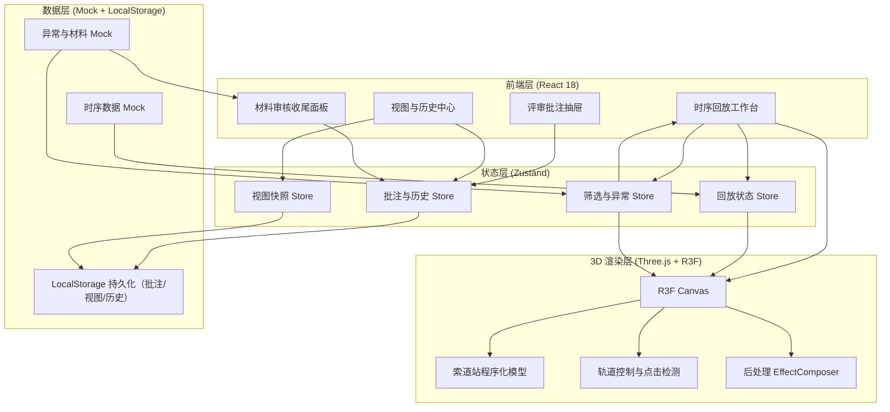
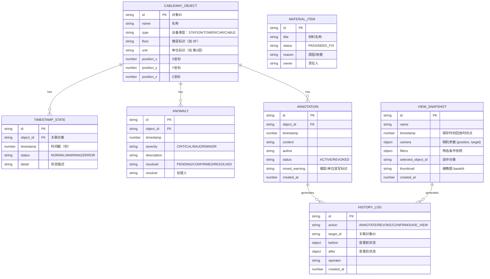

## 1. 架构设计



## 2. 技术选型

- **前端框架**：React 18 + TypeScript
- **初始化工具**：Vite（vite-init react-ts 模板）
- **样式方案**：Tailwind CSS 3 + CSS Variables（工业暗色调）
- **状态管理**：Zustand（按领域拆分 4 个 Store）
- **3D 渲染**：three + @react-three/fiber + @react-three/drei + @react-three/postprocessing
- **路由**：react-router-dom（单页路由：工作台、视图历史、材料审核）
- **图标**：lucide-react
- **后端**：无后端，使用 TypeScript Mock 数据 + LocalStorage 持久化
- **数据库**：无数据库，LocalStorage 存储批注、视图快照、历史记录

## 3. 路由定义

| 路由 | 用途 |
|------|------|
| `/` | 时序回放工作台（主页，默认路由） |
| `/history` | 视图与历史中心（视图快照网格 + 变更历史时间线） |
| `/review` | 材料审核收尾面板（需补材料 / 可放行材料双栏清单） |

## 4. 数据模型

### 4.1 数据模型 ER 图



### 4.2 核心类型定义

```typescript
// 索道站对象
export type ObjectType = 'STATION' | 'TOWER' | 'CAR' | 'CABLE';
export type ObjectStatus = 'NORMAL' | 'WARNING' | 'ERROR';

export interface CablewayObject {
  id: string;
  name: string;
  type: ObjectType;
  floor: string;
  unit: string;
  position: [number, number, number];
}

// 时序状态帧
export interface TimestampState {
  id: string;
  objectId: string;
  timestamp: number;
  status: ObjectStatus;
  detail: string;
}

// 异常
export type Severity = 'CRITICAL' | 'MAJOR' | 'MINOR';
export type ResolveStatus = 'PENDING' | 'CONFIRMED' | 'RESOLVED';

export interface Anomaly {
  id: string;
  objectId: string;
  timestamp: number;
  severity: Severity;
  description: string;
  resolved: ResolveStatus;
  resolver?: string;
}

// 批注
export type AnnotationStatus = 'ACTIVE' | 'REVOKED';

export interface Annotation {
  id: string;
  objectId: string;
  timestamp: number;
  content: string;
  author: string;
  status: AnnotationStatus;
  mixedWarning: boolean;
  createdAt: number;
}

// 视图快照
export interface CameraState {
  position: [number, number, number];
  target: [number, number, number];
}

export interface FilterState {
  floors: string[];
  units: string[];
  types: ObjectType[];
  statuses: ObjectStatus[];
}

export interface ViewSnapshot {
  id: string;
  name: string;
  timestamp: number;
  camera: CameraState;
  filters: FilterState;
  selectedObjectId?: string;
  thumbnail?: string;
  createdAt: number;
}

// 历史日志
export type HistoryAction = 'ANNOTATE' | 'REVOKE' | 'CONFIRM' | 'SAVE_VIEW';

export interface HistoryLog {
  id: string;
  action: HistoryAction;
  targetId: string;
  before?: Record<string, unknown>;
  after?: Record<string, unknown>;
  operator: string;
  createdAt: number;
}

// 材料条目
export type MaterialStatus = 'PASS' | 'NEED_FIX';

export interface MaterialItem {
  id: string;
  title: string;
  status: MaterialStatus;
  reason: string;
  owner: string;
}
```

## 5. Store 拆分（Zustand）

| Store | 文件名 | 核心状态与操作 |
|-------|--------|----------------|
| 回放状态 | `src/stores/playbackStore.ts` | currentTimestamp, isPlaying, speed, keyframes；操作：play/pause/seek/setSpeed |
| 筛选与异常 | `src/stores/filterStore.ts` | filters (floors/units/types/statuses), anomalies, selectedObjectId；操作：toggleFilter, selectObject, confirmAnomaly |
| 批注与历史 | `src/stores/annotationStore.ts` | annotations, historyLogs；操作：addAnnotation, revokeLast, confirmChange |
| 视图快照 | `src/stores/viewStore.ts` | snapshots, currentCamera；操作：saveSnapshot, restoreSnapshot, deleteSnapshot |

## 6. 组件结构

```
src/
├── components/
│   ├── three/
│   │   ├── CablewayScene.tsx      # 索道站3D场景主组件
│   │   ├── StationMesh.tsx        # 站房模型
│   │   ├── TowerMesh.tsx          # 支架模型
│   │   ├── CarMesh.tsx            # 吊厢模型（含时序位置）
│   │   ├── CableLine.tsx          # 钢缆
│   │   ├── Terrain.tsx            # 山地地形与等高线
│   │   ├── SelectionOutline.tsx   # 选中高亮线框
│   │   └── AnomalyPulse.tsx       # 异常脉冲标记
│   ├── layout/
│   │   ├── TopBar.tsx             # 顶部工具条
│   │   ├── FilterPanel.tsx        # 左侧筛选面板
│   │   └── AnomalyQueue.tsx       # 右侧异常队列
│   ├── playback/
│   │   └── Timeline.tsx           # 底部时间轴
│   ├── annotation/
│   │   ├── AnnotationDrawer.tsx   # 批注抽屉
│   │   ├── AnnotationForm.tsx     # 批注录入表单
│   │   └── AnnotationList.tsx     # 批注列表（含撤回）
│   ├── history/
│   │   ├── SnapshotGrid.tsx       # 视图快照网格
│   │   └── HistoryTimeline.tsx    # 变更历史时间线
│   └── review/
│       ├── MaterialNeedFix.tsx    # 需补材料清单
│       └── MaterialPassed.tsx     # 可放行材料清单
├── pages/
│   ├── Workbench.tsx              # 时序回放工作台
│   ├── HistoryCenter.tsx          # 视图与历史中心
│   └── MaterialReview.tsx         # 材料审核收尾
├── stores/                        # 4 个 Zustand Store
├── hooks/
│   ├── useMixedUnitDetection.ts   # 楼层/单位混写检测 Hook
│   └── useCameraSync.ts           # 相机参数同步 Hook
├── utils/
│   ├── mockData.ts                # Mock 数据生成
│   └── storage.ts                 # LocalStorage 封装
└── shared/
    └── types.ts                   # 共享类型定义
```

## 7. 关键联动逻辑说明

1. **点选对象 → 联动筛选/异常/时间轴**：3D 场景点击对象 → `filterStore.selectObject(id)` → 筛选面板高亮、异常队列滚动到该对象第一条异常、详情面板展开。
2. **时间轴拖动 → 联动3D/异常/批注**：`playbackStore.seek(ts)` → 3D 场景内吊厢位置与对象状态刷新 → 若 ts 落在异常区间则异常队列高亮 → 若 ts 有批注则抽屉跳至对应批注。
3. **筛选变化 → 联动3D/异常队列**：`filterStore.toggle*` → 3D 场景非匹配对象 opacity→0.15 → 异常队列只显示匹配对象的异常。
4. **异常队列点击 → 联动时间轴+相机+筛选**：点击异常 → `seek(ts)` + `useCameraSync.flyTo(object.position)` + 自动补充该对象所在楼层/单位筛选。
5. **批注提交 → 联动历史+撤回按钮**：`annotationStore.addAnnotation` → 混写检测 → 写入 `historyLogs`（action=ANNOTATE）→ 启用"撤回上一条"按钮。
6. **撤回操作 → 联动历史+批注状态**：`revokeLast()` → 将最新 ANNOTATION 置为 REVOKED → 写入 historyLogs（action=REVOKE，含 before/after）。
7. **保存视图 → 联动历史+快照**：`viewStore.saveSnapshot` → 捕获相机+筛选+时间点+选中 → 写入 historyLogs（action=SAVE_VIEW）。
8. **人工确认 → 联动历史+异常状态**：`confirmAnomaly` → 异常状态 PENDING→CONFIRMED→RESOLVED → 写入 historyLogs（action=CONFIRM，before/after diff）。
