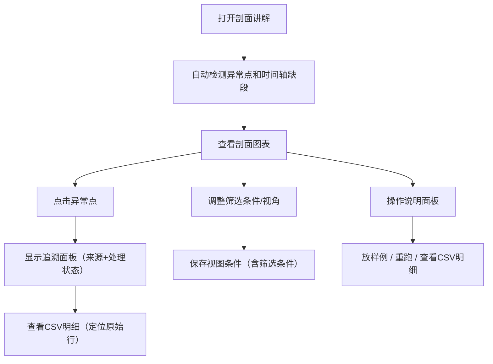

## 1. 产品概述

山地索道站剖面讲解是面向工程复核场景的数据可视化工具，解决CAD图层数据在筛选条件变化后无法追溯来源的核心问题。目标用户为方案经理和复核人，帮助复核人从剖面图表快速定位异常点、追溯原始材料、检测时间轴缺段。

产品核心价值在于建立"图表-异常-来源材料"的完整追溯链路，确保每一条异常记录都能点回原始CAD数据，同时保留字段来源和处理状态，解决人工复核效率低下、数据链路断裂的痛点。

## 2. 核心功能

### 2.1 用户角色

| 角色 | 注册方式 | 核心权限 |
|------|---------|----------|
| 方案经理 | 无需注册 | 上传CAD数据、配置字段映射、管理演示数据 |
| 复核人 | 无需注册 | 查看剖面图表、追溯异常来源、保存视图条件、导出CSV明细 |

### 2.2 功能模块

1. **剖面图表主页面**：索道站剖面图展示、异常点标记、时间轴可视化、筛选条件面板
2. **异常追溯面板**：点击异常点显示来源信息、处理状态、原始CAD记录、影响范围
3. **字段映射配置**：处理CAD图层字段名不一致问题，强制保留"来源"和"处理状态"字段
4. **时间轴缺段检测**：自动检测数据断层，标注缺段影响范围和来源行号
5. **视图条件管理**：保存当前筛选条件和视图视角，支持命名和快速切换
6. **操作说明面板**：放样例、重跑、查看CSV明细三项核心操作说明
7. **演示数据管理**：内置含边界样本和时间轴缺段的演示数据

### 2.3 页面详情

| 页面名称 | 模块名称 | 功能描述 |
|---------|---------|----------|
| 剖面图表主页面 | 剖面图可视化 | SVG绘制山地索道站剖面图，支持缩放、平移，异常点高亮标记 |
| 剖面图表主页面 | 筛选条件面板 | 支持按时间范围、处理状态、数据来源筛选，条件实时联动图表 |
| 剖面图表主页面 | 时间轴组件 | 底部时间轴展示数据分布，缺段区域红色高亮，悬停显示影响范围 |
| 异常追溯面板 | 来源信息卡片 | 点击异常点弹出面板，展示原始CAD字段值、来源图层、处理状态变更历史 |
| 异常追溯面板 | 材料追溯链接 | 点击"查看原始材料"直接定位到CSV对应行，高亮显示 |
| 字段映射配置 | 字段映射表 | 显示当前CAD字段与标准字段的映射关系，支持编辑，强制锁定"来源"和"处理状态" |
| 视图条件管理 | 保存视图按钮 | 捕获当前筛选条件、缩放级别、图表中心位置，支持命名保存 |
| 视图条件管理 | 视图列表 | 已保存视图的快速切换，每个视图显示缩略预览 |
| 操作说明面板 | 操作指南 | 三栏布局分别说明：放样例、重跑、查看CSV明细的操作步骤 |
| CSV明细页面 | 数据表格 | 展示完整原始数据，支持按行号定位、搜索、排序、导出 |

## 3. 核心流程

复核人打开应用后，首先查看"山地索道站剖面讲解"图表，系统自动检测并标记异常点和时间轴缺段。复核人点击异常点，系统弹出追溯面板显示完整来源信息和处理状态，可进一步点击查看CSV明细定位到原始行。复核人可切换不同视角并保存视图条件，用于后续截图复核。

## 4. 用户界面设计

### 4.1 设计风格
- **主色调**：工程蓝（#1E3A8A）作为主色，配合警示红（#DC2626）标记异常，中性灰（#374151）作为文本色
- **配色方案**：深色专业工程风格，深色背景（#0F172A）配合高对比度数据可视化
- **按钮风格**：直角硬朗风格，边框1px，hover时有微妙的发光效果
- **字体**：标题使用JetBrains Mono Bold，正文使用Inter Regular，数字使用等宽字体保证对齐
- **布局风格**：三栏布局，左侧筛选面板，中间主图表区，右侧追溯面板，顶部工具栏
- **图标风格**：线性图标， stroke 1.5px，工程感强

### 4.2 页面设计概述

| 页面名称 | 模块名称 | UI元素 |
|---------|---------|----------|
| 剖面图表主页面 | 剖面图可视化 | SVG画布，网格背景，等高线分层着色，异常点红色脉冲动画 |
| 剖面图表主页面 | 筛选条件面板 | 折叠式面板，时间范围选择器，下拉多选框，状态标签组 |
| 剖面图表主页面 | 时间轴组件 | 横向甘特图样式，数据块蓝色，缺段区域红色虚线，悬停tooltip |
| 异常追溯面板 | 来源信息卡片 | 毛玻璃效果卡片，字段值高亮对比，处理状态时间线 |
| 字段映射配置 | 字段映射表 | 左右两列拖拽映射，锁定字段带锁图标，不一致字段黄色警告 |
| 操作说明面板 | 操作指南 | 卡片式三栏布局，每栏含图标+简短步骤说明，示例截图占位 |

### 4.3 响应式
- 桌面端优先设计（1920×1080），三栏固定布局
- 平板端自适应为两栏，右侧面板可抽屉式呼出
- 移动端保留核心图表查看功能，操作面板转为底部sheet

### 4.4 动画与交互
- 页面加载：图表区域从中心向外渐入，元素依次出现
- 异常点：持续的脉冲呼吸动画，hover时放大并显示tooltip
- 面板切换：平滑滑入滑出，200ms ease-out
- 数据更新：重跑后图表数据有淡入过渡效果
- 行定位：CSV明细中定位到目标行时有黄色闪烁高亮
