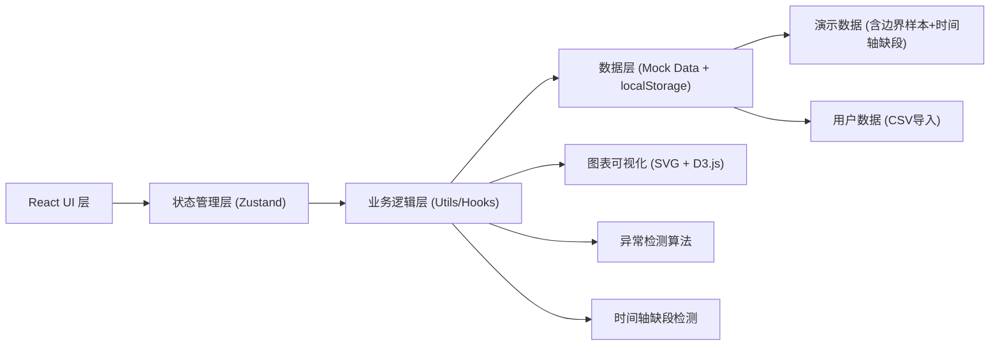
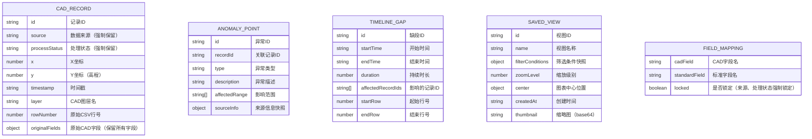

## 1. 架构设计

本项目为纯前端单页应用，无需后端服务。所有数据处理、异常检测、状态管理均在浏览器端完成，数据持久化通过 localStorage 实现。



## 2. 技术描述

- **前端框架**: React@18 + TypeScript@5
- **构建工具**: Vite@5
- **样式方案**: TailwindCSS@3 + CSS Variables
- **状态管理**: Zustand@4（轻量级，适合中小规模应用）
- **图表可视化**: 原生SVG + D3.js（用于比例尺、缩放交互）
- **数据处理**: Papaparse（CSV解析）
- **图标库**: Lucide React（线性图标，符合工程风格）
- **数据持久化**: localStorage（保存视图条件、字段映射配置）
- **后端**: 无（纯前端应用）
- **数据库**: 无（使用Mock数据 + localStorage）

## 3. 目录结构

```
src/
├── components/          # UI组件
│   ├── layout/         # 布局组件
│   ├── chart/          # 剖面图相关组件
│   ├── timeline/       # 时间轴组件
│   ├── filter/         # 筛选面板组件
│   ├── trace/          # 异常追溯面板
│   ├── fieldMapping/   # 字段映射组件
│   ├── viewManagement/ # 视图管理组件
│   ├── csvDetail/      # CSV明细表格
│   └── guide/          # 操作说明组件
├── store/              # Zustand状态管理
│   ├── dataStore.ts    # 数据状态
│   ├── filterStore.ts  # 筛选条件状态
│   └── viewStore.ts    # 视图管理状态
├── hooks/              # 自定义Hooks
│   ├── useAnomalyDetection.ts  # 异常检测
│   ├── useTimelineGap.ts       # 时间轴缺段检测
│   ├── useFieldMapping.ts      # 字段映射处理
│   └── usePanZoom.ts           # 图表平移缩放
├── utils/              # 工具函数
│   ├── csvParser.ts    # CSV解析
│   ├── dataProcessor.ts # 数据处理
│   └── constants.ts    # 常量定义
├── data/               # Mock数据
│   ├── demoData.ts     # 含边界样本和时间轴缺段的演示数据
│   └── fieldMappings.ts # 默认字段映射
├── types/              # TypeScript类型定义
│   └── index.ts
├── App.tsx
├── main.tsx
└── index.css
```

## 3. 路由定义

| 路由 | 页面/组件 | 用途 |
|-----|----------|------|
| / | ProfileChartPage | 剖面图表主页面（默认路由） |
| /csv | CsvDetailPage | CSV明细页面，支持行定位 |
| /mapping | FieldMappingPage | 字段映射配置页面 |

## 4. 核心数据模型



## 5. 核心算法说明

### 5.1 异常检测算法
- 边界值检测：基于四分位距(IQR)识别超出正常范围的边界样本
- 突变检测：相邻点高程变化率超过阈值标记为异常
- 数据完整性检测：关键字段为空或格式错误标记为异常

### 5.2 时间轴缺段检测
- 按时间戳排序后计算相邻记录时间差
- 时间差超过平均间隔的3倍判定为缺段
- 记录缺段的起止时间、影响范围、来源行号

### 5.3 字段映射处理
- 内置标准字段：来源(source)、处理状态(processStatus)强制映射且不可修改
- 支持模糊匹配自动识别同义字段（如"数据源"/"来源"自动映射）
- 字段名不一致时保留原始字段名并标注警告

## 6. 性能优化

- 大数据量虚拟化：CSV表格使用虚拟滚动，支持10万+行流畅浏览
- 图表按需渲染：仅渲染可视区域内的数据点
- 防抖节流：筛选条件变更时300ms防抖后再更新图表
- Web Worker：异常检测和缺段检测在Worker中执行，不阻塞UI

## 7. 浏览器兼容性

- Chrome/Edge：最新2个版本
- Firefox：最新2个版本
- Safari：最新2个版本
- 不支持IE系列
