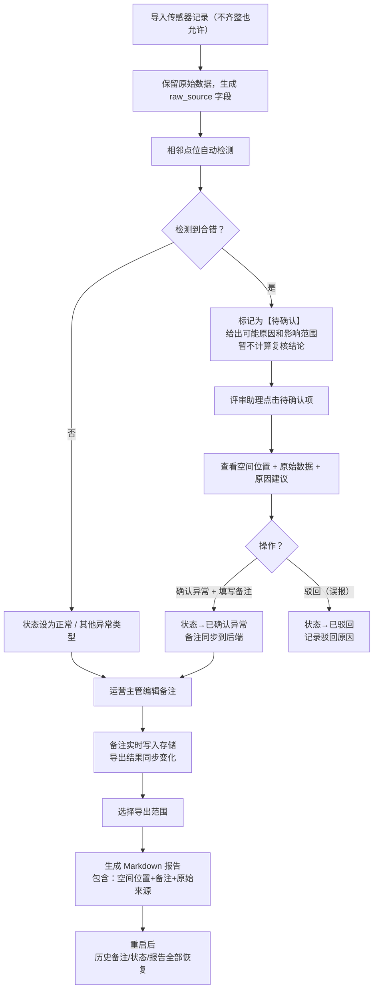

## 1. 产品概述

**数据中心冷通道空间复核工具** —— 面向评审助理和运营主管的轻量级复核工具，让传感器记录中的异常对象（相邻点位错配、空间偏差、数据缺失等）不再被埋没，实现**原始数据可见、备注双向同步、异常先确认后计算、报告可追溯**。

- 目标用户：评审助理阿乔、运营主管
- 核心价值：把"藏着的问题"拎到台面上，复核过程可追溯，备注与导出实时同步
- 设计原则：**不洗脏数据、不替人做判断、不让状态丢失**

---

## 2. 核心功能

### 2.1 用户角色

| 角色 | 登录方式 | 核心权限 |
|------|----------|----------|
| 评审助理 | 无需登录（本地工具） | 查看传感器记录、标记异常对象、确认/驳回待确认项、导出报告 |
| 运营主管 | 无需登录（本地工具） | 编辑复核备注、查看历史记录、导出 Markdown 报告 |

### 2.2 功能模块（单页应用，按 Tab 分区）

1. **复核总览**：冷通道点位列表 + 异常统计卡片 + 待确认事项清单
2. **传感器记录**：原始数据表格（保留原始来源列，脏数据标红不修改）+ 相邻点位检测结果
3. **异常对象详情**：空间位置可视化 + 备注编辑区 + 影响范围高亮 + 导出当前项
4. **报告导出**：全量 / 按筛选 / 按异常对象导出 Markdown 报告

### 2.3 页面详情

| 页面 | 模块 | 功能描述 |
|------|------|----------|
| 复核总览 | 统计卡片 | 总记录数、异常数、待确认数、已复核数 四项指标 |
| 复核总览 | 待确认清单 | 按优先级列出待确认项，点击跳转异常详情，显示"原因建议 + 影响范围" |
| 复核总览 | 点位列表 | 每行显示点位编号、空间坐标、状态（正常/异常/待确认）、备注摘要 |
| 传感器记录 | 原始数据表 | 显示原始来源文件名、导入时间、所有原始字段；脏数据行底色标红但不修改内容 |
| 传感器记录 | 相邻检测列 | 自动检测相邻点位是否合错；合错行显示"待确认"标签 + 原因说明 |
| 异常对象详情 | 空间位置 | 简化 2D 平面图标注点位，异常点位红色高亮，影响范围用虚线框圈出 |
| 异常对象详情 | 备注编辑 | 支持富文本备注（多行文本），前端修改后立即同步到后端存储与导出结果 |
| 异常对象详情 | 状态流转 | 待确认 → 已确认异常 / 误报驳回；操作留痕（时间+操作类型） |
| 异常对象详情 | 单独导出 | 导出仅包含当前异常对象的 Markdown 报告片段 |
| 报告导出 | 筛选区 | 按状态 / 时间 / 点位范围筛选 |
| 报告导出 | 预览 & 下载 | 实时预览 Markdown，一键下载 .md 文件 |

---

## 3. 核心流程

**关键约束**：
- 传感器记录**不做清洗**，原始内容原样保存，附加 `raw_source` 字段标明来源
- 相邻点位合错**不自动修正**，先挂"待确认"，附原因（如：坐标跳变 > 阈值、编号不连续、与邻点温差超出范围）和影响范围（涉及点位列表）
- 前端修改备注**立即持久化**，下次打开导出时备注已同步
- 重启后：历史备注、当前状态、生成过的 Markdown 报告**全部从磁盘读回**，不能丢

---

## 4. 用户界面设计

### 4.1 设计风格

- **主色**：深蓝 `#1e3a5f`（专业、冷静，契合数据中心氛围）
- **强调色**：警示橙 `#f59e0b`（待确认）、异常红 `#dc2626`（已确认异常）、通过绿 `#16a34a`（正常）
- **字体**：标题用 **JetBrains Mono**（等宽、工程感），正文用 **Noto Sans SC**（清晰可读）
- **布局**：左侧导航（紧凑）+ 右侧内容区（卡片式，有 1px 细边框 + 轻微阴影）
- **风格关键词**：工业/工程感、信息密度偏高但不拥挤、所有状态用色块 + 文字双重标识
- **图标**：lucide-react 线性图标，与数据工程主题匹配（Database、AlertTriangle、MapPin、FileText 等）

### 4.2 页面设计概览

| 页面/模块 | 布局要点 | 色彩 & 动效 |
|-----------|----------|-------------|
| 复核总览 | 顶部 4 统计卡片（2×2 网格），下方左侧待确认清单（窄列）、右侧点位列表（宽列） | 统计卡片悬停阴影加深；待确认项逐行淡入（stagger 50ms） |
| 传感器记录 | 表格横向滚动，冻结"点位编号 + 状态"两列；raw_source 列用等宽字体、灰色小字 | 脏数据行用 `bg-red-50 border-l-4 border-red-500` 标识，不修改内容 |
| 异常详情 | 上方 2D 平面图（左）+ 状态卡（右）；下方备注编辑 + 操作日志时间线 | 异常点位脉冲动画 `animate-pulse`；备注保存成功有绿色对勾闪现 |
| 报告导出 | 左侧筛选（垂直）+ 右侧 Markdown 实时预览（带代码高亮风格） | 导出按钮点击后进度条从 0→100（模拟 300ms），然后出现下载链接 |

### 4.3 响应式

- Desktop-first（≥ 1280px 为目标尺寸）
- 平板（768–1279px）：待确认清单改为顶部横向滚动条，平面图与状态卡上下堆叠
- 移动端（< 768px）：表格切换为卡片列表模式，平面图简化为点位编号列表

---
