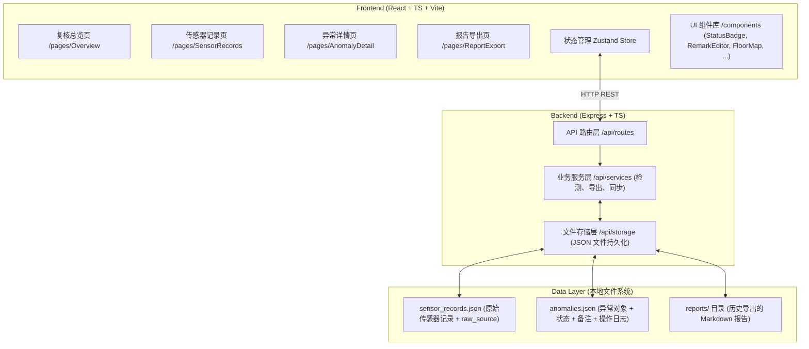
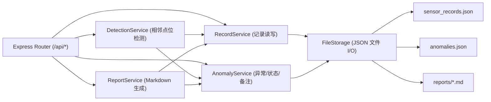
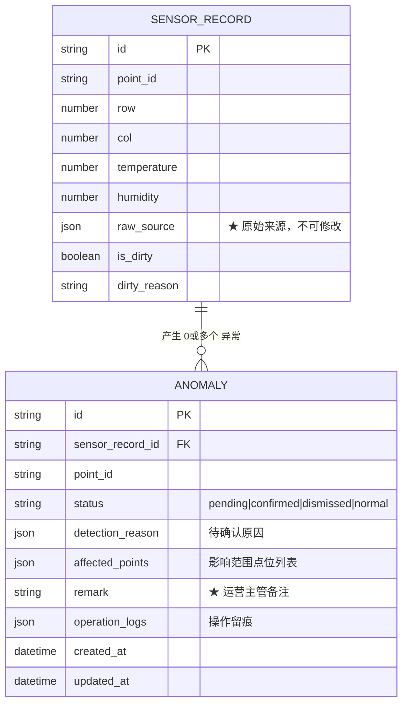

## 1. 架构设计



**设计说明**：
- 前后端分离，Express 同时托管前端静态资源和 API
- 数据持久化采用 **JSON 文件存储**（轻量、可交接、无需额外数据库），重启后自动从文件读回
- 传感器记录**永不修改原始值**，只附加 `raw_source`（来源文件名 + 导入时间戳）和 `is_dirty` 布尔标记
- 状态和备注**单独存储在 anomalies.json**，与原始数据解耦，确保"脏数据痕迹"永不丢失

---

## 2. 技术描述

| 层 | 技术选型 | 说明 |
|----|----------|------|
| 前端框架 | React 18 + TypeScript | 组件化，类型安全 |
| 构建工具 | Vite 5 | 启动快，HMR 顺畅 |
| 路由 | react-router-dom v6 | 4 个主路由 |
| 状态管理 | Zustand | 轻量，避免 Redux 繁琐 |
| UI 样式 | Tailwind CSS 3 | 工程感风格快速实现 |
| 图标 | lucide-react | 线性图标，契合工程气质 |
| Markdown 渲染 | react-markdown + remark-gfm | 实时预览报告 |
| 后端框架 | Express 4 + TypeScript | RESTful API |
| 数据存储 | 本地 JSON 文件 (lowdb 风格手写) | 零依赖，好交接，文件可直接翻阅 |
| HTTP 客户端 | fetch (原生) + 自定义封装 | 避免 axios 额外依赖 |

---

## 3. 路由定义

### 3.1 前端路由 (react-router)

| 路由路径 | 页面组件 | 说明 |
|----------|----------|------|
| `/` | 重定向到 `/overview` | 入口 |
| `/overview` | `pages/Overview.tsx` | 复核总览：统计卡 + 待确认清单 + 点位列表 |
| `/sensors` | `pages/SensorRecords.tsx` | 传感器记录：原始数据表格 + 相邻检测列 |
| `/anomaly/:id` | `pages/AnomalyDetail.tsx` | 异常详情：平面图 + 备注 + 状态流转 |
| `/export` | `pages/ReportExport.tsx` | 报告导出：筛选 + 预览 + 下载 |

### 3.2 后端 API 路由

| Method | Path | 功能 |
|--------|------|------|
| GET | `/api/records` | 获取全部传感器记录（含 raw_source、is_dirty） |
| GET | `/api/anomalies` | 获取全部异常对象（含状态、备注、操作日志） |
| GET | `/api/anomalies/:id` | 获取单个异常对象详情 |
| PATCH | `/api/anomalies/:id/remark` | **修改备注**（核心：改完立即可在导出中看到） |
| PATCH | `/api/anomalies/:id/status` | 变更状态（待确认→已确认异常/已驳回） |
| POST | `/api/detect/adjacent` | 触发相邻点位检测，返回待确认列表 |
| GET | `/api/report` | 按筛选条件生成 Markdown 报告文本（实时） |
| GET | `/api/report/download` | 生成并下载 .md 文件（Content-Disposition） |
| GET | `/api/report/:anomalyId` | 导出**单个异常对象**的 Markdown 片段 |
| POST | `/api/records/seed` | 导入内置 mock 数据（首次启动使用） |

---

## 4. API 类型定义（前后端共享）

```typescript
// 共享类型定义，放 /shared/types.ts

export type PointStatus = 'normal' | 'pending' | 'confirmed_anomaly' | 'dismissed';

export interface SensorRecord {
  id: string;                    // 记录唯一 ID
  point_id: string;              // 点位编号，如 "A-03-12"
  row: number;                   // 行号（冷通道行）
  col: number;                   // 列号（机柜列）
  temperature: number | null;    // 温度（原始值，null 表示缺失）
  humidity: number | null;       // 湿度（原始值）
  raw_source: {                  // ★ 原始来源保留
    file_name: string;           // 原始文件名
    import_time: string;         // 导入时间 ISO
    line_number: number;         // 原始行号
    raw_values: Record<string, any>; // 所有原始字段，原样存
  };
  is_dirty: boolean;             // 是否为脏数据（缺失/格式异常）
  dirty_reason?: string;         // 脏数据原因说明
}

export interface DetectionReason {
  type: 'jump' | 'gap' | 'temp_delta' | 'duplicate';
  description: string;           // 人类可读原因
  detail: Record<string, any>;   // 机器可读细节（阈值、差值等）
}

export interface Anomaly {
  id: string;
  sensor_record_id: string;      // 关联传感器记录
  point_id: string;
  status: PointStatus;
  detection_reason: DetectionReason;  // 待确认原因
  affected_points: string[];     // ★ 影响范围（点位编号列表）
  remark: string;                // ★ 备注（运营主管修改的内容）
  operation_logs: OperationLog[]; // 操作留痕
  created_at: string;
  updated_at: string;
}

export interface OperationLog {
  time: string;
  action: 'create' | 'status_change' | 'remark_edit' | 'dismiss' | 'confirm';
  operator: 'system' | 'reviewer' | 'operator'; // 简化角色
  detail?: string;
}

export interface ReportOptions {
  statuses?: PointStatus[];      // 筛选：状态
  point_range?: { start: string; end: string }; // 筛选：点位范围
  anomaly_ids?: string[];        // 筛选：指定异常对象（点选导出用）
}
```

---

## 5. 后端分层图



**Service 职责**：
- `FileStorage`：原子读写 JSON，写前 `fs.writeFile(tmp) + fs.rename` 防损坏
- `RecordService`：传感器记录 CRUD，**禁止修改 raw_values**
- `AnomalyService`：异常对象 CRUD；**改备注时同步 updated_at 并加 operation_log**
- `DetectionService`：相邻点位检测算法（坐标跳变、编号缺口、温差）；结果写入 anomalies.status = 'pending'
- `ReportService`：模板化 Markdown 拼接，保证"空间位置 + 备注 + 原始来源"三项齐全

---

## 6. 数据模型

### 6.1 ER 图



### 6.2 文件存储约定

**`/api/data/sensor_records.json`**：
```jsonc
{
  "version": 1,
  "records": [
    {
      "id": "rec_001",
      "point_id": "A-01-01",
      "row": 1, "col": 1,
      "temperature": 23.5,
      "humidity": 45,
      "raw_source": {
        "file_name": "dc_sensors_2026Q2.csv",
        "import_time": "2026-06-10T08:00:00Z",
        "line_number": 2,
        "raw_values": { "点位编号": "A-01-01", "温度": "23.5", "湿度": "45", "...原始字段全部保留..." }
      },
      "is_dirty": false
    }
  ]
}
```

**`/api/data/anomalies.json`**：
```jsonc
{
  "version": 1,
  "anomalies": [
    {
      "id": "anm_001",
      "sensor_record_id": "rec_007",
      "point_id": "A-01-07",
      "status": "pending",
      "detection_reason": { "type": "temp_delta", "description": "与左邻点 A-01-06 温差 8.2℃，超出阈值 5℃", "detail": { "delta": 8.2, "threshold": 5 } },
      "affected_points": ["A-01-05", "A-01-06", "A-01-07", "A-01-08"],
      "remark": "",
      "operation_logs": [{ "time": "...", "action": "create", "operator": "system", "detail": "相邻检测自动标记" }],
      "created_at": "...", "updated_at": "..."
    }
  ]
}
```

**`/api/data/reports/`**：每次导出的 Markdown 文件，命名为 `report_YYYYMMDD_HHmmss.md` 或 `single_anm_<id>_YYYYMMDD.md`。

---

## 7. 相邻点位检测算法（核心逻辑）

输入：所有 SensorRecord（按 row, col 排序）
输出：Anomaly[]（status = 'pending'）

**检测规则**（命中任意一条即标记）：
1. **坐标跳变（jump）**：点 A(row,col) 与点 A'(row,col+1) 的 (row,col) 编号连续但物理坐标（若有）或属性跳变 > 阈值
2. **编号缺口（gap）**：同一行中 col 不连续（如 A-01-03 下一条是 A-01-06，缺 04、05）→ 标记缺口两端点位
3. **温差过大（temp_delta）**：相邻两点温度差绝对值 > 5℃ → 标记温度异常点，影响范围包含左右各 1 点
4. **重复编号（duplicate）**：相同 point_id 出现 >1 次 → 全部标记

**关键**：检测只标记、不修改原始数据，不自动生成最终结论，一律走"待确认"流程。

---
