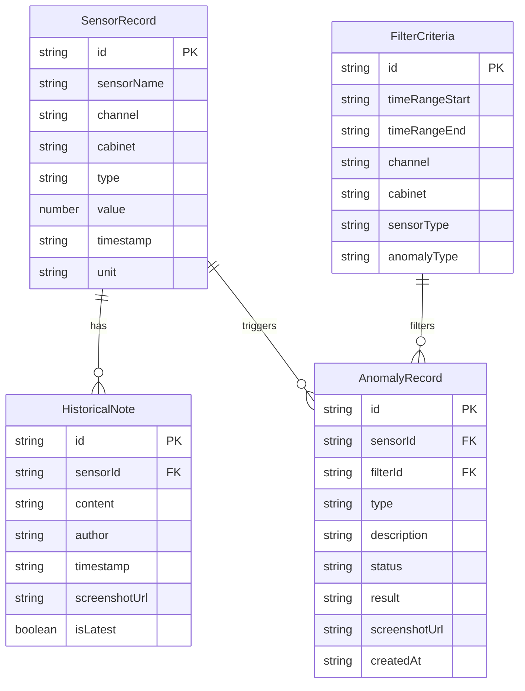

## 1. 架构设计

```mermaid
flowchart TB
    subgraph "前端层"
        "React + TypeScript + Vite"
        "Tailwind CSS"
        "Zustand 状态管理"
        "Recharts 图表"
    end
    subgraph "数据层"
        "Mock 传感器数据"
        "Mock 异常队列数据"
        "Mock 历史备注数据"
    end
    "前端层" --> "数据层"
```

纯前端项目，使用 Mock 数据模拟传感器记录、异常队列和历史备注。

## 2. 技术说明

- 前端：React@18 + TypeScript + Tailwind CSS@3 + Vite
- 初始化工具：vite-init (react-ts 模板)
- 状态管理：Zustand
- 图表库：Recharts（时序折线图）
- 路由：react-router-dom
- 后端：无（纯前端 Mock 数据）
- 数据库：无（使用内存 Mock 数据）

## 3. 路由定义

| 路由 | 用途 |
|------|------|
| / | 时序回放主页，含筛选面板、时序图表、播放控制、截图、导出入口 |
| /anomaly-queue | 异常队列页，含异常列表、截图溯源、材料放置区 |
| /export-preview | 导出预览浮层（作为 Modal 而非独立页面） |

## 4. 数据模型

### 4.1 数据模型定义



### 4.2 核心类型定义

```typescript
interface SensorRecord {
  id: string;
  sensorName: string;
  channel: string;
  cabinet: string;
  type: 'temperature' | 'humidity' | 'pressure';
  value: number;
  timestamp: string;
  unit: string;
}

interface FilterCriteria {
  id: string;
  timeRangeStart: string;
  timeRangeEnd: string;
  channel?: string;
  cabinet?: string;
  sensorType?: string;
  anomalyType?: string;
}

interface AnomalyRecord {
  id: string;
  sensorId: string;
  filterId: string;
  type: 'adjacent_merge_error' | 'value_out_of_range' | 'sensor_offline' | 'data_gap';
  description: string;
  status: 'pending' | 'processing' | 'resolved';
  result: string;
  screenshotUrl?: string;
  sourceObjectId?: string;
  createdAt: string;
}

interface HistoricalNote {
  id: string;
  sensorId: string;
  content: string;
  author: string;
  timestamp: string;
  screenshotUrl?: string;
  isLatest: boolean;
}
```
