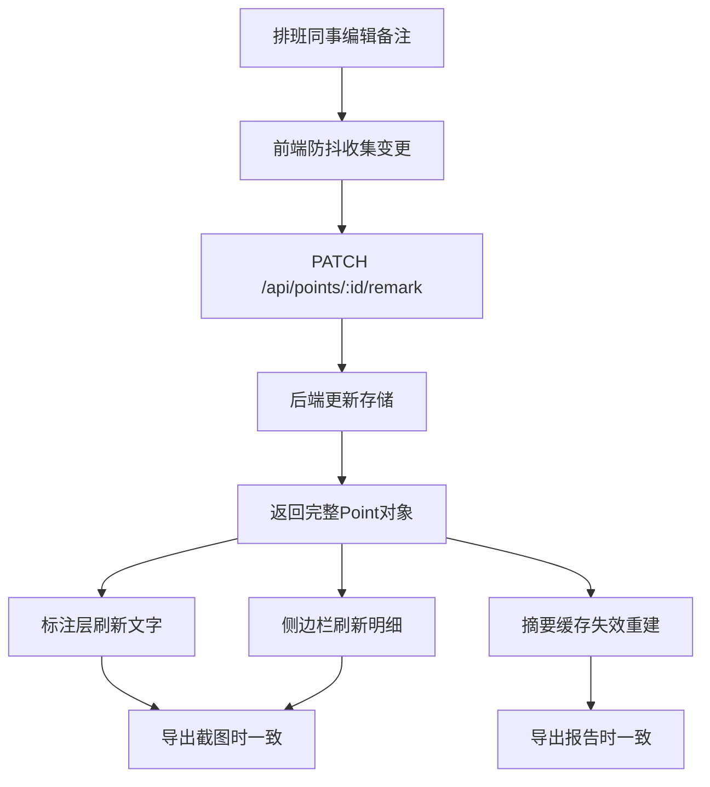

## 1. 产品概述
数据中心冷通道剖面讲解系统是面向运维调度、巡检讲解、汇报沟通场景的可视化协作平台。通过在冷通道剖面图上标注点位坐标、保存讲解视角、同步备注信息，解决现场讲解材料零散、视角复原困难、数据前后不一致的核心痛点，最终产出可直接用于汇报沟通的页面摘要。

- 核心用户：现场调度阿宁（主讲人）、排班同事（维护者）、管理层（听众）
- 核心价值：讲解材料一条主线串到底、数据一处修改处处同步、异常记录自动隔离不混淆、输出即沟通素材

---

## 2. 核心功能

### 2.1 用户角色
| 角色 | 使用方式 | 核心权限 |
|------|---------|---------|
| 调度主讲（阿宁） | 现场讲解、切视角、导出截图 | 浏览点位、切换视角、保存/复原视角、导出、标记坏数据 |
| 排班维护 | 修改备注、补充说明、撤回记录 | 编辑备注、追加后补说明、标记撤回、触发数据同步 |
| 管理层/听众 | 只读浏览、查看摘要报告 | 查看讲解视图、阅读页面摘要、导出报告 |

### 2.2 功能模块
1. **剖面主画布页**：点位渲染、坐标标注、视角操控、筛选切换、对象悬停高亮
2. **侧边明细面板**：点位详情、备注编辑区、撤回/后补记录时间线
3. **视角管理抽屉**：保存的视角列表、视角复原、视角备注、视角删除
4. **异常记录隔离区**：对象重叠记录、撤回记录、后补说明三类异常单独列出
5. **页面摘要输出**：一键生成讲解摘要、标注/明细/报告三栏统一口径
6. **导出中心**：截图导出、PDF报告导出、JSON原始数据导出

### 2.3 页面详情
| 页面名称 | 模块名称 | 功能描述 |
|---------|---------|-----------|
| 剖面主画布页 | 顶部工具栏 | 筛选下拉（按区域/类型/状态）、视角保存、导出按钮、摘要开关 |
| 剖面主画布页 | SVG剖面图 | 冷通道机柜阵列SVG渲染、点位坐标叠加、对象包围盒检测重叠 |
| 剖面主画布页 | 点位标记层 | 圆点+编号、悬停弹出气泡、点击选中联动侧边栏 |
| 剖面主画布页 | 坏数据标注层 | 原始行号红色外框、具体对象编号闪烁提示 |
| 侧边明细面板 | 点位基本信息 | ID、坐标(x,y)、所属机柜、原始数据行号、类型标签 |
| 侧边明细面板 | 备注编辑器 | 实时编辑、失焦自动同步后端、编辑中本地防抖 |
| 侧边明细面板 | 时间线区 | 撤回记录（灰线+删除线）、后补说明（黄底+补字标记）按时间倒序 |
| 视角管理抽屉 | 视角卡片列表 | 缩略图、视角名称、创建时间、【复原】【删除】按钮 |
| 视角管理抽屉 | 保存视角弹窗 | 输入名称、自动生成缩略图、关联当前筛选条件 |
| 异常记录隔离区 | 重叠对象列表 | 检测到重叠的对象对、高亮风险、一键定位到画布 |
| 异常记录隔离区 | 撤回记录列表 | 原内容+撤回原因+操作人，与正常结果物理分隔 |
| 异常记录隔离区 | 后补说明列表 | 补充内容+补录时间+说明人，黄色视觉区分 |
| 页面摘要弹窗 | 三栏统一区 | 标注摘要+侧边明细汇总+报告摘要，内容完全一致 |
| 页面摘要弹窗 | 沟通话术区 | 预填充讲解主线，可编辑后复制 |
| 导出中心 | 格式选择 | PNG截图 / PDF报告 / JSON原始数据，附带当前视角和筛选快照 |

---

## 3. 核心流程

### 3.1 讲解准备流程
排班同事维护点位备注 → 备注修改触发后端同步 → 后端推送更新到所有客户端 → 导出结果自动刷新最新数据 → 阿宁打开系统确认主线

### 3.2 现场讲解流程
阿宁打开系统 → 选择保存的讲解视角（筛选条件一并恢复）→ 按点位顺序逐一讲解 → 遇到重叠对象自动跳到隔离区说明 → 遇到坏数据标注原始行 → 实时切换视角补充说明 → 结束导出截图+摘要

### 3.3 数据一致性流程
前端编辑备注 → 防抖500ms → PATCH请求后端 → 后端更新内存数据库 → 返回更新后的完整点位 → 前端同步标注层/侧边栏/摘要三组件 → 下次导出自动取最新



---

## 4. 用户界面设计

### 4.1 设计风格
- **主色调**：工业蓝 `#1E3A5F`（冷通道专业感）+ 安全绿 `#10B981`（正常状态）+ 告警橙 `#F59E0B`（后补）+ 危险红 `#EF4444`（坏数据/重叠）
- **背景**：深色底 `#0F172A` 带微妙冷色渐变，呼应"冷通道"温度感
- **按钮风格**：直角微圆角（2px）、薄边框、按压下沉效果，工业控制台风格
- **字体**：标题用 `JetBrains Mono`（等宽，坐标数字对齐）、正文用 `Noto Sans SC`（中文可读性）
- **布局风格**：三栏式刚性布局（左：异常隔离区、中：主画布、右：侧边明细）、顶部固定工具栏、底部状态栏
- **图标风格**：lucide-react 线性图标，选中态加粗，配合数据中心特有图形（机柜、风流、温度计）

### 4.2 页面设计概览
| 页面名称 | 模块名称 | UI元素 |
|---------|---------|--------|
| 主画布布局 | 左栏-异常隔离 | 220px固定宽、深灰背景、三折叠分区（重叠/撤回/后补）、每项点击定位 |
| 主画布布局 | 中栏-剖面画布 | 自适应宽度、SVG居中、周围留边距、画布内支持缩放平移 |
| 主画布布局 | 右栏-侧边明细 | 320px固定宽、分三段（基本信息/备注编辑/时间线）、滚动独立 |
| 主画布布局 | 顶部工具栏 | 48px高、左侧筛选芯片组、中间标题、右侧视角+导出+摘要按钮 |
| 主画布布局 | 底部状态栏 | 24px高、左：当前视角名、中：选中点位ID、右：数据版本时间戳 |
| 点位视觉 | 正常点位 | 12px实心圆点+白边、8px编号标签浮在上方 |
| 点位视觉 | 重叠点位 | 外圈红色脉冲环、鼠标悬停显示对撞对象列表 |
| 点位视觉 | 撤回点位 | 灰色虚线圆、文字加删除线、移到画布角落灰色区 |
| 点位视觉 | 坏数据标注 | 点位外2px红色虚线框、旁边标注"R-原始行号"小标签 |
| 视角管理 | 视角卡片 | 80×60缩略图、下方文字、hover时复原按钮浮现 |
| 摘要弹窗 | 三栏并排 | 等宽三列、相同内容、用不同背景色区分来源、底部复制全部按钮 |
| 动效细节 | 视角切换 | 画布用CSS transform平滑缩放平移、400ms cubic-bezier |
| 动效细节 | 备注保存 | 输入框右侧16px打勾图标淡入、200ms后淡出 |
| 动效细节 | 重叠脉冲 | 3s循环 scale 1→1.3→1 opacity 1→0.3→1 |

### 4.3 响应式
- 桌面端（≥1280px）：三栏全开，为主要使用场景
- 平板端（768-1279px）：左栏折叠成图标条、右栏可滑出
- 移动端（<768px）：单栏画布为主，所有面板改为底部抽屉
- 触屏优化：点位点击热区扩大到24px、画布支持双指缩放

### 4.4 3D场景指引（伪3D增强）
- 本项目采用2D SVG剖面图 + CSS 3D transform营造纵深感
- 机柜图形添加透视 `perspective(800px)` 微倾斜、上下边缘渐变模拟厚度
- 冷气流用CSS动画白色半透明长条从下往上浮动，模拟冷风上升
- 环境光：机柜顶部加暖色光（IT设备散热）、底部加冷色光（空调出风）
```
