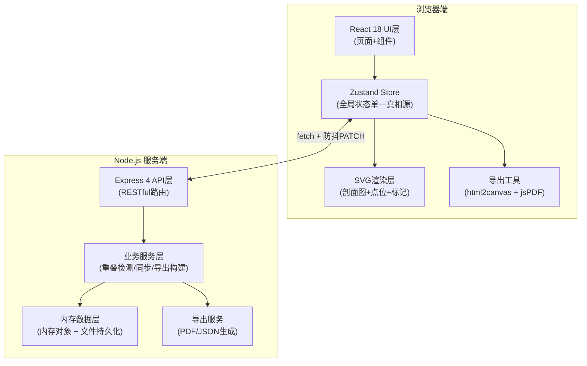
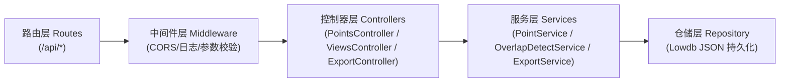
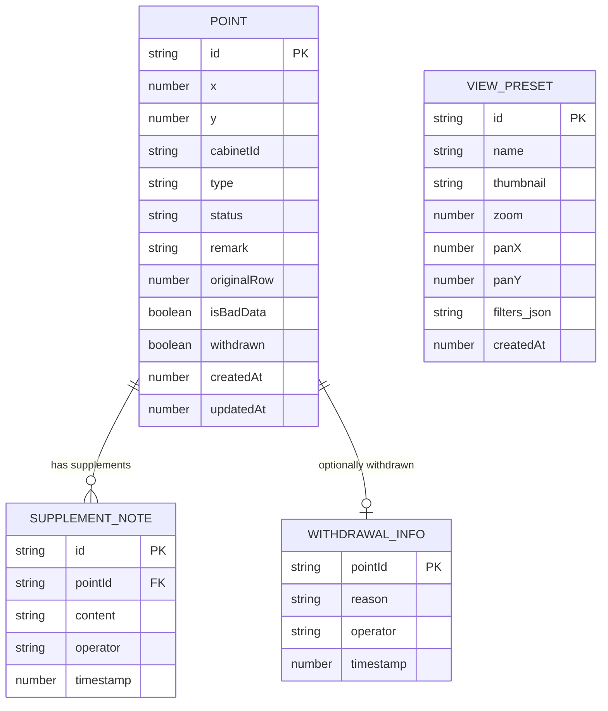

## 1. 架构设计
采用前后端分离的单体架构，前端React负责可视化渲染与交互，后端Express负责数据持久化、同步、重叠检测与导出。状态通过zustand在前端统一管理，确保标注层、侧边栏、摘要三组件数据同源。



---

## 2. 技术说明
- **前端框架**：React@18 + TypeScript + Vite@5
- **样式方案**：Tailwind CSS@3 + 自定义CSS变量（主题色Token）
- **状态管理**：Zustand@4（单一Store，分selector切片）
- **路由**：React Router DOM@6（单页应用，主路由 + 模态路由）
- **可视化**：原生SVG（剖面图、点位、包围盒）+ CSS 3D transform
- **图标库**：lucide-react（按需引入）
- **导出工具**：html2canvas（截图）、jsPDF（PDF）、原生JSON序列化
- **后端框架**：Express@4 + TypeScript + ts-node/tsx
- **数据存储**：Lowdb（JSON文件持久化，模拟生产数据库）
- **跨域处理**：Vite开发代理 + Express CORS中间件
- **初始化工具**：vite-init（react-express-ts模板）

---

## 3. 路由定义
| 路由路径 | 页面/组件 | 用途 |
|---------|----------|------|
| `/` | ColdAisleProfile | 主入口，三栏剖面讲解画布 |
| `/summary` | SummaryModal (嵌套路由) | 页面摘要弹窗（三栏统一口径） |
| `/api/points` | GET | 获取全量点位列表（含筛选query） |
| `/api/points/:id` | GET/PATCH | 单个点位详情 / 更新点位 |
| `/api/points/:id/remark` | PATCH | 专用于更新备注（触发同步广播） |
| `/api/points/:id/withdraw` | POST | 标记点位为撤回记录（入隔离区） |
| `/api/points/:id/supplement` | POST | 追加后补说明（入隔离区） |
| `/api/points/:id/bad-data` | POST | 标记坏数据，绑定原始行号 |
| `/api/views` | GET/POST | 获取保存视角列表 / 保存新视角 |
| `/api/views/:id` | GET/DELETE | 单个视角详情 / 删除视角 |
| `/api/detect/overlaps` | GET | 后端计算对象重叠对返回列表 |
| `/api/export/png` | POST | 接收画布SVG + 元信息，协助生成快照描述 |
| `/api/export/pdf` | GET | 服务端生成PDF报告下载流 |
| `/api/export/json` | GET | 导出全量原始JSON（含撤回/后补/重叠标记） |
| `/api/summary` | GET | 返回统一口径的页面摘要数据（三栏同源） |

---

## 4. API 类型定义

```typescript
// ===== 共享类型（shared/types.ts）=====

export interface Point {
  id: string;                     // 点位唯一ID，如 P-0012
  x: number;                      // 画布坐标X（像素）
  y: number;                      // 画布坐标Y（像素）
  cabinetId: string;              // 所属机柜编号，如 CAB-A-07
  type: 'sensor' | 'outlet' | 'switch' | 'cable';
  status: 'normal' | 'warning' | 'error';
  remark: string;                 // 备注，排班同事修改的核心字段
  originalRow: number | null;     // 原始数据行号（坏数据追踪）
  isBadData: boolean;             // 是否标记为坏数据
  badDataReason?: string;         // 坏数据原因
  withdrawn: boolean;             // 是否已撤回
  withdrawalInfo?: {
    reason: string;
    operator: string;
    timestamp: number;
  };
  supplements: SupplementNote[];  // 后补说明列表
  createdAt: number;
  updatedAt: number;
}

export interface SupplementNote {
  id: string;
  content: string;
  operator: string;
  timestamp: number;
}

export interface ViewPreset {
  id: string;
  name: string;                   // 视角名称
  thumbnail: string;              // 缩略图（base64小图）
  zoom: number;                   // 缩放比例
  panX: number;                   // 平移X
  panY: number;                   // 平移Y
  filters: FilterState;           // 当时的筛选条件快照
  createdAt: number;
}

export interface FilterState {
  regions: string[];              // 区域筛选
  types: Point['type'][];         // 类型筛选
  statuses: Point['status'][];    // 状态筛选
  showWithdrawn: boolean;         // 是否显示撤回
  showSupplements: boolean;       // 是否显示后补
}

export interface OverlapPair {
  pointIds: [string, string];
  distance: number;               // 两点距离
  threshold: number;              // 判定阈值
  severity: 'high' | 'medium' | 'low';
}

export interface UnifiedSummary {
  annotationSummary: string;      // 标注层摘要
  sidebarSummary: string;         // 侧边明细汇总
  reportSummary: string;          // 报告摘要（三者内容一致，仅格式微调）
  talkingPoints: string[];        // 讲解主线话术
  timestamp: number;
}

// ===== 请求响应类型 =====

export type UpdateRemarkRequest = { remark: string; operator: string };
export type UpdateRemarkResponse = Point;

export type CreateViewRequest = Omit<ViewPreset, 'id' | 'createdAt'>;
export type CreateViewResponse = ViewPreset;

export type DetectOverlapsResponse = {
  pairs: OverlapPair[];
  totalPoints: number;
  checkedAt: number;
};
```

---

## 5. 服务端分层架构图



**各层职责：**
- 路由层：仅做URL映射与HTTP方法匹配
- 中间件层：统一错误处理、请求日志、CORS、请求体大小限制
- 控制器层：参数解析、响应格式化（不写业务逻辑）
- 服务层：核心业务（重叠检测算法、摘要口径统一、备注同步）
- 仓储层：CRUD封装，支持JSON文件持久化

---

## 6. 数据模型

### 6.1 ER图



### 6.2 初始化Mock数据（db.json 片段）

```json
{
  "points": [
    {
      "id": "P-0001",
      "x": 320, "y": 180,
      "cabinetId": "CAB-A-01",
      "type": "sensor",
      "status": "normal",
      "remark": "冷通道A-01机柜进风口温度传感器，稳定运行238天",
      "originalRow": 12,
      "isBadData": false,
      "withdrawn": false,
      "supplements": [],
      "createdAt": 1717980000000,
      "updatedAt": 1717980000000
    },
    {
      "id": "P-0002",
      "x": 335, "y": 192,
      "cabinetId": "CAB-A-01",
      "type": "sensor",
      "status": "warning",
      "remark": "与P-0001坐标疑似重叠，待调度人工复核",
      "originalRow": 13,
      "isBadData": true,
      "badDataReason": "x/y值与P-0001距离仅17px，低于阈值30px",
      "withdrawn": false,
      "supplements": [
        {
          "id": "S-001",
          "content": "6月8日后补：运维复核确认点位重复录入，保留P-0001",
          "operator": "排班-李明",
          "timestamp": 1717800000000
        }
      ],
      "createdAt": 1717980100000,
      "updatedAt": 1717990000000
    },
    {
      "id": "P-0003",
      "x": 460, "y": 210,
      "cabinetId": "CAB-A-02",
      "type": "outlet",
      "status": "normal",
      "remark": "旧版点位坐标已撤回，请参考P-0004",
      "originalRow": 14,
      "isBadData": false,
      "withdrawn": true,
      "withdrawalInfo": {
        "reason": "坐标偏移超过容差，重新勘测",
        "operator": "排班-王芳",
        "timestamp": 1717700000000
      },
      "supplements": [],
      "createdAt": 1717980200000,
      "updatedAt": 1717700000000
    }
  ],
  "views": [
    {
      "id": "V-001",
      "name": "冷通道A区-整体视角（汇报用）",
      "thumbnail": "data:image/png;base64,iVBORw0KGg==",
      "zoom": 0.85,
      "panX": 0,
      "panY": -40,
      "filters": {
        "regions": ["A"],
        "types": ["sensor", "outlet"],
        "statuses": ["normal", "warning"],
        "showWithdrawn": false,
        "showSupplements": true
      },
      "createdAt": 1717900000000
    }
  ]
}
```

### 6.3 重叠检测算法说明
- 阈值：同机柜内两点欧氏距离 < 30px 判定为重叠
- 服务层 `OverlapDetectService.detectPairs()`：
  1. 按 cabinetId 分组（不同机柜不检测）
  2. 组内 O(n²) 两两计算 `Math.sqrt((x1-x2)² + (y1-y2)²)`
  3. 低于阈值的对加入结果，按距离升序（越小风险越高）
  4. severity：<15px=high，15-22px=medium，22-30px=low
- 每次新增/修改点位时自动触发重算，结果缓存30s
```
