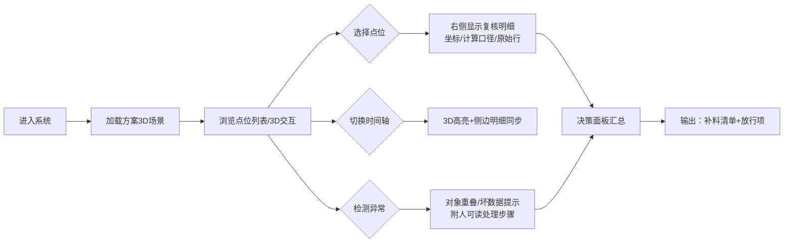

## 1. 产品概述

数据中心冷通道方案比选系统，面向方案经理和现场工程师，解决二维表格缺乏空间感导致复核效率低的问题。系统通过3D可视化呈现冷通道布局，支持点位坐标回溯、异常定位、时间轴对比和决策建议输出。

- 核心目标：将枯燥的点位坐标数据转化为可交互的3D空间模型，加速方案复核与决策
- 目标用户：方案经理（小赵类角色）、现场工程师、数据中心设计人员
- 产品价值：减少方案比选耗时，降低人工复核误差，输出可执行的决策建议

## 2. 核心功能

### 2.1 用户角色

| 角色 | 使用方式 | 核心诉求 |
|------|----------|----------|
| 方案经理 | 方案比选复核、决策输出 | 快速定位异常、拿到可执行的补料/放行建议 |
| 现场工程师 | 点位数据录入、现场复核 | 3D空间感对照、坐标回溯定位 |
| 设计人员 | 方案对比、优化调整 | 多方案时间轴切换、对象重叠分析 |

### 2.2 功能模块

1. **3D冷通道主视图**：数据中心机房3D模型、机柜/设备点位渲染、冷热通道标识
2. **点位坐标复核面板**：点位列表、坐标回溯、计算口径展示、原始数据行定位
3. **异常检测与提示**：对象重叠检测、坏数据识别、可执行处理步骤建议
4. **时间轴方案对比**：多方案/多阶段切换、侧边明细同步、3D高亮联动
5. **决策支持输出**：材料补录清单、放行项清单、异常项跟踪

### 2.3 页面详情

| 页面名称 | 模块名称 | 功能描述 |
|----------|----------|----------|
| 主工作台 | 3D场景区 | 渲染冷通道3D模型，支持旋转/缩放/点击选中，高亮异常点位 |
| 主工作台 | 左侧点位列表 | 展示所有点位坐标，支持按状态筛选（正常/异常/缺失/晚到） |
| 主工作台 | 右侧复核明细 | 选中点位的详细信息：坐标值、计算口径、原始数据行号、附件状态 |
| 主工作台 | 顶部时间轴 | 多方案/多阶段切换滑块，切换时3D高亮和侧边明细同步更新 |
| 主工作台 | 底部决策面板 | 分类展示：需补材料清单、可放行项、待处理异常，每项带操作指引 |
| 主工作台 | 异常提示条 | 悬浮式提示，检测到对象重叠或坏数据时弹出，附带人可读处理步骤 |

## 3. 核心流程

用户打开系统后，默认加载最新方案的3D场景。通过时间轴可切换不同方案阶段，点击3D模型中的点位或左侧列表项，右侧同步显示该点位的复核明细（坐标、计算口径、原始行）。系统自动检测对象重叠和坏数据，以可执行建议方式提示。复核完成后，底部决策面板输出分类结果：哪些材料需补录、哪些项可放行。

## 4. 用户界面设计

### 4.1 设计风格

- **主色调**：深工业蓝 `#0B1F3A` 为背景基色，冷青 `#00D4FF` 为冷通道标识，琥珀橙 `#FF9500` 为异常高亮，苔藓绿 `#34C759` 为放行标识
- **辅助色**：石板灰 `#64748B` 中性色，象牙白 `#F8FAFC` 文本色
- **按钮风格**：方角微圆角（2px），工业风扁平按钮，按下有细微下陷效果
- **字体**：标题用 `Space Grotesk`（工业感几何无衬线），正文用 `JetBrains Mono`（等宽字体，坐标数字对齐清晰）
- **布局风格**：三栏固定式布局（左列表+中3D+右明细），底部决策面板悬浮叠加，顶部时间轴横贯
- **图标风格**：Lucide 线性图标，统一 16px/20px 两档，线宽 1.5px
- **整体氛围**：数据中心监控室风格，深色背景+霓虹色高亮，轻微扫描线纹理，科技感但不花哨

### 4.2 页面设计概述

| 页面名称 | 模块名称 | UI元素 |
|----------|----------|--------|
| 主工作台 | 3D场景区 | 深蓝色空间，机柜以半透明冷青色线框渲染，冷通道地面有发光网格，异常点位有橙色脉冲光环 |
| 主工作台 | 左侧点位列表 | 卡片式列表，每项带状态色标（绿/橙/红/灰），点击卡片背景高亮并同步3D选中 |
| 主工作台 | 右侧复核明细 | 分区块布局：坐标值用等宽大字，计算口径用引用块样式，原始数据行用代码块样式附行号 |
| 主工作台 | 顶部时间轴 | 轨道式滑块，每个节点为方案阶段，节点间有连接线，当前节点发光脉冲 |
| 主工作台 | 底部决策面板 | 三栏标签式：补料（红标）、放行（绿标）、待处理（橙标），每项附操作按钮 |
| 主工作台 | 异常提示条 | 右上角滑入式通知，琥珀色背景，图标+标题+处理步骤列表，可展开/收起 |

### 4.3 响应式

- 桌面端优先（1440px+），三栏完整布局
- 平板端（1024px）：左右面板可折叠为抽屉式
- 移动端（<768px）：单列垂直布局，3D场景置顶，列表和明细为Tab切换

### 4.4 3D场景指导

- **环境与氛围**：深色数据中心机房环境，冷通道区域有淡淡的蓝色体积光，地面有网格线投影，整体偏冷色调
- **光照设置**：主光用冷白色平行光模拟机房照明，冷通道内加蓝色点光，异常点位加橙色聚光
- **摄像机设置**：初始视角为45°俯视，可自由环绕（OrbitControls），限制最小/最大缩放距离，支持点击聚焦
- **构图与焦点**：冷通道位于画面中心，机柜排列呈纵深透视，选中对象自动居中并轻微放大
- **交互与动画**：悬停时机柜高亮发光，选中时有脉冲动画，时间轴切换时有淡入淡出过渡，异常点位持续呼吸闪烁
- **后处理效果**：轻微泛光（Bloom）让高亮部位发光，暗角（Vignette）聚焦中心，整体色调偏冷蓝
- **资产来源与性能**：全部用基础几何体（Box/Cylinder）程序化建模，无外部模型依赖，目标帧率60fps，点位数量≤200
