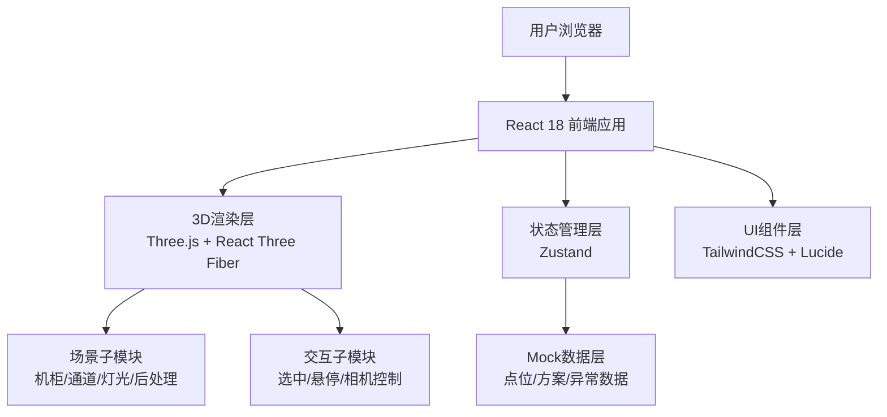
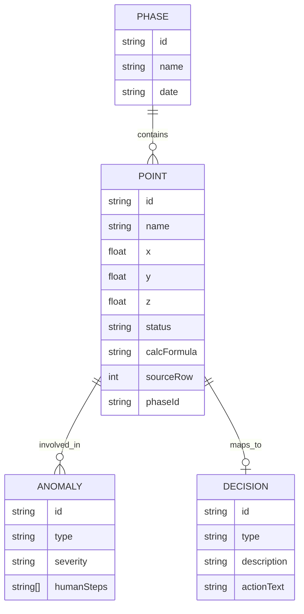

## 1. 架构设计



## 2. 技术说明

- **前端框架**：React@18 + TypeScript@5 + Vite@5
- **初始化工具**：vite-init（react-ts 模板）
- **3D渲染**：three@0.160 + @react-three/fiber@8.15 + @react-three/drei@9.92 + @react-three/postprocessing@2.15
- **样式方案**：tailwindcss@3.4
- **状态管理**：zustand@4.4
- **图标库**：lucide-react@0.294
- **后端**：无（纯前端，内置Mock数据）
- **数据库**：无（本地Mock数据）

## 3. 路由定义

| 路由 | 用途 |
|------|------|
| / | 主工作台（唯一页面，单页应用） |

## 4. API定义

无后端API，所有数据通过本地TypeScript模块提供Mock：

```typescript
// 点位坐标数据
interface PointData {
  id: string;
  name: string;
  x: number;
  y: number;
  z: number;
  status: 'normal' | 'overlap' | 'bad_data' | 'missing' | 'late';
  calcFormula: string;
  sourceRow: number;
  sourceFile: string;
  attachments: string[];
  phaseId: string;
}

// 方案阶段
interface PhaseData {
  id: string;
  name: string;
  date: string;
  description: string;
}

// 异常检测结果
interface AnomalyResult {
  type: 'overlap' | 'bad_data';
  pointIds: string[];
  severity: 'warning' | 'error';
  humanSteps: string[];
}

// 决策建议
interface DecisionItem {
  id: string;
  type: 'supply' | 'release' | 'pending';
  pointId: string;
  description: string;
  actionText: string;
}
```

## 5. 数据模型

### 5.1 数据模型定义



### 5.2 Mock数据结构

项目内置以下Mock数据：
- 3个方案阶段（初版/复核版/终版）
- 48个点位坐标（含8个异常：3个对象重叠、2个坏数据、2个缺失附件、1个晚到附件）
- 异常检测结果及人可读处理步骤
- 决策建议清单（12项补料/24项放行/12项待处理）
