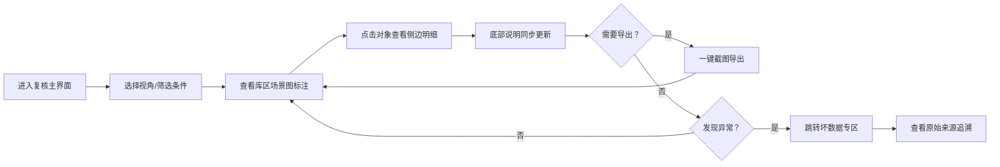

## 1. 产品概述

码头危险品库空间复核系统，用于对码头危险品仓库的空间使用情况进行评审复核。解决评审批注手工核对效率低、异常数据易混入正常结果、多视角导出时数据表述不一致等问题。

- 目标用户：评审助理（如阿乔）、复核负责人
- 核心价值：坏数据自动识别隔离、三套表述数据同源、原始痕迹完整保留

## 2. 核心功能

### 2.1 用户角色

| 角色 | 说明 | 核心权限 |
|------|------|----------|
| 评审助理 | 日常复核操作、导出截图 | 查看数据、切换视角、筛选、导出 |
| 复核负责人 | 审查异常数据、最终确认 | 查看坏数据专区、查看原始来源、审批 |

### 2.2 功能模块

1. **复核主界面**：库区场景图标注 + 侧边明细说明 + 底部截图说明，三套数据同源
2. **视角切换**：按库区 / 按危险品等级 / 按时间轴 三种视角
3. **筛选过滤**：按状态、时间、危险品类别筛选
4. **坏数据专区**：时间轴缺段记录 + 评审批注不齐记录，单独拎出不混入正常结果
5. **原始来源追溯**：点击标注可查看评审批注原始行、具体对象，保留脏数据痕迹
6. **导出功能**：当前视角截图导出，标注/明细/说明三套话一致

### 2.3 页面详情

| 页面名称 | 模块名称 | 功能描述 |
|----------|----------|----------|
| 复核主页面 | 顶部工具栏 | 视角切换、筛选条件、导出按钮、坏数据入口 |
| 复核主页面 | 库区场景图 | 可视化库位布局，危险品标注悬浮提示 |
| 复核主页面 | 侧边明细面板 | 当前选中对象的详细信息、评审批注 |
| 复核主页面 | 底部截图说明区 | 导出时配套的文字说明，与场景标注一致 |
| 坏数据专区 | 时间轴缺段列表 | 缺失时间片段的记录，标注缺失时段 |
| 坏数据专区 | 评审批注异常列表 | 批注不齐、缺失的记录，展示原始行号 |
| 坏数据专区 | 原始来源查看器 | 展示评审批注原始文本，不做清洗 |

## 3. 核心流程

用户进入复核主界面 → 选择视角和筛选条件 → 查看库区场景图标注 → 点击对象查看侧边明细 → 底部同步更新说明文字 → 如需导出则一键截图（含标注+明细+说明） → 发现异常则跳转坏数据专区 → 查看原始来源追溯具体问题

## 4. 用户界面设计

### 4.1 设计风格

- **主色调**：深海蓝 #0F2A4A（工业码头感）+ 警示橙 #FF7A29（危险品标识）
- **辅助色**：钢铁灰 #4A5568、安全绿 #38A169、预警红 #E53E3E
- **按钮风格**：直角硬朗风格，1px 边框，hover 时轻微发光
- **字体**：标题用 B612 Mono（工业等宽感），正文用 Noto Sans SC
- **布局风格**：三栏式密集布局，左侧场景图为主，右侧明细面板，底部说明栏
- **视觉元素**：网格线背景、扫描线动效、数据面板边框带指示灯

### 4.2 页面设计概览

| 页面名称 | 模块名称 | UI 元素 |
|----------|----------|---------|
| 复核主页面 | 顶部工具栏 | 视角切换标签页、筛选下拉、导出按钮（带导出图标）、坏数据角标 |
| 复核主页面 | 库区场景图 | 等距视角库区布局图，危险品库位高亮闪烁，悬浮显示标注卡 |
| 复核主页面 | 侧边明细面板 | 分块信息卡：基本信息、空间数据、评审批注、原始来源 |
| 复核主页面 | 底部说明栏 | 自动生成的截图说明文字，与标注同源 |
| 坏数据专区 | 异常列表 | 带状态标签的列表项，红/橙区分严重程度，可展开查看详情 |
| 坏数据专区 | 原始查看器 | 等宽字体展示原始文本，问题行高亮标记 |

### 4.3 响应式

- 桌面端优先设计（1440px+），适配双屏工作场景
- 平板端折叠侧边栏为抽屉式
- 移动端仅支持列表查看，不支持场景图操作

### 4.4 动效与交互

- 场景图标注：呼吸灯动效，异常数据红色脉冲
- 视角切换：平滑过渡动画，带扫描线横扫效果
- 坏数据角标：数字抖动提示（新异常时）
- 悬浮卡片：轻微上浮 + 阴影加深
- 导出时：全屏闪白一下模拟拍照效果
