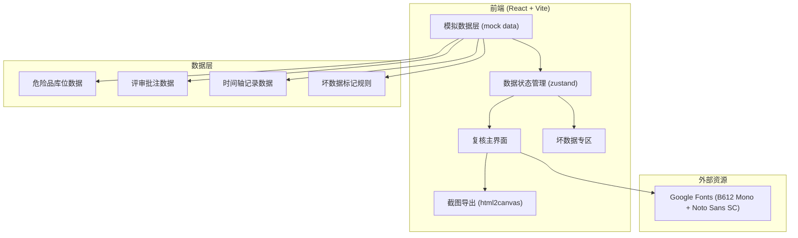
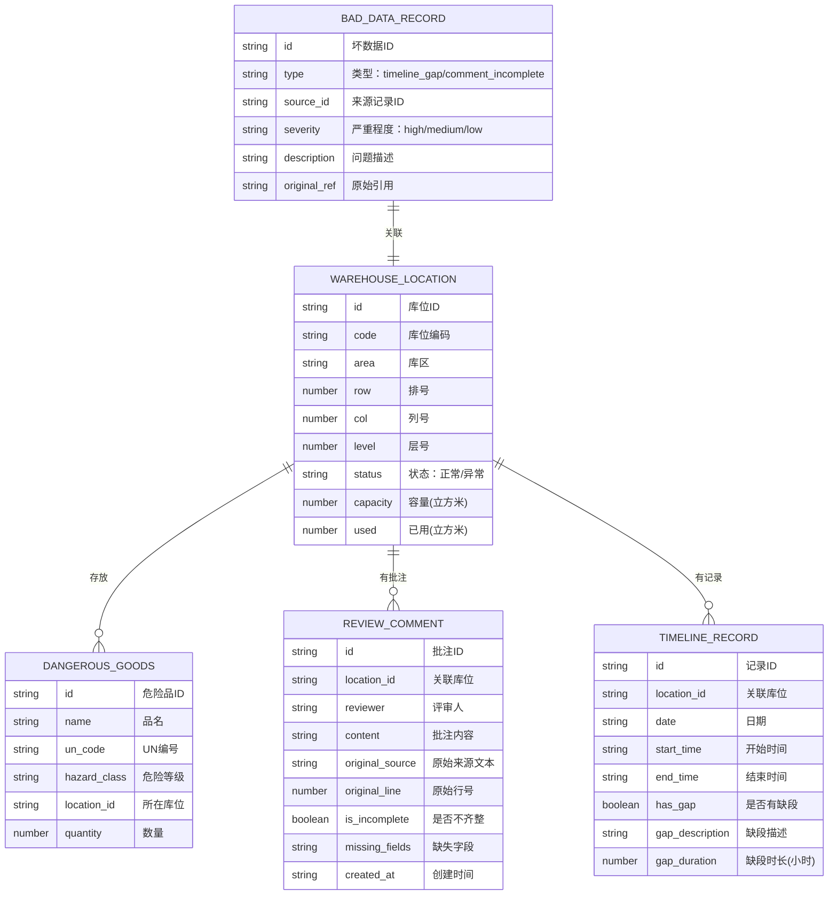

## 1. 架构设计



## 2. 技术描述

- **前端框架**：React@18 + TypeScript + Vite
- **样式方案**：tailwindcss@3 + CSS Variables
- **状态管理**：zustand（轻量级，适合数据复核场景）
- **截图导出**：html2canvas
- **图标**：lucide-react
- **数据来源**：纯前端模拟数据（Mock Data），包含正常数据 + 坏数据样本
- **初始化工具**：vite-init

## 3. 路由定义

| 路由 | 页面 | 用途 |
|------|------|------|
| / | 复核主页面 | 库区场景图 + 侧边明细 + 底部说明 |
| /bad-data | 坏数据专区 | 时间轴缺段 + 评审批注异常列表 |

## 4. 数据模型

### 4.1 数据模型定义



### 4.2 核心 Store 结构

```typescript
// zustand store
interface ReviewStore {
  // 数据
  locations: WarehouseLocation[]
  comments: ReviewComment[]
  timelineRecords: TimelineRecord[]
  badData: BadDataRecord[]
  
  // 当前状态
  selectedLocationId: string | null
  currentView: 'byArea' | 'byHazard' | 'byTimeline'
  filters: {
    area?: string
    hazardClass?: string
    status?: string
    date?: string
  }
  
  // 计算属性
  filteredLocations: WarehouseLocation[]
  selectedLocation: WarehouseLocation | null
  selectedLocationComments: ReviewComment[]
  selectedLocationTimeline: TimelineRecord[]
  locationAnnotation: string  // 场景标注文字
  sideDetail: string          // 侧边说明文字
  screenshotCaption: string   // 截图说明文字
  
  // 操作
  selectLocation: (id: string) => void
  setView: (view: ViewType) => void
  setFilter: (key: string, value: any) => void
  exportScreenshot: () => void
}
```

### 4.3 三套话同源机制

场景标注、侧边说明、截图说明三套文字都从同一份数据（selectedLocation + comments + timelineRecords）通过统一的格式化函数生成，确保表述一致：

```typescript
function generateDescription(location, comments, timeline, type) {
  // 统一数据源，按 type 输出不同详略程度的文字
  // type: 'annotation' | 'sideDetail' | 'screenshotCaption'
}
```

## 5. 坏数据识别规则

### 5.1 时间轴缺段识别
- 同一库位一天内记录不连续，时间间隔 > 1 小时判定为缺段
- 缺段时长 > 4 小时标记为 high 严重程度
- 缺段时长 1-4 小时标记为 medium 严重程度

### 5.2 评审批注不齐识别
- 批注内容缺失关键字段（如：评审人、时间、结论）
- 原始行号不连续
- 批注内容为空或过短（< 5 字）

### 5.3 坏数据隔离原则
- 正常列表中不显示坏数据，仅在坏数据专区展示
- 保留原始数据完整，不做清洗修复
- 每条坏数据都关联原始来源引用
