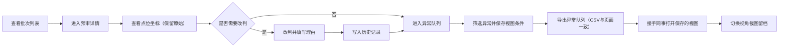

## 1. 产品概述

码头危险品库碰撞预审系统，用于对码头危险品仓库的三维模型点位坐标进行碰撞检测预审核，识别异常对象（如重叠、越界、坐标缺失），辅助方案经理从人工兜底转向系统化管理。目标用户为方案经理小赵及接手同事，核心价值在于保留原始脏数据痕迹、异常对象快速定位、视图条件可复现、导出数据与页面状态一致。

## 2. 核心功能

### 2.1 用户角色
| 角色 | 说明 | 核心权限 |
|------|------|----------|
| 方案经理 | 日常预审操作人 | 查看列表/详情、改判、导出异常队列、保存视图条件 |
| 接手同事 | 后续复核人员 | 查找异常对象、切换视图截图、查看历史改判 |

### 2.2 功能模块
1. **碰撞预审列表页**：所有预审批次总览，状态筛选，异常数量统计
2. **预审详情页**：点位坐标可视化（保留原始来源），碰撞/异常对象高亮，改判操作入口
3. **改判功能**：人工修正系统判定结果，填写改判理由，写入历史记录
4. **历史记录页**：展示改判历史，支持按批次/时间/操作人筛选
5. **异常队列页**：集中展示所有未处理异常，支持导出、视图条件保存与恢复
6. **现场材料数据包**：预置一批模拟真实现场的脏数据（含坐标缺失、格式异常、对象重叠案例）

### 2.3 页面详情
| 页面名称 | 模块名称 | 功能描述 |
|----------|----------|----------|
| 碰撞预审列表 | 批次卡片列表 | 展示批次编号、危险品库名称、检测时间、异常数量、状态（待审核/已改判/已完成） |
| 碰撞预审列表 | 筛选与搜索 | 按状态、时间范围、关键词搜索，异常数量排序 |
| 预审详情 | 点位坐标展示 | 保留原始坐标数据，不做自动清洗，异常数据以不同颜色标记 |
| 预审详情 | 原始来源标注 | 每个点位显示数据来源（如激光扫描/人工录入/系统导入）及原始值 |
| 预审详情 | 碰撞检测面板 | 列出所有系统判定的碰撞对、异常对象（重叠、越界、坐标缺失） |
| 预审详情 | 改判操作 | 对单条判定进行改判（确认碰撞/排除误报/需复核），填写理由 |
| 历史记录 | 时间线列表 | 展示所有改判记录，含操作人、前后状态、理由、时间戳 |
| 异常队列 | 异常卡片网格 | 展示所有待处理异常，含异常类型、所属批次、发现时间、当前状态 |
| 异常队列 | 视图条件保存 | 保存当前筛选/排序/视角参数，命名后可一键恢复 |
| 异常队列 | 导出功能 | CSV导出，导出文件内容与页面当前筛选状态完全一致 |

## 3. 核心流程

方案经理查看预审批次列表 → 进入详情页查看点位坐标与碰撞结果（原始数据保留） → 对存疑判定进行改判 → 改判写入历史 → 打开异常队列集中处理 → 筛选并保存视图条件 → 导出异常队列（文件与页面状态一致） → 接手同事打开保存的视图 → 切换视角截图留档

## 4. 用户界面设计

### 4.1 设计风格
- **主色调**：工业警示色系 — 深灰蓝（#1E293B）为底，警示橙（#F97316）标记异常，安全绿（#10B981）标记正常，强调码头危险品库区的严肃工业氛围
- **辅助色**：琥珀黄（#F59E0B）标记待复核，靛蓝（#6366F1）标记已改判
- **按钮风格**：直角方边，轻微内阴影，工业控制台风格；主按钮橙底白字，次按钮灰底深字
- **字体**：标题用 JetBrains Mono（等宽工业风），正文用 Noto Sans SC
- **布局风格**：顶部固定导航 + 左侧分栏（列表/详情切换）+ 右侧主内容区，采用卡片+分隔线的工业仪表盘布局
- **图标**：Lucide 图标库，线描风格，统一 16px/20px 尺寸

### 4.2 页面设计概览
| 页面名称 | 模块名称 | UI 元素 |
|----------|----------|---------|
| 预审列表 | 顶部统计栏 | 异常总数、待审核数、已改判数、完成率进度条，橙红配色突出警示 |
| 预审列表 | 批次卡片 | 左侧状态色块条 + 批次号 + 库名 + 时间 + 异常数徽章，hover 时轻微上浮 |
| 预审详情 | 坐标原始数据面板 | 等宽字体表格，异常行背景浅橙，原始值与修正值双列对比 |
| 预审详情 | 异常对象高亮面板 | 橙红边框卡片，异常类型标签，原始来源小字标注 |
| 预审详情 | 改判操作区 | 下拉选择改判结果 + 多行文本理由框 + 提交按钮，有字数统计 |
| 历史记录 | 时间线 | 左侧竖线时间轴，节点圆点，操作内容卡片，操作人头像 |
| 异常队列 | 卡片网格 | 4列网格布局，异常卡片含类型图标、批次信息、状态、操作按钮 |
| 异常队列 | 视图保存条 | 顶部固定条，显示当前视图名称，保存/切换下拉按钮 |
| 异常队列 | 导出按钮 | 右上角主按钮，点击显示导出中状态动画 |

### 4.3 响应式
桌面端优先（1440px 基准），支持 1280px~1920px 自适应；导航栏在 <1024px 时折叠为汉堡菜单。触摸屏下按钮最小 44px 触控区。

### 4.4 三维场景指引（点位坐标可视化）
- **环境**：深色工业背景，轻微网格地面，模拟仓库空间感
- **光照**：柔和顶光 + 前向补光，异常对象加红色轮廓光
- **相机**：默认正交视角，支持旋转/缩放/平移，可一键切换正视/侧视/俯视
- **交互**：点击异常对象弹出详情面板，视角切换带平滑过渡动画
- **性能**：点位数量控制在演示级别（100~300个），确保流畅渲染
