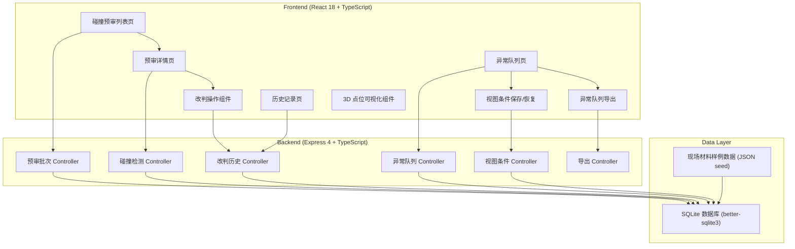
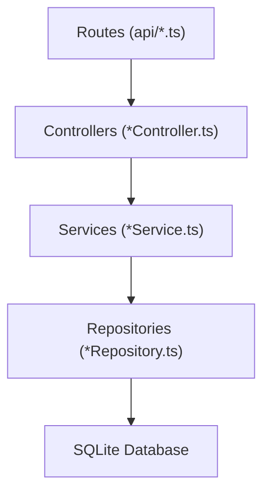
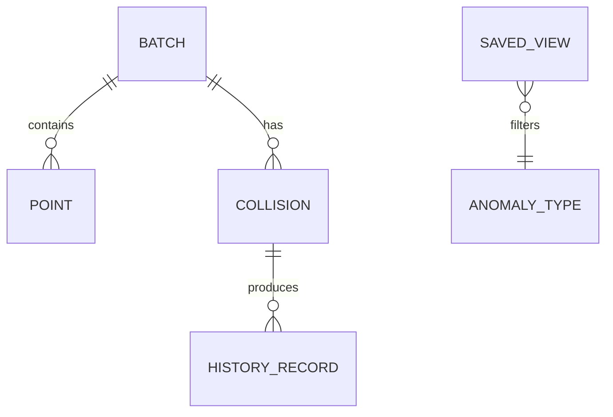

## 1. 架构设计



## 2. 技术说明

- **前端**：React@18 + TypeScript + Vite@5 + TailwindCSS@3 + Zustand + React Router@6 + Lucide React
- **后端**：Express@4 + TypeScript + better-sqlite3（同步SQLite，轻量无需额外服务）
- **数据库**：SQLite（文件存储，开箱即用，适合单机演示）
- **初始化工具**：vite-init（react-express-ts 模板）
- **3D 可视化**：使用 HTML Canvas + 等距投影模拟 3D 视角（避免引入 three.js 重型依赖，保持项目轻量可运行）

## 3. 路由定义

### 前端路由
| 路由 | 页面 | 用途 |
|------|------|------|
| / | 重定向到 /batches | 首页入口 |
| /batches | 碰撞预审列表页 | 批次总览、筛选、搜索 |
| /batches/:id | 预审详情页 | 点位坐标、碰撞结果、改判操作 |
| /history | 历史记录页 | 改判时间线、筛选 |
| /anomalies | 异常队列页 | 异常集中处理、视图保存、导出 |

### 后端 API 路由
| 方法 | 路由 | 用途 |
|------|------|------|
| GET | /api/batches | 获取预审批次列表 |
| GET | /api/batches/:id | 获取单个批次详情（含点位坐标、碰撞结果） |
| GET | /api/batches/:id/points | 获取批次的原始点位坐标（保留脏数据） |
| GET | /api/batches/:id/collisions | 获取批次碰撞检测结果 |
| POST | /api/collisions/:id/rejudge | 对碰撞/异常结果进行改判 |
| GET | /api/history | 获取改判历史记录 |
| GET | /api/anomalies | 获取异常队列（支持筛选参数） |
| POST | /api/views | 保存当前视图条件 |
| GET | /api/views | 获取已保存的视图条件列表 |
| GET | /api/views/:id | 恢复指定视图条件 |
| GET | /api/anomalies/export | 导出异常队列 CSV（与页面筛选状态一致） |

## 4. API 类型定义

```typescript
// 批次状态
type BatchStatus = 'pending' | 'rejudged' | 'completed';

// 异常类型
type AnomalyType = 'overlap' | 'out_of_bounds' | 'missing_coord' | 'format_error';

// 碰撞/异常判定结果
type CollisionStatus = 'confirmed' | 'false_positive' | 'needs_review';

// 点位坐标（保留原始值）
interface Point {
  id: string;
  batchId: string;
  objectName: string;
  source: 'laser_scan' | 'manual_entry' | 'system_import';
  rawX: string | null;  // 原始值，可能为非数字或空
  rawY: string | null;
  rawZ: string | null;
  parsedX: number | null;  // 解析后的值，解析失败为 null
  parsedY: number | null;
  parsedZ: number | null;
  isDirty: boolean;  // 是否为脏数据（原始值无法解析或缺失）
  createdAt: string;
}

// 碰撞检测结果
interface Collision {
  id: string;
  batchId: string;
  type: AnomalyType;
  objectA?: string;
  objectB?: string;  // 重叠类异常有两个对象
  pointId?: string;
  status: CollisionStatus;
  description: string;
  detectedAt: string;
  rejudgedBy?: string;
  rejudgedReason?: string;
  rejudgedAt?: string;
}

// 改判历史
interface HistoryRecord {
  id: string;
  collisionId: string;
  batchId: string;
  operator: string;
  oldStatus: CollisionStatus;
  newStatus: CollisionStatus;
  reason: string;
  createdAt: string;
}

// 视图条件
interface SavedView {
  id: string;
  name: string;
  anomalyTypes: AnomalyType[];
  statusFilter: CollisionStatus[];
  sortBy: string;
  sortOrder: 'asc' | 'desc';
  cameraAngle: 'front' | 'side' | 'top' | 'iso';
  createdBy: string;
  createdAt: string;
}

// 预审批次
interface Batch {
  id: string;
  batchNo: string;
  warehouseName: string;
  status: BatchStatus;
  totalPoints: number;
  anomalyCount: number;
  detectedAt: string;
}
```

## 5. 服务端架构分层



- **Routes**：定义 HTTP 路由与请求参数校验
- **Controllers**：处理请求上下文、组装响应
- **Services**：业务逻辑（碰撞检测、改判校验、导出组装）
- **Repositories**：数据库 CRUD 操作封装

## 6. 数据模型

### 6.1 ER 图


### 6.2 DDL 语句
```sql
-- 预审批次表
CREATE TABLE IF NOT EXISTS batches (
  id TEXT PRIMARY KEY,
  batch_no TEXT NOT NULL UNIQUE,
  warehouse_name TEXT NOT NULL,
  status TEXT NOT NULL DEFAULT 'pending',
  total_points INTEGER NOT NULL DEFAULT 0,
  anomaly_count INTEGER NOT NULL DEFAULT 0,
  detected_at TEXT NOT NULL
);

-- 点位坐标表（保留原始脏数据）
CREATE TABLE IF NOT EXISTS points (
  id TEXT PRIMARY KEY,
  batch_id TEXT NOT NULL,
  object_name TEXT NOT NULL,
  source TEXT NOT NULL,
  raw_x TEXT,
  raw_y TEXT,
  raw_z TEXT,
  parsed_x REAL,
  parsed_y REAL,
  parsed_z REAL,
  is_dirty INTEGER NOT NULL DEFAULT 0,
  created_at TEXT NOT NULL,
  FOREIGN KEY (batch_id) REFERENCES batches(id)
);

-- 碰撞/异常结果表
CREATE TABLE IF NOT EXISTS collisions (
  id TEXT PRIMARY KEY,
  batch_id TEXT NOT NULL,
  type TEXT NOT NULL,
  object_a TEXT,
  object_b TEXT,
  point_id TEXT,
  status TEXT NOT NULL DEFAULT 'needs_review',
  description TEXT NOT NULL,
  detected_at TEXT NOT NULL,
  rejudged_by TEXT,
  rejudged_reason TEXT,
  rejudged_at TEXT,
  FOREIGN KEY (batch_id) REFERENCES batches(id),
  FOREIGN KEY (point_id) REFERENCES points(id)
);

-- 改判历史表
CREATE TABLE IF NOT EXISTS history_records (
  id TEXT PRIMARY KEY,
  collision_id TEXT NOT NULL,
  batch_id TEXT NOT NULL,
  operator TEXT NOT NULL,
  old_status TEXT NOT NULL,
  new_status TEXT NOT NULL,
  reason TEXT NOT NULL,
  created_at TEXT NOT NULL,
  FOREIGN KEY (collision_id) REFERENCES collisions(id),
  FOREIGN KEY (batch_id) REFERENCES batches(id)
);

-- 已保存视图条件表
CREATE TABLE IF NOT EXISTS saved_views (
  id TEXT PRIMARY KEY,
  name TEXT NOT NULL,
  anomaly_types TEXT NOT NULL,
  status_filter TEXT NOT NULL,
  sort_by TEXT NOT NULL,
  sort_order TEXT NOT NULL,
  camera_angle TEXT NOT NULL,
  created_by TEXT NOT NULL,
  created_at TEXT NOT NULL
);

-- 索引
CREATE INDEX IF NOT EXISTS idx_points_batch_id ON points(batch_id);
CREATE INDEX IF NOT EXISTS idx_collisions_batch_id ON collisions(batch_id);
CREATE INDEX IF NOT EXISTS idx_collisions_status ON collisions(status);
CREATE INDEX IF NOT EXISTS idx_history_batch_id ON history_records(batch_id);
CREATE INDEX IF NOT EXISTS idx_history_created_at ON history_records(created_at DESC);
```

### 6.3 初始种子数据
现场材料样例数据包包含：
- 3 个预审批次（分别对应不同危险品库）
- 150+ 个点位坐标，其中故意混入：
  - 坐标缺失（raw 字段为空字符串）
  - 格式异常（raw 字段为 "N/A"、"--"、非数字文本）
  - 越界坐标（超出仓库边界）
  - 至少 1 组对象重叠案例（两个化学品桶坐标完全相同）
- 已保存的 2 个视图条件（"小赵常用视图"、"重叠异常优先"）
