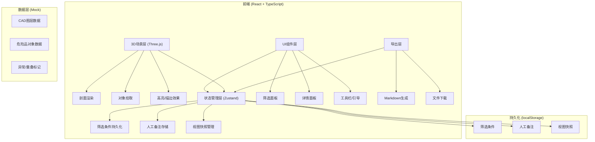
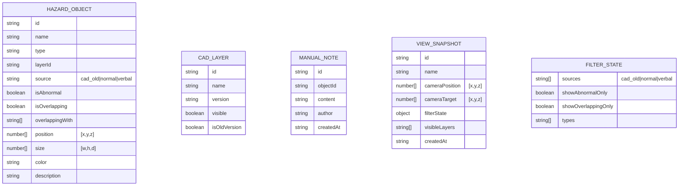

## 1. 架构设计



## 2. 技术描述
- **前端框架**：React@18 + TypeScript@5 + Vite@5
- **状态管理**：Zustand@4 + persist 中间件（localStorage 持久化）
- **3D引擎**：Three@0.160 + @react-three/fiber@8 + @react-three/drei@9 + @react-three/postprocessing@2
- **样式方案**：TailwindCSS@3
- **图标库**：lucide-react@0.309
- **路由**：react-router-dom@6（单页面，/ 为主路由）
- **初始化工具**：vite-init（react-ts 模板）
- **后端**：无，全部使用内置 Mock 数据

## 3. 路由定义
| 路由 | 用途 |
|------|------|
| / | 码头危险品库剖面讲解主页（唯一页面） |

## 4. 数据模型

### 4.1 数据模型定义



### 4.2 TypeScript 类型定义

```typescript
export type DataSource = 'cad_old' | 'normal' | 'verbal';

export interface HazardObject {
  id: string;
  name: string;
  type: 'tank' | 'pipe' | 'valve' | 'storage';
  layerId: string;
  source: DataSource;
  isAbnormal: boolean;
  isOverlapping: boolean;
  overlappingWith: string[];
  position: [number, number, number];
  size: [number, number, number];
  color: string;
  description: string;
}

export interface CadLayer {
  id: string;
  name: string;
  version: string;
  visible: boolean;
  isOldVersion: boolean;
}

export interface ManualNote {
  id: string;
  objectId: string;
  content: string;
  author: string;
  createdAt: string;
}

export interface ViewSnapshot {
  id: string;
  name: string;
  cameraPosition: [number, number, number];
  cameraTarget: [number, number, number];
  filterState: FilterState;
  visibleLayers: string[];
  createdAt: string;
}

export interface FilterState {
  sources: DataSource[];
  showAbnormalOnly: boolean;
  showOverlappingOnly: boolean;
  types: HazardObject['type'][];
}
```

## 5. 项目结构

```
src/
├── components/
│   ├── Scene3D/           # Three.js 3D场景
│   │   ├── index.tsx
│   │   ├── HazardMesh.tsx
│   │   └── SectionPlane.tsx
│   ├── FilterPanel/       # 左侧筛选面板
│   │   ├── index.tsx
│   │   ├── SourceFilter.tsx
│   │   └── LayerToggle.tsx
│   ├── DetailPanel/       # 右侧详情面板
│   │   ├── index.tsx
│   │   ├── ObjectInfo.tsx
│   │   ├── NoteEditor.tsx
│   │   └── SnapshotList.tsx
│   ├── Toolbar/           # 顶部工具栏
│   │   └── index.tsx
│   ├── GuideBar/          # 底部引导条
│   │   └── index.tsx
│   └── OverlapList/       # 重叠对象独立列表
│       └── index.tsx
├── store/                 # Zustand 状态
│   ├── useAppStore.ts
│   └── persist.ts
├── data/                  # Mock 数据
│   ├── layers.ts
│   ├── objects.ts
│   └── notes.ts
├── types/                 # 类型定义
│   └── index.ts
├── utils/                 # 工具函数
│   ├── markdown.ts
│   ├── overlap.ts
│   └── export.ts
├── App.tsx
├── main.tsx
└── index.css
```
