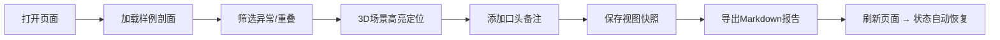

## 1. 产品概述
码头危险品库剖面讲解系统，面向现场调度和接手同事，解决 CAD 图层人工核验效率低、异常对象难发现、筛选/备注/报告不同步的问题。
- 核心目的：快速定位异常对象、区分数据来源（CAD旧版/正常记录/口头备注）、保留视图上下文、一键导出一致报告
- 目标用户：现场调度阿宁（快速浏览）、接手同事（深度核查）

## 2. 核心功能

### 2.1 用户角色
| 角色 | 使用场景 | 核心诉求 |
|------|----------|----------|
| 现场调度阿宁 | 接班快速查看 | 三样东西：样例在哪、异常在哪、结果怎么导出 |
| 接手同事 | 深度核验剖面 | 异常优先、重叠对象单独拎出、视图条件可保存、报告与页面一致 |

### 2.2 功能模块
1. **3D剖面视图**：Three.js 渲染码头危险品库剖面，支持 CAD 图层显隐切换、视角旋转缩放
2. **筛选面板**：按数据来源（CAD旧版/正常记录/口头备注）、异常状态、对象类型过滤，刷新后状态保留
3. **人工备注**：支持对对象追加口头备注，与筛选条件、视图状态联动同步
4. **异常与重叠检测**：异常对象高亮优先展示，重叠对象单独拎出列表，不混入正常结果
5. **视图快照**：保存当前视角、图层显隐、筛选条件，支持一键恢复
6. **Markdown 报告导出**：页面当前状态（筛选结果、异常、备注、视图）与导出文件完全一致
7. **快速操作引导**：简洁三点说明，不写大段文字

### 2.3 页面详情
| 页面名称 | 模块名称 | 功能描述 |
|----------|----------|----------|
| 剖面讲解主页 | 3D场景区 | Three.js渲染剖面，异常对象红色高亮，重叠对象闪烁边框 |
| 剖面讲解主页 | 左侧筛选面板 | 图层显隐、数据来源筛选、异常开关、重叠开关，状态持久化 |
| 剖面讲解主页 | 右侧信息面板 | 选中对象详情、人工备注输入、异常标签、视图快照保存/恢复 |
| 剖面讲解主页 | 底部状态栏 | 快速操作引导：样例位置、异常位置、导出方式 |
| 剖面讲解主页 | 顶部工具栏 | 导出 Markdown、重置视图、切换剖面切片 |

## 3. 核心流程

用户打开页面 → 默认加载样例剖面 → 左侧筛选定位异常/重叠对象 → 3D场景高亮跳转 → 右侧添加口头备注 → 保存视图快照 → 导出 Markdown 报告 → 刷新页面后筛选/备注/快照自动恢复

## 4. 用户界面设计

### 4.1 设计风格
- **主色调**：工业深蓝 `#0f172a` 为底，警示橙 `#f97316` 标记异常，安全绿 `#10b981` 标记正常，重叠黄 `#eab308` 闪烁提示
- **按钮风格**：直角切边工业风，2px 实线边框，hover 时背景色填充
- **字体**：标题用 "JetBrains Mono" 等宽工业感字体，正文用 "Noto Sans SC" 中文黑体
- **布局**：三栏工业仪表盘布局，固定顶栏 + 左侧筛选 + 中央3D + 右侧详情 + 底部引导条
- **图标风格**：Lucide 线性图标，异常/告警用实心图标强化视觉冲击

### 4.2 页面设计概览
| 页面名称 | 模块名称 | UI元素 |
|----------|----------|--------|
| 剖面讲解主页 | 3D场景区 | 深蓝色渐变背景 + 网格线，异常红色发光边框，重叠黄色脉冲动画，悬浮显示对象标签 |
| 剖面讲解主页 | 筛选面板 | 深色卡片，分组折叠，开关式筛选器，选中项带左侧彩色指示条 |
| 剖面讲解主页 | 详情面板 | 标签页切换（详情/备注/快照），备注输入框带来源标记，快照卡片带缩略图 |
| 剖面讲解主页 | 底部引导 | 半透明黑底，三个圆点编号 + 短句，右侧"我知道了"关闭按钮 |
| 剖面讲解主页 | 顶部工具栏 | 品牌Logo左侧，操作按钮右侧（导出/重置/剖面切换），按钮带快捷键提示 |

### 4.3 响应性
桌面端优先设计，最小支持宽度 1280px。3D场景自适应拉伸，侧栏固定宽度 320px，底部引导固定高度 56px。

### 4.4 3D场景指引
- **环境**：深蓝工业背景，雾效 `FogExp2` 渐远渐隐，网格地面增加纵深感
- **光照**：`DirectionalLight` 主光 + `AmbientLight` 补光，异常对象额外叠加 `PointLight` 红光
- **相机**：`PerspectiveCamera` 初始 45° 俯视角，`OrbitControls` 限制在剖面范围内
- **构图**：剖面切片居中，危险品罐体沿纵深排列，异常对象放在视觉焦点区
- **交互**：点击对象触发高亮脉冲 + 右侧详情联动，hover 显示悬浮标签，滚轮缩放
- **后期**：轻微 `Bloom` 让异常发光更柔和，`Outline` 效果描边选中对象
