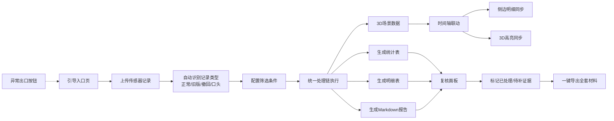

## 1. 产品概述

码头危险品库方案比选评审工作台，解决评审助理从杂乱传感器记录中梳理方案比选结论的全链路痛点。通过统一的数据处理链，从原始记录同时产出筛选条件、统计数字、明细表与Markdown报告，并以3D空间可视化辅助现场同事理解二维表缺乏的空间关系。

- **目标用户**：评审助理（阿乔）、现场采集同事、复核人、非技术试用者
- **核心价值**：一套输入产四份输出、旧版/撤回/口头记录自动分流溯源、时间轴驱动3D与明细同步、复核状态一目了然、入口出口自解释

---

## 2. 核心功能

### 2.1 用户角色

| 角色 | 进入方式 | 核心权限 |
|------|----------|----------|
| 评审助理 | 材料入口进入 | 上传记录、配置筛选、生成全套输出、标注影响来源 |
| 现场同事 | 分享链接 | 查看3D场景与时间轴联动、理解空间关系 |
| 复核人 | 复核入口 | 标记已处理/待补证据、导出复核清单 |
| 试用者 | 引导页进入 | 引导式浏览、异常出口提示、快速理解全貌 |

### 2.2 功能模块

1. **材料入口引导页**：流程说明卡、上传入口、异常出口提示
2. **数据处理链工作台**：原始记录列表、筛选条件面板、清洗规则预览、处理进度
3. **3D码头场景主视图**：危险品库候选址三维标注、分区高亮、距离测量
4. **时间轴联动面板**：分段时间轴、侧边明细同步、3D高亮联动
5. **溯源分流视图**：旧版/撤回/口头记录分类卡片、影响范围标注、来源行追踪
6. **统一结果输出区**：统计表、明细表、Markdown报告预览与导出
7. **复核状态面板**：已处理/待补证据两栏、证据缺口清单、复核进度条

### 2.3 页面详情

| 页面名称 | 模块名称 | 功能描述 |
|----------|----------|----------|
| 引导入口页 | 流程说明卡 | 四步流程图：上传→清洗→比选→输出，异常出口悬浮按钮常驻 |
| 引导入口页 | 材料上传区 | 拖拽上传传感器记录CSV/Excel，支持口头备注文本框 |
| 数据工作台 | 原始记录列表 | 全部记录表格，颜色标记：正常/旧版/撤回/口头 |
| 数据工作台 | 筛选条件面板 | 时间范围、库区、风险等级、记录类型多选，条件即时生效 |
| 数据工作台 | 溯源分流区 | 三类异常记录卡片组，点击展开影响的结论行 |
| 3D场景页 | 三维主视图 | 码头地形+三个候选库址方案，点击切换方案高亮 |
| 3D场景页 | 时间轴组件 | 底部横向分段时间轴，拖拽滑块切换时间片段 |
| 3D场景页 | 侧边明细栏 | 与当前时间轴片段同步的传感器明细表 |
| 结果输出页 | 统计表卡 | 风险指标、成本、距离等核心指标对比表 |
| 结果输出页 | 明细表卡 | 带来源行号的完整明细表，支持按条件过滤 |
| 结果输出页 | Markdown报告卡 | 实时渲染报告，含影响溯源脚注 |
| 复核面板 | 状态总览栏 | 已处理/待补证据计数与进度条 |
| 复核面板 | 待补证据列表 | 每条缺口标注所需证据类型、关联记录ID |

---

## 3. 核心流程

评审助理从引导页进入，上传传感器记录（含旧版、撤回、口头备注混合数据）→ 系统自动识别记录类型并分流 → 配置筛选条件后统一处理链产出统计表、明细表、Markdown报告 → 在3D场景中通过时间轴联动查看各方案的空间与明细 → 复核人切换到复核面板标记处理状态 → 复核完成后全套材料可一键导出。异常出口在任意阶段可点击返回引导页或查看问题诊断。

---

## 4. 用户界面设计

### 4.1 设计风格

- **主色**：深海蓝 `#0A2540`（工业/安全氛围），辅色：警示橙 `#FF6B35`（异常标记）、通过绿 `#2EC4B6`（已处理）、提醒黄 `#FFD166`（待补证据）
- **按钮风格**：方角微圆角（3px），2px描边，悬停时内阴影+轻微位移，主按钮深海蓝填充白字，次按钮白底深蓝字
- **字体**：标题用 `Noto Serif SC`（专业评审感），正文用 `JetBrains Mono`（表格数据可读性），辅助文字用 `Noto Sans SC`
- **布局风格**：左右分栏主结构（左面板+右3D/内容区），卡片式分组，细密网格线背景增强工程感
- **图标/emoji风格**：线性图标（Feather Icons风格），异常标记用实心警示三角，状态用彩色圆点

### 4.2 页面设计总览

| 页面名称 | 模块名称 | UI元素 |
|----------|----------|----------|
| 引导入口页 | 流程说明卡 | 大编号1-4步骤卡，对角线排列，悬停时卡片上浮+阴影加深，深海蓝渐变边框 |
| 引导入口页 | 材料上传区 | 虚线描边拖放区，中心大图标+提示文字，上传后显示文件芯片+进度条 |
| 数据工作台 | 原始记录列表 | 斑马纹表格，行首状态色点，旧版记录加删除线，撤回记录灰底，口头记录右对齐引号标识 |
| 数据工作台 | 筛选条件面板 | 左侧固定抽屉式，分组折叠，条件变更时0.3s过渡刷新数据 |
| 3D场景页 | 三维主视图 | 顶部半透明工具条（方案切换/测量/截图），底部时间轴，右侧滑出明细栏 |
| 3D场景页 | 时间轴组件 | 多段色带（正常/异常区间），滑块带磁吸，当前段高亮发光 |
| 结果输出页 | 三栏输出卡 | 等高卡片组，顶部Tab切换方案，每张卡右上角导出按钮 |
| 复核面板 | 状态总览栏 | 两个大号数字卡（已处理绿/待补橙），下方横向渐变进度条 |
| 全页面 | 异常出口 | 右上角固定圆形警示橙按钮，悬停展开"返回引导/查看诊断/联系支持" |

### 4.3 响应式

- 桌面优先设计（≥1440px最优），三栏布局：左筛选+中3D+右明细
- 平板（768-1439px）：上下结构，上半3D下半面板，筛选抽屉改为顶部折叠条
- 移动（<768px）：单栏流式，3D场景固定最小高度400px，时间轴改为横向滚动
- 触摸优化：滑块加大触控区，卡片点击区域≥44px，双指缩放3D场景

### 4.4 3D场景指引

- **环境/HDRI与氛围**：黄昏港口HDRI，暖金色夕阳+冷蓝色海面反射，薄雾增加纵深，整体安全评估的严肃但不压抑氛围
- **光照设置**：主光方向Key Light（45°侧上方模拟夕阳），补光Fill Light（冷蓝海面反射），轮廓光Rim Light（码头边缘LED灯带发光），库区方案灯光明亮度区分
- **相机设置与运动**：初始等距视角俯瞰全码头，点击方案后相机平滑飞行到该方案正上方45°，时间轴切换时相机轻微推进/拉远呼应时间远近
- **构图与焦点元素**：三个候选危险品库以不同颜色半透明立方体+发光轮廓表示，周围50m安全距离以线框球体可视化，码头起重机/集装箱作为比例尺参照物
- **交互与动画**：鼠标悬停库区显示悬浮信息卡（面积/风险等级/距码头距离），点击方案时立方体发光脉冲，时间轴拖动时库区颜色亮度随风险值变化
- **后处理效果**：Bloom发光（库区轮廓、警示区域），SSAO环境光遮蔽增强立体感，轻微色差模拟工程图纸质感
- **资产来源与性能预算**：码头地形程序化生成（three.js PlaneGeometry + noise），集装箱/起重机用基础几何体组合，总面数控制在5万以内，draw call < 50
