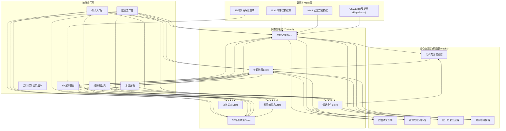
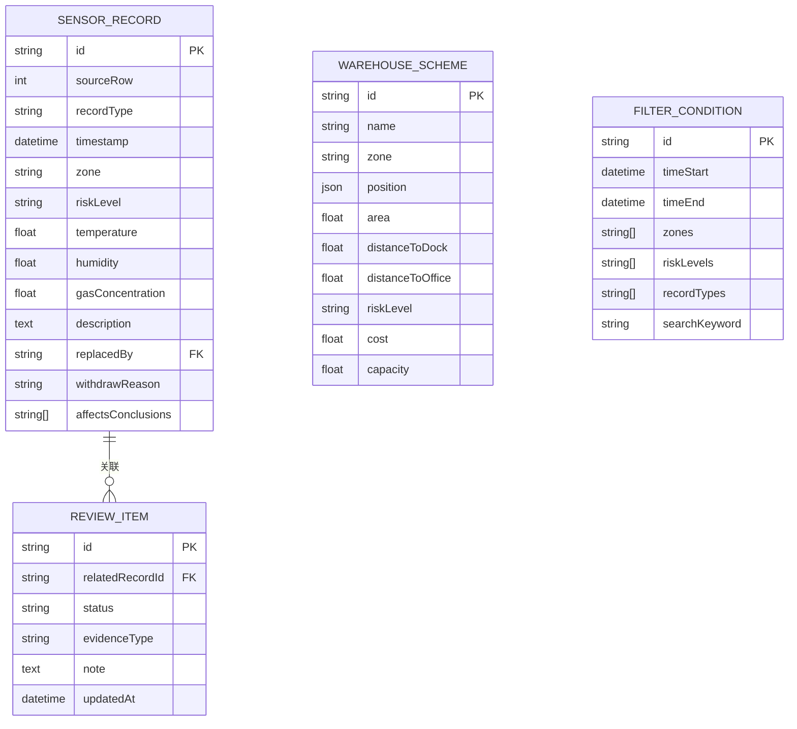

## 1. 架构设计



## 2. 技术说明

- **前端框架**：React@18 + TypeScript@5 + Vite@5
- **样式方案**：TailwindCSS@3 + CSS变量主题系统
- **3D渲染**：Three@0.160 + @react-three/fiber@8 + @react-three/drei@9 + @react-three/postprocessing@2
- **状态管理**：Zustand@4（轻量跨组件状态共享）
- **路由**：React Router@6（Hash路由，支持静态部署）
- **文件解析**：PapaParse@5（CSV）、xlsx@0.18（Excel）
- **Markdown渲染**：react-markdown@9 + remark-gfm@4
- **图表/表格**：自定义CSS表格工程风样式
- **初始化工具**：Vite官方模板 `npm create vite@latest -- --template react-ts`
- **后端**：无后端，全前端Mock数据驱动
- **数据库**：无数据库，数据存储于浏览器内存 + LocalStorage持久化复核状态

## 3. 路由定义

| 路由 | 页面 | 核心功能 |
|------|------|----------|
| `/` | 引导入口页 | 流程说明、材料上传、角色快速入口 |
| `/workbench` | 数据工作台 | 原始记录列表、筛选条件、溯源分流视图 |
| `/scenario` | 3D场景视图 | 码头3D可视化、时间轴联动、侧边明细栏 |
| `/output` | 结果输出页 | 统计表、明细表、Markdown报告三合一输出 |
| `/review` | 复核面板 | 已处理/待补证据状态管理、证据缺口清单 |

## 4. API定义（无后端，纯前端Mock接口封装）

```typescript
// 传感器记录类型
type RecordType = 'normal' | 'old_version' | 'withdrawn' | 'verbal';
type RiskLevel = 'low' | 'medium' | 'high' | 'critical';
type WarehouseZone = 'A' | 'B' | 'C';

interface SensorRecord {
  id: string;
  sourceRow: number;           // 来源行号（溯源用）
  recordType: RecordType;
  timestamp: string;           // ISO时间
  zone: WarehouseZone;
  riskLevel: RiskLevel;
  temperature?: number;
  humidity?: number;
  gasConcentration?: number;
  description: string;
  // 溯源关联
  replacedBy?: string;         // 旧版被哪条新记录替代
  withdrawReason?: string;     // 撤回原因
  affectsConclusions: string[]; // 影响的结论ID列表
}

interface WarehouseScheme {
  id: string;
  name: string;
  zone: WarehouseZone;
  position: { x: number; y: number; z: number }; // 3D坐标（米）
  area: number;               // 面积㎡
  distanceToDock: number;     // 距码头米
  distanceToOffice: number;   // 距办公区米
  riskLevel: RiskLevel;
  cost: number;               // 造价万元
  capacity: number;           // 容量吨
}

interface ReviewItem {
  id: string;
  relatedRecordId: string;
  status: 'processed' | 'evidence_needed';
  evidenceType?: string;
  note?: string;
  updatedAt: string;
}

interface UnifiedResult {
  statistics: {
    totalRecords: number;
    byType: Record<RecordType, number>;
    byRiskLevel: Record<RiskLevel, number>;
    byZone: Record<WarehouseZone, number>;
    schemeComparison: Array<{
      schemeId: string;
      schemeName: string;
      indicators: Record<string, number | string>;
    }>;
  };
  detailTable: SensorRecord[];
  markdownReport: string;
  traceMap: Record<string, { affectedConclusionIds: string[]; sourceRows: number[] }>;
}
```

## 5. 服务器架构图（无后端，略）

纯前端应用，无服务器层。所有数据处理在浏览器端完成。

## 6. 数据模型

### 6.1 数据模型定义



### 6.2 数据定义语言（LocalStorage Schema & Mock初始化）

```typescript
// LocalStorage 键名
const LS_KEYS = {
  RAW_RECORDS: 'dwh_raw_records',
  REVIEW_ITEMS: 'dwh_review_items',
  FILTER_PRESET: 'dwh_filter_preset',
} as const;

// Mock 初始化数据（内置一套完整的码头危险品库比选数据）
// 包含：
// - 120条传感器记录（含8条旧版、5条撤回、12条口头备注）
// - 3个候选库区方案 A/B/C
// - 预关联影响结论ID与来源行号
```
