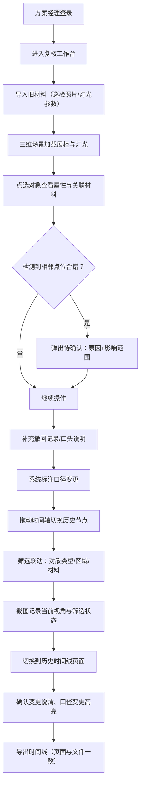

## 1. 产品概述

"博物馆展柜灯光空间复核"是一款面向博物馆展陈方案经理的 Web3D 复核工具。核心解决的问题是：当巡检照片、撤回记录和口头说明等碎片化材料涌入时，方案经理能在一个三维空间中联动点选对象、切换时间轴、筛选与追溯历史变化，从而准确判断灯光空间是否合规，并清晰识别哪份材料后来改过口径。

- 目标用户：博物馆展陈方案经理（如小赵），以及参与评审的团队
- 核心价值：将碎片化复核材料结构化，让三维场景、时间线和材料口径变更形成闭环，避免"看照片能拼出主线、视角却复原不了"的困局

## 2. 核心功能

### 2.1 用户角色

| 角色 | 进入方式 | 核心权限 |
|------|----------|----------|
| 方案经理 | 账号登录 | 导入材料、点选对象、切换时间轴、筛选、标记待确认、导出历史时间线 |
| 评审成员 | 账号登录 | 查看三维场景、截图回溯对象来源、浏览历史时间线、导出 |

### 2.2 功能模块

1. **复核工作台页面**：三维展柜场景、点选交互、对象属性面板、材料面板、时间轴控件、筛选联动
2. **历史时间线页面**：完整变更时间线、口径变更高亮、待确认事项、导出功能

### 2.3 页面详情

| 页面名称 | 模块名称 | 功能描述 |
|----------|----------|----------|
| 复核工作台 | 三维展柜场景 | Web3D 渲染博物馆展柜与灯光，支持旋转/缩放/平移，保存与复原视角 |
| 复核工作台 | 点选交互 | 点击展柜内对象高亮选中，右侧属性面板联动显示灯光参数、关联材料 |
| 复核工作台 | 对象属性面板 | 显示选中对象的灯光参数、关联巡检照片、撤回记录、口头说明；标记口径变更 |
| 复核工作台 | 材料面板 | 列出所有关联材料（巡检照片、撤回记录、口头说明），标注修改时间和口径变更状态 |
| 复核工作台 | 时间轴控件 | 横向时间轴，拖动切换日期，场景自动还原对应时间点的灯光状态和对象配置 |
| 复核工作台 | 筛选联动 | 按对象类型/区域/材料类型筛选，筛选结果同步影响三维场景高亮和时间轴标记 |
| 复核工作台 | 待确认提示 | 当检测到相邻点位合错时，弹出待确认原因和影响范围，不自动关闭 |
| 复核工作台 | 截图回溯 | 截图时记录当前视角、选中对象、筛选状态；从截图可一键回到当时的完整上下文 |
| 历史时间线 | 变更时间线 | 纵向时间线展示所有材料导入、撤回、修改事件，口径变更条目高亮 |
| 历史时间线 | 待确认事项 | 聚合展示所有相邻点位合错等待确认的事项，含原因和影响范围 |
| 历史时间线 | 导出 | 导出历史时间线为文件，文件中的状态描述与页面所见完全一致 |

## 3. 核心流程

方案经理小赵在下午换班前按真实节奏操作：

1. **导入旧材料**：将巡检照片和早期灯光参数导入系统，三维场景自动加载对应展柜和灯光布局
2. **补充撤回记录**：新增一条撤回记录，系统在时间轴和材料面板中标注该记录，并标记其与已有材料的口径差异
3. **查看历史时间线**：切换到历史时间线页面，确认每一条变更是否说清了变化原因，口径变更是否高亮可见

## 4. 用户界面设计

### 4.1 设计风格

- **主色调**：深炭灰（#1A1A2E）为底，暖铜金（#C9956B）为强调色，呼应博物馆展厅氛围
- **辅助色**：象牙白（#F5F0EB）用于面板文字，琥珀橙（#E8A838）用于口径变更高亮，翠绿（#4CAF82）用于已确认状态
- **按钮风格**：圆角微弧（radius 6px），深色底色+铜金边框hover态
- **字体**：标题使用 Noto Serif SC（衬线体，博物馆气质），正文使用 Noto Sans SC
- **布局**：左侧三维场景占主体（70%宽度），右侧属性/材料面板（30%），底部时间轴控件横贯
- **图标**：Lucide图标库，线性风格

### 4.2 页面设计概览

| 页面名称 | 模块名称 | UI要素 |
|----------|----------|--------|
| 复核工作台 | 三维展柜场景 | 深色背景，Three.js渲染展柜模型与灯光光锥，选中对象铜金高亮轮廓，视角保存/复原按钮浮动右上 |
| 复核工作台 | 点选交互 | 鼠标悬停对象微光提示，点击后铜金边框选中，右侧面板同步刷新 |
| 复核工作台 | 对象属性面板 | 半透明深色卡片，灯光参数表格，关联材料缩略图列表，口径变更标签（琥珀橙） |
| 复核工作台 | 材料面板 | 纵向列表，每条材料含类型图标、名称、导入时间、口径变更标记，点击可定位三维对象 |
| 复核工作台 | 时间轴控件 | 底部横向时间条，圆点标记事件节点，拖拽滑块，筛选后高亮相关节点 |
| 复核工作台 | 筛选联动 | 顶部筛选条（对象类型/区域/材料类型），下拉选择，三维场景+时间轴同步响应 |
| 复核工作台 | 待确认提示 | 居中弹出浮层，琥珀橙边框，显示原因文本和影响范围列表，需手动确认关闭 |
| 复核工作台 | 截图回溯 | 截图按钮在场景右上角，截图缩略图存入材料面板，点击缩略图恢复当时视角+筛选 |
| 历史时间线 | 变更时间线 | 纵向时间线，左列时间点，右列事件卡片，口径变更卡片琥珀橙左边框 |
| 历史时间线 | 待确认事项 | 独立区块，列表展示待确认项，含原因和范围 |
| 历史时间线 | 导出 | 右上角导出按钮，导出为JSON文件，状态描述与页面所见一致 |

### 4.3 响应式

- 桌面优先设计，1920x1080为主视口
- 三维场景最小宽度960px，面板可折叠
- 时间轴控件自适应宽度

### 4.4 3D场景指引

- **环境/氛围**：暗室环境，模拟博物馆展厅微弱环境光，展柜内部为重点照明
- **灯光设置**：环境光（AmbientLight 微弱暖白），展柜内聚光灯（SpotLight 暖白，可见光锥），选区高亮用边缘光
- **相机设置**：透视相机，默认45°俯角，鼠标控制轨道旋转（OrbitControls），支持保存/还原相机位置
- **构图与焦点**：展柜居中，灯光光锥可见，选中对象铜金边缘发光
- **交互与动画**：选中对象缩放微动效，光锥亮度脉动，视角切换平滑过渡
- **后处理**：Bloom效果用于灯光光锥和选中高亮，轻微暗角
- **资源来源**：Three.js内置几何体构建展柜模型，灯光参数使用mock数据
- **性能预算**：60fps目标，展柜数量≤10，灯光≤30

## 5. 关键交互规则

1. **口径变更识别**：当同一对象的关联材料中存在撤回记录或修改记录时，系统自动标记"口径变更"，用琥珀橙标签显示
2. **相邻点位合错检测**：当巡检照片中相邻灯光点位的参数差异超过阈值时，弹出待确认浮层，显示原因和影响范围，不自动关闭
3. **截图回溯**：截图时自动记录当前相机位置、选中对象ID、筛选条件；点击截图缩略图可一键恢复完整上下文
4. **导出一致性**：历史时间线导出的JSON文件中，每条事件的状态字段与页面渲染的状态标签文本完全一致
5. **视角保存与复原**：保存视角时记录相机position、target和zoom；复原时使用平滑过渡动画
