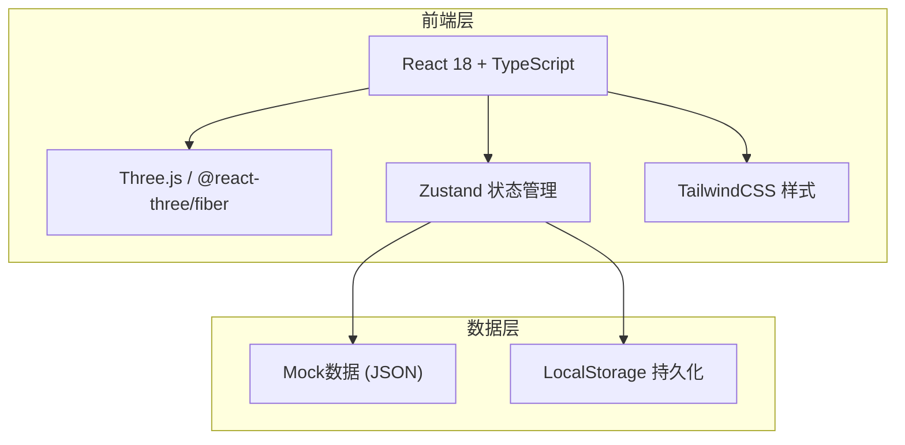
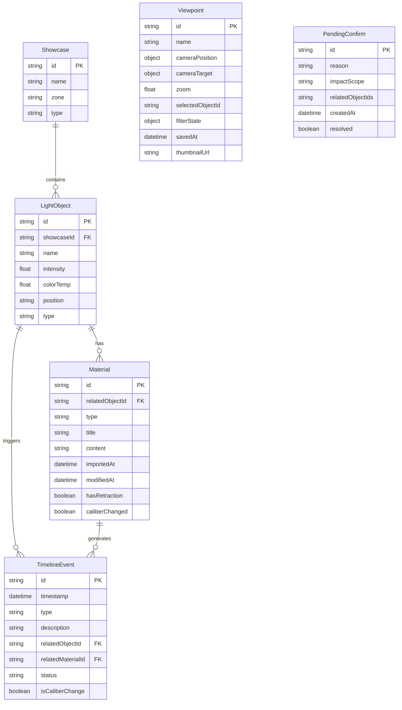

## 1. 架构设计



## 2. 技术说明

- **前端**：React@18 + TypeScript + TailwindCSS@3 + Vite
- **3D渲染**：three + @react-three/fiber + @react-three/drei + @react-three/postprocessing
- **状态管理**：Zustand（含持久化中间件 persist）
- **初始化工具**：vite-init
- **后端**：无（纯前端，数据使用 Mock JSON + LocalStorage）
- **图标**：lucide-react

## 3. 路由定义

| 路由 | 用途 |
|------|------|
| `/` | 复核工作台页面：三维场景+对象属性+材料面板+时间轴+筛选 |
| `/timeline` | 历史时间线页面：变更时间线+待确认事项+导出 |

## 4. 数据模型

### 4.1 数据模型定义



### 4.2 数据定义

**核心类型定义（TypeScript）：**

```typescript
interface Showcase {
  id: string;
  name: string;
  zone: string;
  type: string;
}

interface LightObject {
  id: string;
  showcaseId: string;
  name: string;
  intensity: number;
  colorTemp: number;
  position: [number, number, number];
  type: "spot" | "ambient" | "point";
}

interface Material {
  id: string;
  relatedObjectId: string;
  type: "inspection_photo" | "retraction_record" | "verbal_note";
  title: string;
  content: string;
  importedAt: string;
  modifiedAt: string;
  hasRetraction: boolean;
  caliberChanged: boolean;
}

interface TimelineEvent {
  id: string;
  timestamp: string;
  type: "import" | "retraction" | "modification" | "confirm" | "note";
  description: string;
  relatedObjectId: string;
  relatedMaterialId: string;
  status: "confirmed" | "pending" | "retracted" | "modified";
  isCaliberChange: boolean;
}

interface Viewpoint {
  id: string;
  name: string;
  cameraPosition: [number, number, number];
  cameraTarget: [number, number, number];
  zoom: number;
  selectedObjectId: string | null;
  filterState: FilterState;
  savedAt: string;
  thumbnailUrl: string;
}

interface FilterState {
  objectType: string | null;
  zone: string | null;
  materialType: string | null;
}

interface PendingConfirm {
  id: string;
  reason: string;
  impactScope: string[];
  relatedObjectIds: string[];
  createdAt: string;
  resolved: boolean;
}
```

## 5. 项目结构

```
src/
├── components/
│   ├── scene/                  # 三维场景组件
│   │   ├── ShowcaseScene.tsx    # 主场景容器
│   │   ├── ShowcaseModel.tsx    # 展柜模型
│   │   ├── LightCone.tsx        # 灯光光锥
│   │   └── ObjectHighlight.tsx  # 选中高亮
│   ├── panels/                 # 右侧面板组件
│   │   ├── ObjectPropertyPanel.tsx  # 对象属性面板
│   │   ├── MaterialPanel.tsx        # 材料面板
│   │   └── CaliberChangeTag.tsx     # 口径变更标签
│   ├── timeline/               # 时间轴组件
│   │   ├── TimeSlider.tsx      # 时间轴滑块
│   │   └── TimelinePage.tsx    # 历史时间线页面
│   ├── filters/                # 筛选组件
│   │   └── FilterBar.tsx       # 筛选条
│   ├── overlay/                # 浮层组件
│   │   ├── PendingConfirmModal.tsx  # 待确认弹窗
│   │   └── ScreenshotOverlay.tsx    # 截图浮层
│   └── common/                 # 通用组件
│       └── ExportButton.tsx    # 导出按钮
├── hooks/
│   ├── useSceneStore.ts        # 三维场景状态
│   ├── useTimelineStore.ts     # 时间线状态
│   └── useViewpoint.ts         # 视角保存/复原
├── pages/
│   ├── ReviewWorkbench.tsx     # 复核工作台
│   └── HistoryTimeline.tsx     # 历史时间线
├── data/
│   └── mockData.ts             # Mock数据
├── utils/
│   ├── caliberDetector.ts      # 口径变更检测
│   ├── adjacencyChecker.ts     # 相邻点位合错检测
│   └── exportTimeline.ts       # 导出逻辑
├── App.tsx
└── main.tsx
```

## 6. 关键技术方案

### 6.1 视角保存与复原

使用 Zustand persist 中间件，将 Viewpoint 对象持久化到 LocalStorage。复原时通过 @react-three/drei 的 OrbitControls 的 `setTarget` 和相机 `position.set` 实现平滑过渡。

### 6.2 点选交互

使用 @react-three/fiber 的 `onClick` 事件和 `useRaycaster`，为每个三维对象绑定点击事件。选中后更新 Zustand store 中的 `selectedObjectId`，右侧面板自动联动。

### 6.3 时间轴联动

时间轴滑块变化时，从 mock 数据中筛选对应时间点的灯光参数，更新三维场景中灯光对象的 intensity 和 colorTemp。同时高亮该时间点关联的时间线事件。

### 6.4 筛选联动

FilterBar 中的筛选条件变更时，同步更新：三维场景中未选中对象透明度降低、时间轴上非匹配节点灰化、材料面板过滤显示。

### 6.5 口径变更检测

在 `caliberDetector.ts` 中，对比同一对象的关联材料的时间线和内容，如果存在撤回记录（hasRetraction=true）或修改时间不一致（modifiedAt > importedAt），自动标记 `caliberChanged=true`。

### 6.6 相邻点位合错检测

在 `adjacencyChecker.ts` 中，计算空间位置相邻的灯光对象参数差异，当色温差 > 500K 或亮度差 > 30% 时，生成 PendingConfirm 记录，弹出待确认弹窗。

### 6.7 截图回溯

截图时使用 canvas.toDataURL 生成缩略图，同时记录当前 FilterState、selectedObjectId、相机参数到 Viewpoint 对象。点击材料面板中的截图缩略图，从 Viewpoint 中恢复完整上下文。

### 6.8 导出一致性

导出时，TimelineEvent 的 status 字段直接使用与页面标签相同的中文映射（confirmed→"已确认"，pending→"待确认"，retracted→"已撤回"，modified→"已修改"），确保页面与文件一致。
