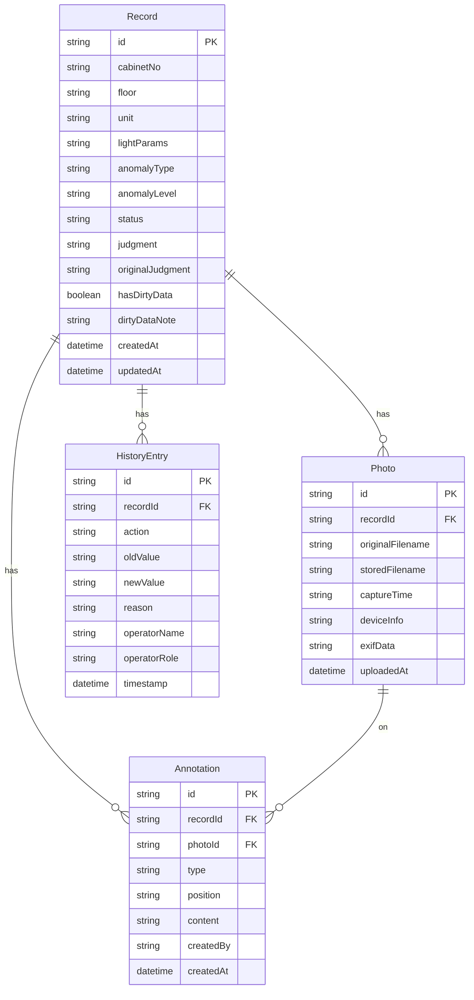

## 1. 架构设计

```mermaid
flowchart TB
    subgraph "前端层"
        "React 18 + Vite"
        "TailwindCSS"
        "React Router"
        "Zustand 状态管理"
    end
    subgraph "后端层"
        "Express 4"
        "REST API"
        "Multer 文件上传"
    end
    subgraph "数据层"
        "SQLite (better-sqlite3)"
        "文件系统 (照片存储)"
    end
    "React 18 + Vite" --> "REST API"
    "REST API" --> "SQLite (better-sqlite3)"
    "REST API" --> "文件系统 (照片存储)"
```

## 2. 技术说明

- **前端**：React@18 + TailwindCSS@3 + Vite + Zustand（轻量状态管理）
- **初始化工具**：Vite (vite-init)
- **后端**：Express@4 + better-sqlite3 + Multer
- **数据库**：SQLite（单文件数据库，适合轻量级部署，数据持久化）
- **文件存储**：本地文件系统，巡检照片保留原始文件名和 EXIF 信息
- **报告生成**：Markdown 字符串拼接，前端预览 + 后端导出

## 3. 路由定义

| 路由 | 用途 |
|------|------|
| `/` | 重定向至列表页 |
| `/records` | 时序列表页，支持筛选、视角切换 |
| `/records/:id` | 时序详情页，含照片、标注、侧边明细、改判入口 |
| `/records/:id/history` | 历史追踪页，改判时间线与对比 |
| `/reports` | Markdown 报告页，生成、预览、导出 |

## 4. API 定义

### 4.1 时序记录 API

```typescript
interface Record {
  id: string;
  cabinetNo: string;
  floor: string;
  unit: string;
  lightParams: {
    brightness: number;
    colorTemp: number;
    schedule: string;
  };
  anomalyType: "normal" | "flicker" | "off_schedule" | "brightness_abnormal" | "mixed_unit";
  anomalyLevel: "none" | "low" | "medium" | "high";
  status: "pending" | "reviewed" | "rejudged" | "resolved";
  judgment: string;
  originalJudgment: string;
  hasDirtyData: boolean;
  dirtyDataNote: string;
  createdAt: string;
  updatedAt: string;
}

// GET /api/records - 获取记录列表
interface GetRecordsRequest {
  floor?: string;
  cabinetNo?: string;
  anomalyType?: string;
  status?: string;
  view?: "anomaly_first" | "chronological" | "by_cabinet";
  dateFrom?: string;
  dateTo?: string;
  page?: number;
  pageSize?: number;
}

interface GetRecordsResponse {
  records: Record[];
  total: number;
  page: number;
  pageSize: number;
}

// GET /api/records/:id - 获取记录详情
interface GetRecordDetailResponse {
  record: Record;
  photos: Photo[];
  annotations: Annotation[];
  history: HistoryEntry[];
}

// PUT /api/records/:id/judgment - 改判
interface RejudgeRequest {
  newJudgment: string;
  reason: string;
  operatorName: string;
  operatorRole: string;
}

interface RejudgeResponse {
  record: Record;
  historyEntry: HistoryEntry;
}
```

### 4.2 巡检照片 API

```typescript
interface Photo {
  id: string;
  recordId: string;
  originalFilename: string;
  storedFilename: string;
  captureTime: string;
  deviceInfo: string;
  exifData: Record<string, string>;
  uploadedAt: string;
}

// POST /api/records/:id/photos - 上传照片
// GET /api/records/:id/photos - 获取照片列表
// GET /api/photos/:id/file - 获取照片文件
```

### 4.3 标注 API

```typescript
interface Annotation {
  id: string;
  recordId: string;
  photoId: string;
  type: "arrow" | "circle" | "text" | "highlight";
  position: { x: number; y: number; width?: number; height?: number };
  content: string;
  createdBy: string;
  createdAt: string;
}

// POST /api/records/:id/annotations - 创建标注
// GET /api/records/:id/annotations - 获取标注列表
// PUT /api/annotations/:id - 更新标注
// DELETE /api/annotations/:id - 删除标注
```

### 4.4 历史记录 API

```typescript
interface HistoryEntry {
  id: string;
  recordId: string;
  action: "create" | "judge" | "rejudge" | "annotate" | "status_change";
  oldValue: string;
  newValue: string;
  reason: string;
  operatorName: string;
  operatorRole: string;
  timestamp: string;
}

// GET /api/records/:id/history - 获取历史记录
// POST /api/records/:id/history - 手动添加历史记录
```

### 4.5 报告 API

```typescript
interface ReportConfig {
  dateFrom: string;
  dateTo: string;
  floor?: string;
  anomalyType?: string;
  includePhotos: boolean;
  includeHistory: boolean;
}

// POST /api/reports/generate - 生成报告
interface GenerateReportResponse {
  reportId: string;
  markdown: string;
  generatedAt: string;
}

// GET /api/reports/:id - 获取报告
// GET /api/reports/:id/download - 下载 .md 文件
```

## 5. 服务端架构

```mermaid
flowchart TD
    "Router 路由层" --> "Controller 控制层"
    "Controller 控制层" --> "Service 业务层"
    "Service 业务层" --> "Repository 数据层"
    "Repository 数据层" --> "SQLite 数据库"
    "Service 业务层" --> "文件系统"
```

- **Router**：Express Router，按资源分组（records、photos、annotations、history、reports）
- **Controller**：请求参数校验、响应格式化
- **Service**：业务逻辑（改判流程、报告生成、历史记录写入）
- **Repository**：SQL 查询封装，使用 better-sqlite3 同步 API
- **文件系统**：照片存储在 `uploads/photos/` 目录，保留原始文件名

## 6. 数据模型

### 6.1 数据模型定义



### 6.2 数据定义语言

```sql
CREATE TABLE records (
  id TEXT PRIMARY KEY,
  cabinetNo TEXT NOT NULL,
  floor TEXT NOT NULL,
  unit TEXT NOT NULL,
  lightParams TEXT NOT NULL DEFAULT '{}',
  anomalyType TEXT NOT NULL DEFAULT 'normal',
  anomalyLevel TEXT NOT NULL DEFAULT 'none',
  status TEXT NOT NULL DEFAULT 'pending',
  judgment TEXT NOT NULL DEFAULT '',
  originalJudgment TEXT NOT NULL DEFAULT '',
  hasDirtyData INTEGER NOT NULL DEFAULT 0,
  dirtyDataNote TEXT NOT NULL DEFAULT '',
  createdAt TEXT NOT NULL DEFAULT (datetime('now')),
  updatedAt TEXT NOT NULL DEFAULT (datetime('now'))
);

CREATE TABLE photos (
  id TEXT PRIMARY KEY,
  recordId TEXT NOT NULL REFERENCES records(id),
  originalFilename TEXT NOT NULL,
  storedFilename TEXT NOT NULL,
  captureTime TEXT,
  deviceInfo TEXT,
  exifData TEXT NOT NULL DEFAULT '{}',
  uploadedAt TEXT NOT NULL DEFAULT (datetime('now'))
);

CREATE TABLE annotations (
  id TEXT PRIMARY KEY,
  recordId TEXT NOT NULL REFERENCES records(id),
  photoId TEXT NOT NULL REFERENCES photos(id),
  type TEXT NOT NULL,
  position TEXT NOT NULL DEFAULT '{}',
  content TEXT NOT NULL DEFAULT '',
  createdBy TEXT NOT NULL,
  createdAt TEXT NOT NULL DEFAULT (datetime('now'))
);

CREATE TABLE history_entries (
  id TEXT PRIMARY KEY,
  recordId TEXT NOT NULL REFERENCES records(id),
  action TEXT NOT NULL,
  oldValue TEXT NOT NULL DEFAULT '',
  newValue TEXT NOT NULL DEFAULT '',
  reason TEXT NOT NULL DEFAULT '',
  operatorName TEXT NOT NULL,
  operatorRole TEXT NOT NULL DEFAULT '',
  timestamp TEXT NOT NULL DEFAULT (datetime('now'))
);

CREATE INDEX idx_records_floor ON records(floor);
CREATE INDEX idx_records_status ON records(status);
CREATE INDEX idx_records_anomaly_type ON records(anomalyType);
CREATE INDEX idx_records_created_at ON records(createdAt);
CREATE INDEX idx_photos_record_id ON photos(recordId);
CREATE INDEX idx_annotations_record_id ON annotations(recordId);
CREATE INDEX idx_annotations_photo_id ON annotations(photoId);
CREATE INDEX idx_history_record_id ON history_entries(recordId);
CREATE INDEX idx_history_timestamp ON history_entries(timestamp);
```

### 6.3 初始样例数据

初始数据需包含以下典型场景：
1. **正常记录**：灯光时序正常，无异常
2. **异常记录**：闪烁、亮度异常、时序偏移
3. **楼层单位混写脏数据**：如"3层/B区"与"3F-SecB"混写，`hasDirtyData=1`，处理结果标记为"已处理（含异常）"
4. **已改判记录**：含完整改判历史，展示教学老师改判过程
5. **待审核记录**：状态为 pending，等待教学老师审核
