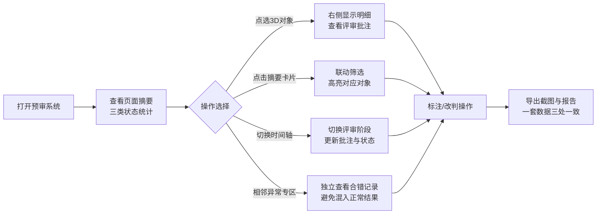

## 1. 产品概述

博物馆展柜灯光碰撞预审系统是一款基于 Web3D 的专业评审工具，专为博物馆展陈工程月底封账前的灯光碰撞检测设计。系统通过三维可视化方式呈现展柜与灯光点位的空间关系，帮助现场老师快速识别碰撞风险、标注评审批注、导出预审报告，避免坐标系混乱导致的信任危机。

- **核心问题**：传统评审依赖二维图纸，坐标系混淆时结果不可信；相邻点位合错易混入正常记录
- **目标用户**：现场评审老师、运维工程师
- **产品价值**：一套数据贯穿3D标注、侧边明细和报告输出，消除三套说法的偏差

## 2. 核心功能

### 2.1 用户角色

| 角色 | 登录方式 | 核心权限 |
|------|----------|----------|
| 现场老师 | 本地应用 | 查看3D场景、点选对象、筛选记录、导出截图与报告 |
| 运维工程师 | 本地应用 | 同现场老师，负责月底封账前终审 |

### 2.2 功能模块

1. **3D场景主视图**：展柜与灯光点位三维展示、视角切换、对象点选、坐标系标识
2. **侧边明细面板**：选中对象详情、评审批注列表、状态分类标签
3. **筛选工具栏**：按状态筛选（正常/待补材料/人工改判）、按点位组筛选
4. **时间轴控件**：切换不同评审阶段、查看历史批注
5. **页面摘要区**：已处理/待补材料/人工改判三类统计与快捷入口
6. **相邻点位异常专区**：独立展示相邻点位合错记录，避免混入正常结果
7. **导出功能**：当前视角截图导出、预审报告生成

### 2.3 页面详情

| 页面名称 | 模块名称 | 功能描述 |
|----------|----------|----------|
| 预审主页 | 3D场景区 | 展示展柜与灯光点位，支持旋转/缩放/平移，点选对象高亮，显示XYZ坐标系辅助线 |
| 预审主页 | 顶部状态栏 | 显示当前评审批次、坐标系说明、导出按钮 |
| 预审主页 | 左侧摘要面板 | 三类状态统计卡片（已处理/待补材料/人工改判），点击可联动筛选 |
| 预审主页 | 右侧明细面板 | 选中对象详情、评审批注列表、状态流转操作 |
| 预审主页 | 底部时间轴 | 评审阶段切换（初评/复核/终审），联动场景与批注 |
| 预审主页 | 相邻异常专区 | 独立卡片展示相邻点位合错记录，红色警示标识，悬浮联动3D场景 |
| 预审主页 | 筛选工具栏 | 状态筛选标签、点位组筛选下拉、搜索框 |

## 3. 核心流程

用户打开应用后，首先看到3D场景与摘要面板，可通过左侧摘要快速筛选待处理项，或直接在3D场景中点选灯光点位查看明细。现场老师切换时间轴查看不同阶段的批注，遇到相邻点位合错时可在独立专区直接定位。确认无误后导出当前视角截图与预审报告，标注、明细、报告共用同一数据源。

## 4. 用户界面设计

### 4.1 设计风格

- **主色调**：深青灰 (#0F172A) 背景搭配青蓝 accent (#0EA5E9)，营造专业工程氛围
- **警示色**：琥珀橙 (#F59E0B) 待补材料、玫红 (#EC4899) 人工改判、红色 (#EF4444) 相邻异常
- **成功色**：翠绿 (#10B981) 已处理/正常
- **按钮风格**：细边框圆角按钮，hover 时轻微上浮+发光描边
- **字体**：标题用 Space Grotesk，正文用 JetBrains Mono，保持技术感与可读性
- **布局风格**：三栏式布局（左摘要 + 中3D + 右明细），底部悬浮时间轴
- **图标风格**：lucide 线性图标，与边框风格统一

### 4.2 页面设计概述

| 页面名称 | 模块名称 | UI 元素 |
|----------|----------|---------|
| 预审主页 | 3D场景区 | 深灰背景、网格地面、青蓝展柜模型、发光灯光点位、XYZ三色坐标轴、选中对象金色描边 |
| 预审主页 | 左侧摘要面板 | 三张竖向堆叠卡片，各带状态色条、数字、标签，点击有按压动效 |
| 预审主页 | 右侧明细面板 | 半透明毛玻璃面板、对象基本信息网格、批注时间线、状态操作按钮组 |
| 预审主页 | 底部时间轴 | 轨道式时间轴、三个阶段节点、当前节点发光、拖拽/点击切换 |
| 预审主页 | 相邻异常专区 | 红色渐变边框卡片、警示图标、合错点位对列表、悬浮联动3D高亮 |
| 预审主页 | 顶部工具栏 | Logo、批次信息、坐标系说明 tooltip、筛选按钮组、导出下拉菜单 |

### 4.3 响应式

- 桌面端优先（1440px+），三栏完整布局
- 平板端折叠左侧摘要为可展开抽屉
- 移动端暂不支持核心3D评审功能，仅提供报告查看

### 4.4 3D场景指引

- **环境**：深灰色渐变背景 + 柔和雾效，营造空间感
- **光照**：主光源 45° 斜上方 + 环境光补光，灯光点位自身发光
- **相机**：默认 45° 俯视角，支持 OrbitControls 轨道控制
- **构图**：展柜阵列居中，灯光点位悬浮于展柜上方，坐标系辅助线位于角落
- **交互**：点击灯光点位触发金色描边 + 轻微上浮动画，双击聚焦
- **后期**：轻微 bloom 发光效果，突出灯光点位
- **模型**：使用 Three.js 基础几何体构建，确保加载性能
