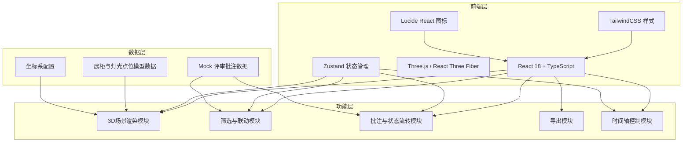
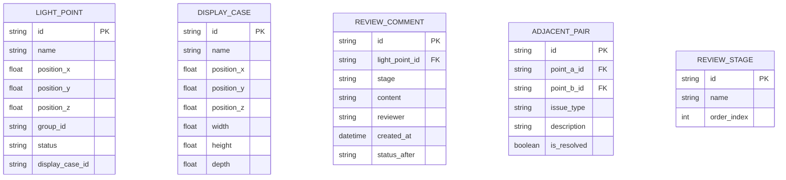

## 1. 架构设计



## 2. 技术描述

- **前端框架**：React 18 + TypeScript + Vite
- **3D 引擎**：three @0.160 + @react-three/fiber @8 + @react-three/drei @9
- **状态管理**：zustand @4
- **样式方案**：tailwindcss @3
- **图标库**：lucide-react
- **后端**：无，纯前端应用，使用 Mock 数据
- **构建工具**：Vite 5

## 3. 路由定义

| 路由 | 用途 |
|------|------|
| / | 预审主页（3D场景 + 摘要 + 明细 + 时间轴） |

## 4. 数据模型

### 4.1 数据模型定义



### 4.2 状态枚举

- **灯光点位状态 (LightPointStatus)**
  - `normal` - 正常/已处理
  - `pending_material` - 待补材料
  - `manual_review` - 人工改判

- **评审阶段 (ReviewStage)**
  - `initial` - 初评
  - `review` - 复核
  - `final` - 终审

## 5. 项目结构

```
src/
├── components/
│   ├── Scene3D/           # 3D场景组件
│   │   ├── index.tsx
│   │   ├── DisplayCase.tsx
│   │   ├── LightPoint.tsx
│   │   └── AxisHelper.tsx
│   ├── SummaryPanel/      # 左侧摘要面板
│   │   ├── index.tsx
│   │   └── StatCard.tsx
│   ├── DetailPanel/       # 右侧明细面板
│   │   ├── index.tsx
│   │   ├── CommentList.tsx
│   │   └── StatusActions.tsx
│   ├── Timeline/          # 底部时间轴
│   │   └── index.tsx
│   ├── AdjacentAlert/     # 相邻点位异常专区
│   │   └── index.tsx
│   ├── Toolbar/           # 顶部工具栏
│   │   └── index.tsx
│   └── FilterBar/         # 筛选栏
│       └── index.tsx
├── store/
│   └── useReviewStore.ts  # Zustand 状态管理
├── data/
│   ├── mockData.ts        # Mock 评审批注数据
│   └── sceneData.ts       # 场景模型数据
├── types/
│   └── index.ts           # TypeScript 类型定义
├── utils/
│   ├── export.ts          # 导出工具函数
│   └── coordinate.ts      # 坐标系工具
├── App.tsx
├── main.tsx
└── index.css
```

## 6. 核心技术点

### 6.1 3D场景交互
- 使用 `@react-three/fiber` 的 `useThree` 和事件系统实现点选
- 通过 `Outline` 或自定义 shader 实现选中对象高亮
- `OrbitControls` 控制视角，限制缩放范围

### 6.2 状态联动
- Zustand 单一数据源，3D场景/摘要/明细/时间轴共享状态
- 选择灯光点位 → 更新选中ID → 明细面板自动刷新
- 点击摘要卡片 → 更新筛选条件 → 3D场景中对应对象高亮显示
- 切换时间轴阶段 → 过滤该阶段批注 → 更新状态显示

### 6.3 相邻点位异常
- 独立数据结构存储相邻点位对
- 悬浮异常记录时，同时高亮3D场景中的两个点位
- 红色边框 + 警示图标，视觉上与正常记录区隔

### 6.4 导出功能
- 使用 `html2canvas` 或 Three.js 自带的 `renderer.domElement.toDataURL()` 截图
- 报告生成基于当前筛选状态和选中对象，使用同一数据源
