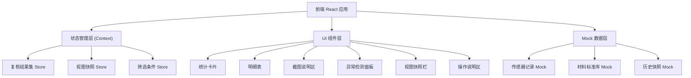
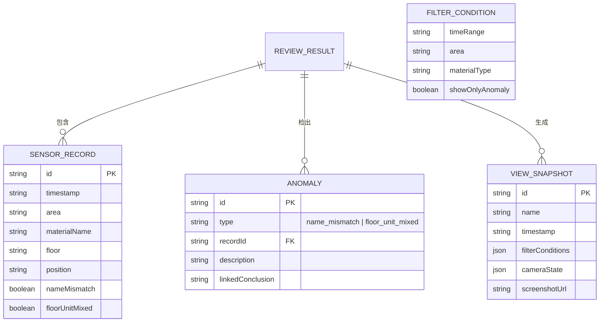

## 1. 架构设计



## 2. 技术说明
- 前端：React@18 + TypeScript + Vite
- 样式：TailwindCSS@3
- 状态管理：React Context + useReducer（轻量，无额外依赖）
- 3D 可视化：@react-three/fiber + @react-three/drei + three
- 后端：无，使用本地 Mock 数据
- 数据持久化：localStorage 保存视图快照

## 3. 路由定义

| 路由 | 用途 |
|------|------|
| / | 复核控制台（单页应用，无额外路由） |

## 4. 数据模型

### 4.1 数据模型定义



### 4.2 TypeScript 类型定义

```typescript
interface SensorRecord {
  id: string;
  timestamp: string;
  area: string;
  materialName: string;
  standardMaterialName: string;
  floor: string;
  normalizedFloor: number;
  position: { x: number; y: number; z: number };
  nameMismatch: boolean;
  floorUnitMixed: boolean;
  status: 'normal' | 'warning' | 'error';
}

interface Anomaly {
  id: string;
  type: 'name_mismatch' | 'floor_unit_mixed';
  recordId: string;
  description: string;
  linkedConclusion?: string;
}

interface ViewSnapshot {
  id: string;
  name: string;
  timestamp: string;
  filterConditions: FilterConditions;
  cameraState: {
    position: [number, number, number];
    target: [number, number, number];
    fov: number;
  };
  screenshotDataUrl?: string;
}

interface FilterConditions {
  timeRange: [string, string] | null;
  area: string | null;
  materialType: string | null;
  showOnlyAnomaly: boolean;
}

interface ReviewResult {
  records: SensorRecord[];
  anomalies: Anomaly[];
  stats: {
    total: number;
    anomalyCount: number;
    nameMismatchCount: number;
    floorUnitMixedCount: number;
  };
}
```

## 5. 核心算法逻辑

### 5.1 名称不一致检测
将材料名称与标准库比对（忽略大小写、特殊符号、空格），不匹配则标记 `nameMismatch: true`。

### 5.2 楼层单位混写检测
- 正则提取楼层数字和单位
- 如果同一区域内同时出现"层"、"F"、"Floor"等不同写法，标记 `floorUnitMixed: true`
- 归一化为纯数字存入 `normalizedFloor`

### 5.3 同一结果集保证
筛选条件变化时，一次性生成 `ReviewResult`，所有组件（统计、明细、截图）从同一份 `ReviewResult` 读取，确保数据一致。
