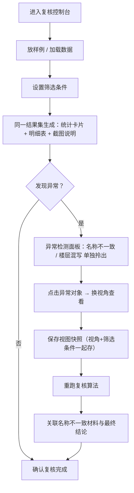

## 1. 产品概述
桥隧检修平台空间复核系统，用于解决桥隧检修作业中传感器记录与空间视图不一致、材料命名混乱、楼层单位混写等问题。确保筛选条件、统计、明细表、截图说明从同一结果集生成，异常记录单独拎出，视图条件与截图同步保存。

- 目标用户：教学老师（林姐）、算法值班人
- 核心价值：复核流程可追溯，异常材料不遗漏，视图快照可复原

## 2. 核心特性

### 2.1 用户角色

| 角色 | 说明 | 核心权限 |
|------|------|----------|
| 教学老师 | 日常复核教学用例 | 查看复核结果、放样例、查看截图说明 |
| 算法值班人 | 处理异常数据、生成复核报告 | 筛选异常、换视角截图、保存视图、重跑复核 |

### 2.2 功能模块

1. **复核控制台**：筛选条件、统计卡片、明细表、截图说明一体化展示
2. **异常检测面板**：名称不一致材料标记、楼层单位混写记录单独拎出
3. **视图快照**：视角与筛选条件同步保存、一键复原
4. **操作说明区**：放样例、重跑、查看截图说明三件事

### 2.3 页面详情

| 页面名称 | 模块名称 | 功能描述 |
|----------|----------|----------|
| 复核控制台 | 筛选条件栏 | 时间、区域、材料类型等筛选，与明细表/统计/截图联动 |
| 复核控制台 | 统计卡片 | 总记录数、异常数、名称不一致数、楼层单位混写数 |
| 复核控制台 | 明细表 | 完整记录列表，异常行高亮，可点击定位异常对象 |
| 复核控制台 | 截图说明区 | 当前结果集对应的截图 + 视角条件，随筛选联动刷新 |
| 异常检测面板 | 名称不一致清单 | 列出命名与标准库不匹配的材料，可关联最终结论 |
| 异常检测面板 | 楼层单位混写清单 | 单独拎出楼层写"3层"/"3F"/"Floor3"混用的记录 |
| 视图快照栏 | 快照列表 | 已保存的视角+筛选条件，点击一键复原 |
| 视图快照栏 | 保存快照 | 将当前视角+筛选条件+截图一起存档 |
| 操作说明区 | 放样例 | 一键加载标准教学用例数据 |
| 操作说明区 | 重跑 | 基于当前筛选重新执行复核算法 |
| 操作说明区 | 查看截图说明 | 展开当前截图对应的视角参数与异常标注 |

## 3. 核心流程

教学老师林姐日常复核：加载样例 → 查看筛选联动的统计/明细/截图 → 确认无旧说法混入

算法值班人处理异常：进入控制台 → 先找异常对象 → 切换视角截图 → 保存视图快照 → 重跑复核 → 关联不一致材料与结论

## 4. 用户界面设计

### 4.1 设计风格
- 主色：工业蓝 `#1E40AF`，辅色：警示橙 `#F97316`、异常红 `#DC2626`
- 按钮：直角胶囊型，轻微阴影，hover 有浮起效果
- 字体：标题用思源黑体 Heavy，正文用思源宋体 Regular，数据用 JetBrains Mono
- 布局：左侧筛选 + 中间明细 + 右侧截图，顶部统计卡片，底部操作说明
- 视觉风格：工业/工程感，网格背景，分区明显，异常数据用醒目边框

### 4.2 页面设计概览

| 页面名称 | 模块名称 | UI 元素 |
|----------|----------|---------|
| 复核控制台 | 统计卡片 | 四宫格数字卡片，异常数橙色高亮，点击跳转对应异常清单 |
| 复核控制台 | 明细表 | 斑马纹表格，异常行左侧红色竖条标记，hover 显示定位按钮 |
| 复核控制台 | 截图说明区 | 大图 + 视角参数折叠面板，标注框高亮异常位置 |
| 异常检测面板 | 异常清单 | 卡片式列表，每条异常显示"关联结论"按钮 |
| 视图快照栏 | 快照缩略图 | 横向滚动小图，点击后全屏复原当时视角与筛选 |
| 操作说明区 | 三操作按钮 | 大号图标按钮，下方一行简短中文说明 |

### 4.3 响应式
- 桌面端优先（1440px+），工程人员使用大屏显示器
- 平板端左右栏上下堆叠
- 不考虑移动端

### 4.4 3D 场景引导
- 环境：桥隧内部视角，低饱和灰蓝色调，金属感材质
- 光照：顶部冷白主光 + 侧面橙色警示补光
- 相机：可自由旋转/缩放，保存时记录 camera position、target、fov
- 交互：点击构件高亮，可切换透视/正交视角
- 后处理：轻微暗角，边缘线条强化，突出工程结构感
