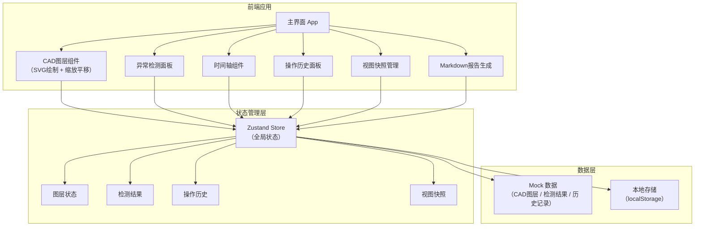
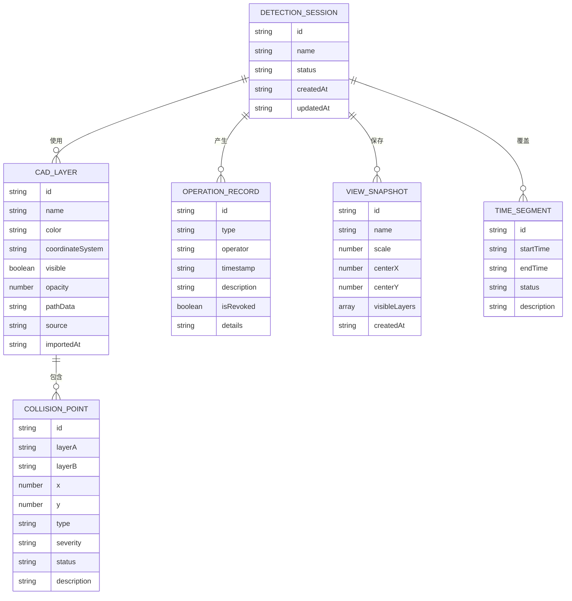

## 1. 架构设计



## 2. 技术描述

- **前端框架**：React@18 + TypeScript
- **构建工具**：Vite@5
- **样式方案**：TailwindCSS@3
- **状态管理**：Zustand
- **CAD图层渲染**：原生SVG + 自定义缩放平移hooks
- **Markdown渲染**：react-markdown
- **图标**：Lucide React（线性图标，符合工程风格）
- **数据**：内置Mock数据，模拟真实工程场景（包含撤回记录、坐标系混杂、时间轴缺段）

## 3. 路由定义

| 路由 | 用途 |
|------|------|
| / | 预审主界面（单页应用，全部功能在一个页面） |

## 4. 数据模型

### 4.1 数据模型定义



### 4.2 核心数据结构（TypeScript）

```typescript
interface CadLayer {
  id: string;
  name: string;
  color: string;
  coordinateSystem: 'bj54' | 'wgs84' | 'local' | 'unknown';
  visible: boolean;
  opacity: number;
  elements: CadElement[];
  source: string;
  importedAt: string;
}

interface CadElement {
  id: string;
  type: 'line' | 'rect' | 'polygon' | 'circle';
  points: Point[];
  label?: string;
  category: 'bridge' | 'tunnel' | 'platform' | 'other';
}

interface CollisionPoint {
  id: string;
  layerA: string;
  layerB: string;
  x: number;
  y: number;
  type: 'hard' | 'soft' | 'clearance';
  severity: 'critical' | 'warning' | 'info';
  status: 'pending' | 'confirmed' | 'resolved' | 'revoked';
  description: string;
  calcBasis: string;
  relatedSegments: string[];
}

interface OperationRecord {
  id: string;
  type: 'import' | 'adjust' | 'revoke' | 'confirm' | 'suspend' | 'report';
  operator: string;
  timestamp: string;
  description: string;
  isRevoked: boolean;
  details: Record<string, any>;
}

interface ViewSnapshot {
  id: string;
  name: string;
  scale: number;
  centerX: number;
  centerY: number;
  visibleLayers: string[];
  createdAt: string;
  thumbnail?: string;
}

interface TimeSegment {
  id: string;
  startTime: string;
  endTime: string;
  status: 'completed' | 'in_progress' | 'suspended' | 'missing';
  description: string;
  responsible: string;
}
```

## 5. 模块划分

| 模块 | 目录 | 职责 |
|------|------|------|
| CAD图层 | src/components/cad-canvas/ | SVG渲染、缩放平移、元素绘制 |
| 异常检测 | src/components/collision-panel/ | 异常列表、详情、状态切换 |
| 时间轴 | src/components/timeline/ | 时段展示、缺段标记、挂起提示 |
| 操作历史 | src/components/history-panel/ | 操作时间线、撤回记录、详情展开 |
| 视图快照 | src/components/view-snapshots/ | 快照列表、保存、切换 |
| 报告生成 | src/components/report-panel/ | Markdown渲染、导出、变更说明 |
| 状态管理 | src/store/ | Zustand stores、actions |
| Mock数据 | src/data/ | 模拟CAD图层、检测结果、历史记录 |
| 工具函数 | src/utils/ | 坐标转换、碰撞计算、格式化 |
| 类型定义 | src/types/ | TypeScript类型声明 |
