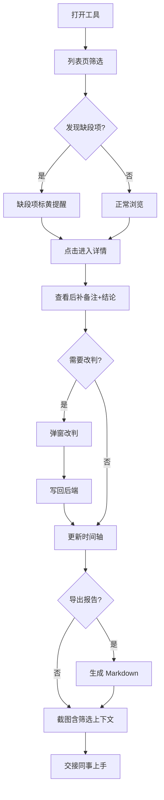

## 1. 产品概述

桥隧检修平台方案比选工具——面向运维工程师的轻量交接工具，解决以往靠点位坐标硬拼、截图脱离筛选条件说不清的问题。将后补备注与最后结论串联，时间轴缺段明确标记，截图可回溯到对象来源与当前筛选，Markdown 报告与页面状态一致，让排班同事无需口头交接即可上手。

- 目标用户：桥隧检修运维工程师、评审参会人员
- 核心价值：减少口头交接依赖，截图即上下文，数据即结论

## 2. 核心功能

### 2.1 用户角色

| 角色 | 进入方式 | 核心权限 |
|------|----------|----------|
| 运维工程师 | 默认进入 | 浏览、筛选、查看详情、改判、导出报告 |
| 评审人员 | 共享链接进入 | 浏览、筛选、查看详情、导出报告 |

### 2.2 功能模块

1. **方案比选列表页**：筛选、列表、缺段标记、截图上下文水印
2. **方案详情页**：基本信息、后补备注+结论、时间轴（含缺段标记）、改判操作、历史记录
3. **Markdown 报告导出**：一键导出当前筛选+状态一致的报告

### 2.3 页面详情

| 页面名称 | 模块名称 | 功能描述 |
|----------|----------|----------|
| 方案比选列表页 | 筛选面板 | 按桥隧名称、方案类型、结论状态、时间段筛选；缺段项标黄提醒 |
| 方案比选列表页 | 方案卡片列表 | 展示方案编号、桥隧名、点位坐标、结论状态、后补备注摘要；缺段项带标记徽章 |
| 方案比选列表页 | 截图上下文栏 | 页面顶部常驻当前筛选条件摘要，截图时自动包含 |
| 方案详情页 | 基本信息区 | 方案编号、桥隧名、点位坐标、方案类型、创建时间 |
| 方案详情页 | 后补备注+结论区 | 后补备注文本框与最终结论联动，结论变更自动记录 |
| 方案详情页 | 时间轴 | 按时间展示方案历程；缺段时间区间用虚线+警示色标记 |
| 方案详情页 | 改判操作 | 弹窗选择新结论+填写改判原因，提交后写回后端 |
| 方案详情页 | 历史记录 | 展示所有改判与备注变更记录 |
| 方案详情页 | 截图回溯 | 详情页顶部显示"来源：列表筛选→点击项"，点击可返回带筛选的列表 |
| Markdown 报告 | 导出面板 | 选择导出范围（当前筛选/单条），生成 Markdown 文件；状态措辞与页面一致 |

## 3. 核心流程

运维工程师打开工具 → 在列表页按条件筛选 → 缺段项自动标黄 → 点击进入详情 → 查看后补备注与结论 → 如需改判则弹窗操作 → 查看时间轴（缺段标记醒目）→ 需要时导出 Markdown 报告 → 截图自带筛选上下文 → 接班同事直接上手

## 4. 用户界面设计

### 4.1 设计风格

- 主色调：深灰蓝（#1e293b）+ 工程橙（#f97316）强调色，营造工业运维质感
- 辅助色：缺段警示黄（#eab308）、正常绿（#22c55e）、改判红（#ef4444）
- 按钮风格：圆角 6px，微阴影，主操作用实色填充，次操作用描边
- 字体：标题用 Noto Sans SC Medium，正文用 Noto Sans SC Regular，数据/编号用 JetBrains Mono
- 布局：左侧筛选面板固定 + 右侧主内容区滚动，顶部常驻筛选摘要条
- 图标风格：线性图标（Lucide），与工业工具感一致

### 4.2 页面设计概览

| 页面名称 | 模块名称 | UI 元素 |
|----------|----------|---------|
| 方案比选列表页 | 筛选面板 | 固定左侧 280px，下拉+日期选择器，缺段过滤开关 |
| 方案比选列表页 | 筛选摘要条 | 顶部 48px 高，标签式展示当前筛选，截图时可见 |
| 方案比选列表页 | 方案卡片 | 白色卡片，左侧色条标状态，右上角缺段徽章，阴影 hover |
| 方案详情页 | 基本信息区 | 顶部网格布局，关键字段加粗 |
| 方案详情页 | 后补备注+结论区 | 双栏：左备注文本框、右结论选择+历史 |
| 方案详情页 | 时间轴 | 左侧竖线+圆点，缺段区间用虚线+黄色背景 |
| 方案详情页 | 改判弹窗 | 居中弹窗，下拉选结论+文本域填原因 |
| 方案详情页 | 回溯面包屑 | 顶部面包屑："列表 / 筛选条件 / 当前方案" |

### 4.3 响应式

- 桌面优先（1920×1080 为基准）
- 平板（768px+）：筛选面板折叠为顶部抽屉
- 手机暂不强制适配，工具定位为桌面运维场景

## 4.4 三维场景

不涉及三维场景
