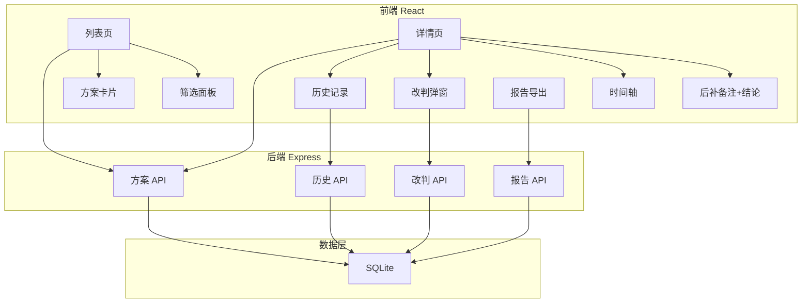
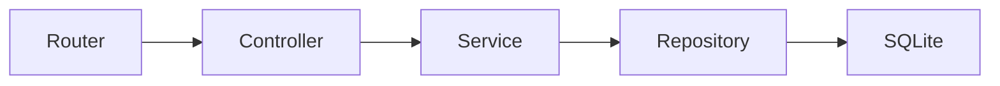
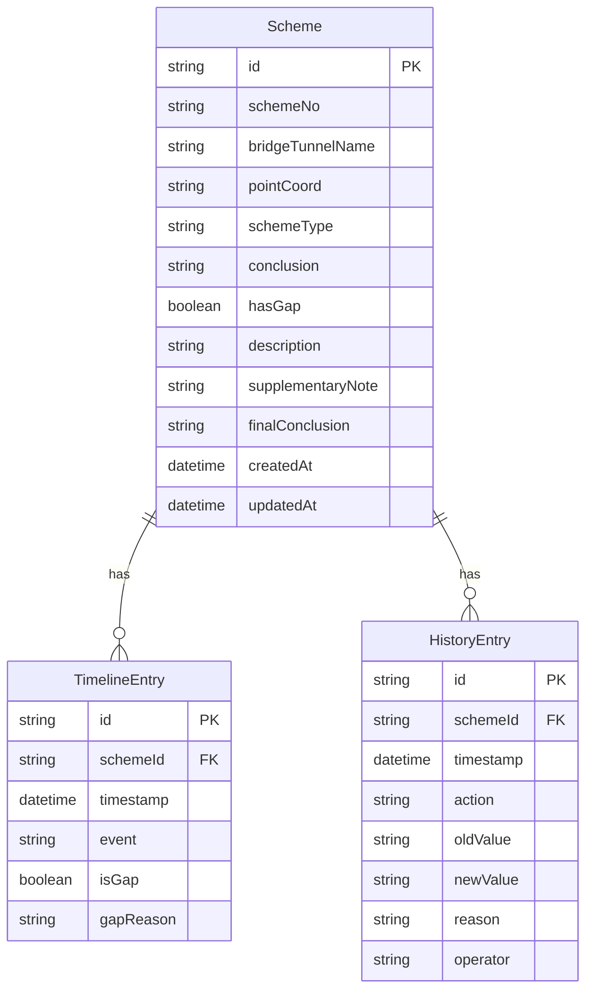

## 1. 架构设计



## 2. 技术说明

- 前端：React@18 + tailwindcss@3 + vite + zustand + react-router-dom
- 初始化工具：vite-init
- 后端：Express@4 + TypeScript（ESM）
- 数据库：SQLite（better-sqlite3），文件存储在项目根目录 `data/app.db`

## 3. 路由定义

| 路由 | 用途 |
|------|------|
| `/` | 方案比选列表页，含筛选、缺段标记 |
| `/scheme/:id` | 方案详情页，含后补备注、结论、时间轴、改判、历史 |
| `/report` | Markdown 报告导出页 |

## 4. API 定义

### 4.1 方案列表

```typescript
interface SchemeListItem {
  id: string;
  schemeNo: string;
  bridgeTunnelName: string;
  pointCoord: string;
  schemeType: string;
  conclusion: "pending" | "approved" | "rejected" | "revised";
  hasGap: boolean;
  supplementaryNote: string | null;
  createdAt: string;
  updatedAt: string;
}

interface ListQuery {
  bridgeTunnelName?: string;
  schemeType?: string;
  conclusion?: string;
  hasGap?: boolean;
  dateFrom?: string;
  dateTo?: string;
}

// GET /api/schemes?q=...
// Response: { items: SchemeListItem[], total: number }
```

### 4.2 方案详情

```typescript
interface SchemeDetail extends SchemeListItem {
  description: string;
  finalConclusion: string;
  supplementaryNote: string;
  timeline: TimelineEntry[];
  history: HistoryEntry[];
}

interface TimelineEntry {
  id: string;
  timestamp: string;
  event: string;
  isGap: boolean;
  gapReason?: string;
}

interface HistoryEntry {
  id: string;
  timestamp: string;
  action: "conclusion_change" | "note_update" | "create";
  oldValue: string | null;
  newValue: string;
  reason?: string;
  operator: string;
}

// GET /api/schemes/:id
// Response: SchemeDetail
```

### 4.3 改判

```typescript
interface RejudgePayload {
  newConclusion: "pending" | "approved" | "rejected" | "revised";
  reason: string;
  operator: string;
}

// POST /api/schemes/:id/rejudge
// Body: RejudgePayload
// Response: SchemeDetail
```

### 4.4 更新后补备注

```typescript
interface UpdateNotePayload {
  supplementaryNote: string;
  operator: string;
}

// PUT /api/schemes/:id/note
// Body: UpdateNotePayload
// Response: SchemeDetail
```

### 4.5 导出 Markdown 报告

```typescript
interface ReportQuery {
  schemeIds?: string[];
  filters?: ListQuery;
}

// POST /api/report/markdown
// Body: ReportQuery
// Response: { content: string, filename: string }
```

## 5. 服务器架构



## 6. 数据模型

### 6.1 数据模型定义



### 6.2 数据定义语言

```sql
CREATE TABLE IF NOT EXISTS schemes (
  id TEXT PRIMARY KEY,
  scheme_no TEXT NOT NULL UNIQUE,
  bridge_tunnel_name TEXT NOT NULL,
  point_coord TEXT NOT NULL,
  scheme_type TEXT NOT NULL,
  conclusion TEXT NOT NULL DEFAULT 'pending',
  has_gap INTEGER NOT NULL DEFAULT 0,
  description TEXT DEFAULT '',
  supplementary_note TEXT DEFAULT '',
  final_conclusion TEXT DEFAULT '',
  created_at TEXT NOT NULL DEFAULT (datetime('now')),
  updated_at TEXT NOT NULL DEFAULT (datetime('now'))
);

CREATE TABLE IF NOT EXISTS timeline_entries (
  id TEXT PRIMARY KEY,
  scheme_id TEXT NOT NULL,
  timestamp TEXT NOT NULL,
  event TEXT NOT NULL,
  is_gap INTEGER NOT NULL DEFAULT 0,
  gap_reason TEXT,
  sort_order INTEGER NOT NULL,
  FOREIGN KEY (scheme_id) REFERENCES schemes(id)
);

CREATE TABLE IF NOT EXISTS history_entries (
  id TEXT PRIMARY KEY,
  scheme_id TEXT NOT NULL,
  timestamp TEXT NOT NULL DEFAULT (datetime('now')),
  action TEXT NOT NULL,
  old_value TEXT,
  new_value TEXT NOT NULL,
  reason TEXT,
  operator TEXT NOT NULL,
  FOREIGN KEY (scheme_id) REFERENCES schemes(id)
);

CREATE INDEX IF NOT EXISTS idx_schemes_conclusion ON schemes(conclusion);
CREATE INDEX IF NOT EXISTS idx_schemes_bridge ON schemes(bridge_tunnel_name);
CREATE INDEX IF NOT EXISTS idx_schemes_has_gap ON schemes(has_gap);
CREATE INDEX IF NOT EXISTS idx_timeline_scheme ON timeline_entries(scheme_id);
CREATE INDEX IF NOT EXISTS idx_history_scheme ON history_entries(scheme_id);
```
