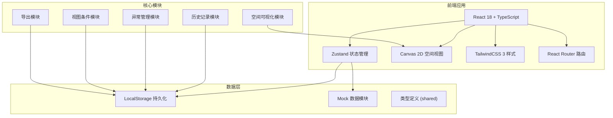
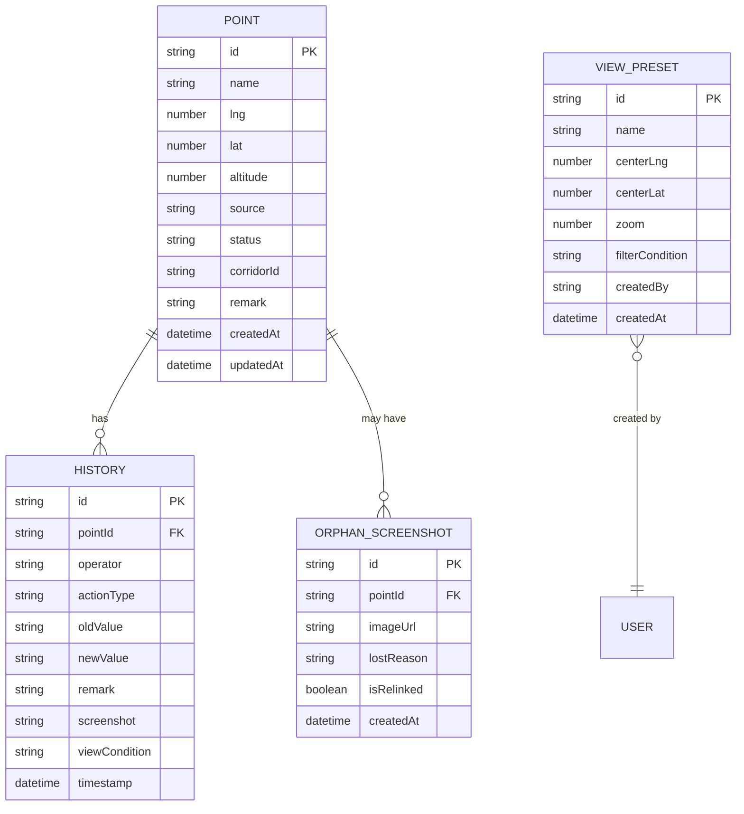

## 1. 架构设计



## 2. 技术描述

- **前端**：React@18 + TypeScript + Vite@5
- **状态管理**：Zustand@4（轻量、高性能）
- **样式**：TailwindCSS@3
- **路由**：React Router DOM@6
- **空间可视化**：原生 Canvas 2D API（无需地图库，自主绘制航线走廊）
- **图标**：Lucide React
- **数据持久化**：LocalStorage（无需后端，纯前端应用）
- **初始化工具**：vite-init
- **后端**：无（纯前端单页应用，数据本地存储）

## 3. 目录结构

```
src/
├── components/
│   ├── layout/           # 布局组件
│   │   ├── Header.tsx    # 顶部操作栏
│   │   ├── Sidebar.tsx   # 左侧点位列表
│   │   ├── DetailPanel.tsx # 右侧详情面板
│   │   └── Timeline.tsx  # 底部历史时间线
│   ├── map/              # 空间视图组件
│   │   ├── MapCanvas.tsx # Canvas 绘制容器
│   │   ├── PointMarker.tsx # 点位标记
│   │   └── Corridor.tsx  # 航线走廊绘制
│   ├── history/          # 历史记录组件
│   │   ├── HistoryItem.tsx
│   │   └── VersionCompare.tsx
│   ├── preset/           # 视图条件组件
│   │   └── ViewPresetSelector.tsx
│   ├── orphan/           # 条件丢失截图组件
│   │   └── OrphanList.tsx
│   ├── guide/            # 接班指引组件
│   │   └── OnboardingGuide.tsx
│   └── common/           # 通用组件
│       ├── Button.tsx
│       ├── Badge.tsx
│       └── Modal.tsx
├── pages/
│   └── MainPage.tsx      # 主页面
├── store/
│   ├── usePointStore.ts  # 点位状态
│   ├── useHistoryStore.ts # 历史记录状态
│   ├── useViewStore.ts   # 视图状态
│   └── usePresetStore.ts # 视图条件状态
├── hooks/
│   ├── useCanvasMap.ts   # Canvas 地图 Hook
│   ├── useHistory.ts     # 历史操作 Hook
│   └── useExport.ts      # 导出 Hook
├── utils/
│   ├── coord.ts          # 坐标转换工具
│   ├── export.ts         # 导出工具
│   └── storage.ts        # 本地存储工具
├── types/
│   └── index.ts          # 类型定义
├── data/
│   └── mockData.ts       # 模拟数据
├── App.tsx
├── main.tsx
└── index.css
```

## 4. 路由定义

| 路由 | 页面 | 说明 |
|------|------|------|
| `/` | 空间复核主页面 | 默认路由，包含所有功能模块 |
| `/orphan` | 条件丢失截图列表 | 可通过主页面标签切换，也支持直接路由 |

## 5. 数据模型

### 5.1 ER 图



### 5.2 核心类型定义

```typescript
// 点位状态枚举
export type PointStatus = 'normal' | 'abnormal' | 'pending' | 'unchecked';

// 操作类型枚举
export type ActionType = 'create' | 'update_status' | 'update_coord' | 'add_remark' | 'add_screenshot' | 'modify_judgment';

// 点位
export interface Point {
  id: string;
  name: string;
  lng: number;
  lat: number;
  altitude: number;
  source: string;
  status: PointStatus;
  corridorId: string;
  remark?: string;
  createdAt: string;
  updatedAt: string;
}

// 历史记录
export interface HistoryRecord {
  id: string;
  pointId: string;
  operator: string;
  actionType: ActionType;
  oldValue?: string;
  newValue?: string;
  remark?: string;
  screenshot?: string;
  viewCondition?: ViewCondition;
  timestamp: string;
}

// 视图条件
export interface ViewCondition {
  centerLng: number;
  centerLat: number;
  zoom: number;
  filters: {
    status?: PointStatus[];
    corridorId?: string;
    searchText?: string;
  };
}

// 视图预设
export interface ViewPreset {
  id: string;
  name: string;
  viewCondition: ViewCondition;
  createdBy: string;
  createdAt: string;
}

// 条件丢失截图
export interface OrphanScreenshot {
  id: string;
  pointId: string;
  imageUrl: string;
  lostReason: string;
  isRelinked: boolean;
  createdAt: string;
}
```

## 6. 核心模块设计

### 6.1 空间可视化模块

- 基于 Canvas 2D API 自主绘制
- 支持缩放（鼠标滚轮）、平移（拖拽）
- 坐标转换：经纬度 → Canvas 像素坐标
- 航线走廊：多边形填充 + 边界高亮
- 点位标记：根据状态显示不同颜色，异常点位脉冲动画

### 6.2 历史记录模块

- 每次修改自动创建历史记录
- 保留旧值和新值，支持版本对比
- 截图自动关联当前视图条件
- 如果视图条件缺失，自动归入 Orphan 分类
- 支持时间线浏览和筛选

### 6.3 状态管理

使用 Zustand 分模块管理：
- `usePointStore`：点位 CRUD、状态变更
- `useHistoryStore`：历史记录增删查
- `useViewStore`：当前视图状态（中心点、缩放、筛选）
- `usePresetStore`：视图预设保存和切换

### 6.4 导出模块

- 支持 CSV、JSON 格式
- 可选择导出范围：全部、筛选结果、单个航线
- 导出内容包含点位信息、状态、最新备注
- 异常清单单独导出选项
