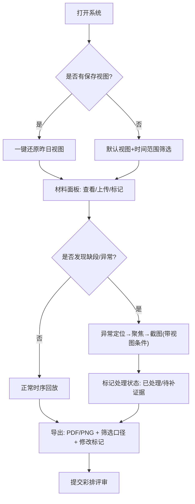

## 1. 产品概述

低空航线走廊时序回放系统，面向评审助理、排班同事等内部业务人员，解决彩排前低空航线材料的时间轴回放、异常标记、视图保存、证据追踪等核心问题。通过统一的时序视图串联点位坐标、附件材料、口头说明等多源数据，避免"视角复原不了""数字对不上""缺段看不出来"等业务痛点。

目标价值：让彩排评审从"临时解释口径"转向"一键回放留痕"，排班同事能直观定位已处理/待补证据的异常对象。

## 2. 核心功能

### 2.1 用户角色

| 角色 | 典型场景 | 核心权限 |
|------|----------|----------|
| 评审助理（阿乔） | 整理点位坐标/附件/口头说明、提交彩排版本、导出评审材料 | 编辑材料、保存视图、导出含口径标记的文件 |
| 排班同事 | 查找异常对象、换视角截图、核对处理状态 | 筛选异常、切换视角、标记处理状态、截图导出 |

### 2.2 功能模块

1. **时序回放主界面**：航线走廊地图 + 时间轴滑块 + 侧边材料面板，支持按时间逐帧回放
2. **视图保存/复原**：一键保存当前视角（地图中心/缩放/筛选条件/时间范围），次日点击即可还原
3. **材料口径追踪**：每条材料（点位/附件/口头说明）带修改历史标记，标注"是否后来改过口径"
4. **时间轴缺段标记**：时间轴上可视化标出缺段区间，筛选/详情/导出三处同步保留标记
5. **异常对象快速定位**：侧边异常列表一键跳转，支持切换视角后截图（自动附带当前视图条件）
6. **处理状态看板**：总览"已处理/待补证据/已驳回"三类对象清单，支持按状态筛选
7. **导出功能**：导出PDF/图片时内嵌屏幕数字、筛选口径元数据、修改标记与缺段标记
8. **演示数据引擎**：内置"不干净"演示数据集（含1条晚到附件、2处时间轴缺段、3处口径修改）

### 2.3 页面详情

| 页面名称 | 模块名称 | 功能描述 |
|----------|----------|----------|
| 时序回放主页 | 航线走廊地图 | 2D俯视/3D视角切换，点位渲染，航线走廊高亮，鼠标悬停显示详情 |
| 时序回放主页 | 时间轴组件 | 线性时间轴+滑块，缺段区间红色虚线标注，播放/暂停/逐帧按钮 |
| 时序回放主页 | 材料侧边栏 | 分Tab展示"点位坐标/附件/口头说明"，每项带修改标记徽章 |
| 时序回放主页 | 视图保存栏 | 视图名称输入框+保存按钮，已保存视图列表（支持删除/恢复） |
| 时序回放主页 | 筛选工具栏 | 日期范围、异常状态、材料类型、修改口径四项筛选，筛选条件可导出 |
| 时序回放主页 | 异常定位面板 | 异常对象列表（按严重程度排序），点击跳转+自动聚焦 |
| 时序回放主页 | 处理状态看板 | 三栏卡片：已处理/待补证据/已驳回，点击数字跳转筛选 |
| 材料详情抽屉 | 口径变更历史 | 时间线条目展示每次修改时间、修改人、修改前后差异 |
| 导出对话框 | 导出选项 | 格式选择（PDF/PNG）、是否包含筛选口径、是否包含修改标记、是否附带视图条件JSON |

## 3. 核心流程

评审助理阿乔的日常工作流：早晨打开系统 → 点击昨日保存的"彩排V3视图"一键还原 → 收到新的晚到附件后上传 → 系统自动在附件上打"晚到"徽章并标红 → 检查时间轴缺段是否被正确识别 → 勾选"含筛选口径+修改标记"导出PDF → 提交给彩排评审。

排班同事的工作流：打开系统 → 从处理状态看板点击"待补证据"数字 → 自动跳转筛选 → 从异常列表选中第一个对象 → 系统自动聚焦并切换到推荐视角 → 点击"截图导出" → 图片自动附带视图条件元数据 → 标记为"已处理"。

## 4. 用户界面设计

### 4.1 设计风格

**设计方向：工业管制大屏风（Aero-Industrial Aesthetic）**——参考航空管制中心的深色主题，将专业感与信息密度做平衡。
- 主色：深空蓝 `#0A1628`（背景）、航线青 `#00D4AA`（正常）、告警橙 `#FF7A45`（晚到/修改）、危险红 `#FF4D4F`（缺段/严重异常）
- 强调色：航迹黄 `#FFD93D`（高亮选中）
- 按钮：圆角 4px，扁平为主，危险操作带 1px 发光边框
- 字体：数字与代码使用 `JetBrains Mono`，正文使用 `Noto Sans SC`，标题使用 `Orbitron`（航空感几何字体）
- 布局：三栏式（左筛选+中地图+右材料/异常），顶部固定状态栏（时间、筛选摘要、处理统计）
- 图标风格：线性，圆角端点，`lucide-react` 默认风格但统一描边宽度

### 4.2 页面设计概述

| 页面名称 | 模块名称 | UI元素细节 |
|----------|----------|------------|
| 时序回放主页 | 航线走廊地图 | 深色底图，走廊半透明青蓝色填充，点位用脉冲动画圆环标记；异常点位红色光晕 |
| 时序回放主页 | 时间轴组件 | 背景用重复栅格模拟示波器刻度；缺段区间红色虚线+锯齿边缘；当前时刻黄色竖线+数字时钟 |
| 时序回放主页 | 材料侧边栏 | 每项卡片右上角彩色徽章：🟢正常 🟠晚到 🔴缺段 🔵改过口径；悬停展开修改摘要 |
| 时序回放主页 | 视图保存栏 | 已保存视图为可拖拽Tag，点击激活高亮边框，悬停显示删除按钮 |
| 时序回放主页 | 处理状态看板 | 三个等宽卡片，数字用大号 Orbitron 字体；底部进度条表示占比；点击整张卡片触发筛选 |
| 导出对话框 | 导出选项 | 每个选项对应一个可预览的缩略图示意；口径元数据展示为可折叠JSON片段 |

### 4.3 响应性

桌面端优先（最小宽度 1440px）；侧边栏支持折叠为图标；时间轴在 <1600px 时自动压缩刻度；处理状态看板在 <1280px 时改为上下堆叠。

### 4.4 3D场景指引（3D视角切换时）

- 环境：HDRI使用工业机场黄昏光照，避免纯黑导致航线发灰
- 灯光：主光冷白+补光暖橙，模拟塔台照明；航线自发光材质
- 相机：默认俯视 45°，保存视图时记录 camera.position 与 target
- 后处理：Bloom用于异常点光晕，Chromatic Aberration轻微模拟管制屏幕
- 性能：3D模式下点位使用 InstancedMesh，走廊使用 TubeGeometry，帧率目标 ≥45fps
