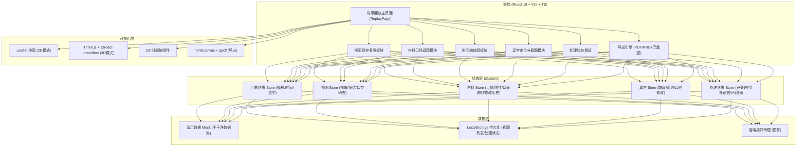
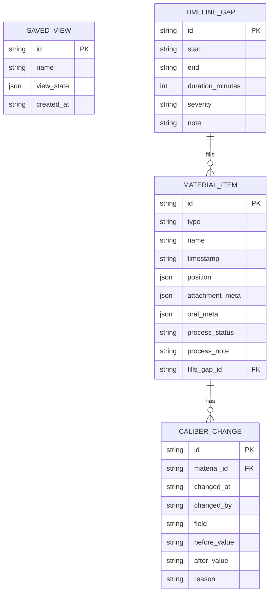

## 1. 架构设计



## 2. 技术说明

- **前端**：React@18 + TypeScript@5 + Vite@5 + TailwindCSS@3 + zustand@4
- **地图引擎**：leaflet@1.9 + react-leaflet@4（2D），预留 @react-three/fiber@8 + three@0.160（3D）
- **图表/时间轴**：d3@7（自定义时间轴 + 刻度 + 缺段渲染）
- **导出**：html2canvas@1 + jspdf@2，元数据 JSON 内嵌 PNG EXIF（预留）/ PDF 元数据字段
- **UI组件库**：lucide-react（图标）+ 自研组件（严格遵循航空管制风格，避免引入 antd 等臃肿库）
- **持久化**：localStorage（视图列表、处理状态、上传的材料记录），无需数据库
- **后端**：无。接口层定义为 TypeScript 类型 + Mock 数据，导出筛选口径通过前端拼装返回结构实现（满足"筛选口径留在接口返回里"的要求）
- **初始化**：使用 `react-ts` 模板（纯前端，无后端），因为用户场景为单页内部工具

## 3. 路由定义

| 路由 | 页面 | 用途 |
|------|------|------|
| `/` | ReplayPage | 时序回放主页面（含全部功能模块，单页应用架构，无子路由） |

所有功能模块在单页内通过抽屉/弹窗/切换组件展示，避免跳转打断回放上下文。

## 4. 接口定义（前端 Mock，模拟"接口返回"）

### 4.1 核心返回结构（模拟后端接口响应体）

```typescript
// 材料查询接口返回 - 满足"筛选口径留在接口返回里"
export interface MaterialQueryResponse {
  code: number;
  message: string;
  data: {
    items: MaterialItem[];
    // 关键：筛选口径回显在返回体里，导出时一起写进文件
    filterSnapshot: FilterSnapshot;
    // 异常汇总，供异常面板使用
    anomalySummary: AnomalySummary;
    // 时间轴缺段区间数组
    timelineGaps: TimelineGap[];
  };
  timestamp: string;
  requestId: string;
}

export interface FilterSnapshot {
  dateRange: { start: string; end: string };
  anomalyStatus: ('normal' | 'gap' | 'late' | 'modified')[];
  materialTypes: ('point' | 'attachment' | 'oral')[];
  hasModifiedCaliber: boolean | null; // null = 全部
  rawSqlLike: string; // 人类可读的筛选条件描述，导出时展示
}

// 单条材料（点位/附件/口头说明统一结构）
export interface MaterialItem {
  id: string;
  type: 'point' | 'attachment' | 'oral';
  name: string;
  timestamp: string;
  // 坐标（点位有值，附件/口头说明可关联到某个点位）
  position?: { lng: number; lat: number; altitude?: number };
  // 附件特有
  attachmentMeta?: {
    fileName: string;
    fileSize: number;
    uploadTime: string;
    isLate: boolean;   // 晚到附件标记
    expectedTime: string; // 应到时间
  };
  // 口头说明特有
  oralMeta?: { speaker: string; audioUrl?: string; transcript: string };
  // 口径修改追踪
  caliberHistory: CaliberChange[];
  hasModifiedCaliber: boolean;
  // 关联的时间轴缺段（如这条材料正好填补某缺段）
  fillsGapId?: string;
  // 处理状态
  processStatus: 'untreated' | 'processed' | 'need_evidence' | 'rejected';
  processNote?: string;
}

export interface CaliberChange {
  changedAt: string;
  changedBy: string;
  field: string;       // 哪个字段改了，如 "position.lat"
  beforeValue: string;
  afterValue: string;
  reason: string;      // 为什么改（阿乔的口头说明转文字）
}

export interface TimelineGap {
  id: string;
  start: string;
  end: string;
  durationMinutes: number;
  severity: 'warning' | 'critical';
  relatedMaterialIds: string[]; // 缺段相关材料（如晚到附件）
  note: string;
}

export interface AnomalySummary {
  totalMaterials: number;
  lateAttachments: number;
  modifiedCalibers: number;
  timelineGaps: number;
  byStatus: {
    untreated: number;
    processed: number;
    need_evidence: number;
    rejected: number;
  };
}
```

### 4.2 视图相关接口

```typescript
// 保存视图 - POST /api/views
export interface SaveViewRequest {
  name: string;
  viewState: ViewState;
}
export interface ViewState {
  // 地图/3D视角
  camera: {
    mode: '2D' | '3D';
    center: { lng: number; lat: number };
    zoom?: number;        // 2D用
    position?: [number, number, number]; // 3D用
    target?: [number, number, number];   // 3D用
  };
  // 筛选条件（和 FilterSnapshot 对应）
  filter: FilterSnapshot;
  // 当前时间轴位置
  currentTime: string;
  // 侧边栏展开状态、选中材料ID等UI状态
  ui: {
    selectedMaterialId?: string;
    sidebarTab: 'points' | 'attachments' | 'orals' | 'anomalies';
  };
  createdAt: string;
}
```

## 5. 数据模型

### 5.1 ER 图



### 5.2 演示数据（"不干净"数据集）

演示数据满足以下条件，确保"跑完别像只展示了正常样例"：
1. **晚到附件 1 条**：`附件-雷达扫描图V2.png`，应到时间 `10:20`，实际上传 `11:05`，标记 `isLate=true`
2. **时间轴缺段 2 处**：
   - 缺段A：`10:18 ~ 10:35`（17分钟，critical），正好覆盖晚到附件的时间段
   - 缺段B：`12:02 ~ 12:08`（6分钟，warning），无任何材料覆盖
3. **口径修改 3 处**：
   - 点位P04的纬度从 `31.2311` 改为 `31.2345`（阿乔操作）
   - 点位P07的高度从 `120m` 改为 `150m`（空管口头通知）
   - 附件`飞行计划V1.pdf`的说明文字从"正常"改为"绕飞雷雨区"
4. **处理状态故意不均匀**：已处理 8，待补证据 3（含晚到附件），已驳回 1，未处理 4
5. **时间跨度设计**：`09:30 ~ 13:00`，共 3.5 小时，包含正常飞行段 + 2 处缺段 + 晚到附件
