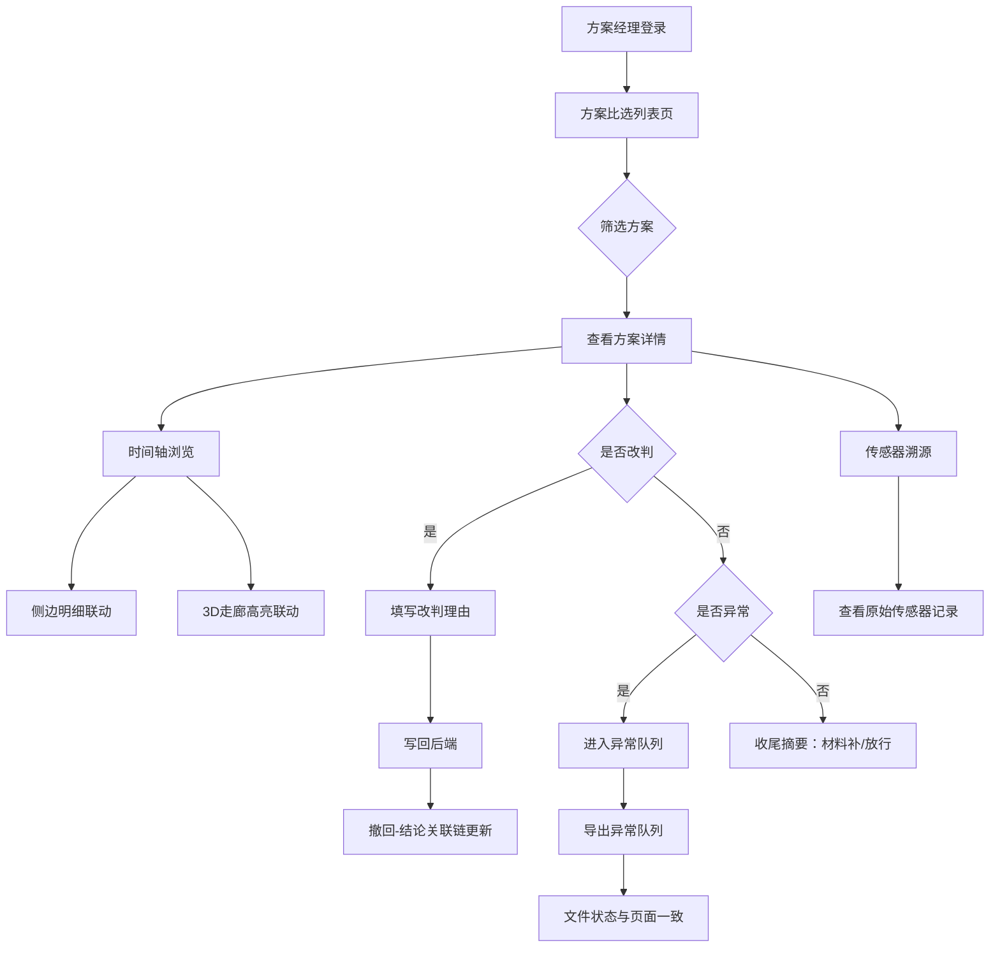

## 1. 产品概述

低空航线走廊方案比选工具——为方案经理提供走廊方案从筛选、判定到收尾的一站式管理。核心解决三个痛点：①撤回记录与最终结论断裂，②截图脱离筛选条件后无法追溯原始传感器依据，③异常队列导出与页面状态不一致。目标用户为方案经理（如小赵），需在最小可用范围内把列表、详情、改判、历史和异常队列真实写回后端。

## 2. 核心功能

### 2.1 用户角色

| 角色 | 核心权限 |
|------|----------|
| 方案经理 | 浏览方案列表、查看详情、执行改判、查看历史、管理异常队列、导出 |
| 审阅人（只读） | 浏览方案列表、查看详情与历史 |

### 2.2 功能模块

1. **方案比选列表页**：筛选条件面板 + 方案卡片列表 + 状态快速切换
2. **方案详情页**：时间轴 + 侧边明细 + 3D 走廊高亮 + 撤回-结论关联链 + 传感器溯源
3. **异常队列页**：异常条目列表 + 批量导出 + 状态一致性保障

### 2.3 页面详情

| 页面名称 | 模块名称 | 功能描述 |
|----------|----------|----------|
| 方案比选列表页 | 筛选条件面板 | 条件（走廊编号、状态、时间段、传感器类型）始终可见，截图时条件自动嵌入图片水印，条件可一键追溯至传感器记录 |
| 方案比选列表页 | 方案卡片列表 | 展示方案编号、走廊名称、当前状态（通过/待补/异常/撤回）、传感器来源摘要、最后结论摘要；支持改判入口 |
| 方案比选列表页 | 状态快速切换 | 按状态标签过滤，异常队列快捷入口 |
| 方案详情页 | 时间轴 | 按时间排列方案全生命周期节点（创建→传感器采集→初审→改判→撤回→终审结论），点击节点同步侧边明细与 3D 高亮 |
| 方案详情页 | 侧边明细 | 展示当前时间节点的详细数据（传感器原始读数、撤回原因、结论依据），随时间轴切换实时联动 |
| 方案详情页 | 3D 走廊高亮 | Three.js 渲染走廊三维模型，根据时间轴选中节点高亮对应航段与传感器位置 |
| 方案详情页 | 撤回-结论关联链 | 将撤回记录与最终结论用可视化连线绑定，展示"撤回原因→补充材料→最终判定"完整链路 |
| 方案详情页 | 传感器溯源 | 点击结论中的任一依据，跳转至原始传感器记录，显示采集时间、设备编号、原始读数 |
| 方案详情页 | 改判操作 | 弹出改判表单，填写改判理由与补充材料，提交后写回后端并更新历史 |
| 方案详情页 | 收尾摘要 | 非技术说明，而是人可读的行动清单：哪条材料需补、哪条可放行、撤回影响的范围 |
| 异常队列页 | 异常条目列表 | 展示所有异常方案，状态列与导出文件中状态字段严格一致 |
| 异常队列页 | 批量导出 | 导出 CSV/JSON，文件中状态枚举值与页面显示完全一致，包含筛选条件快照 |
| 异常队列页 | 条件溯源 | 每条异常记录可追溯到触发异常的传感器原始记录 |

## 3. 核心流程

方案经理打开列表页，按走廊/状态/时间筛选方案；选中某方案进入详情页，通过时间轴查看全生命周期；若发现需改判，执行改判并填写理由；改判后撤回记录自动与最终结论关联；异常方案进入异常队列，导出时状态与页面一致。

## 4. 用户界面设计

### 4.1 设计风格

- **主色**：深炭灰 `#0F1419` + 航空仪表青 `#00D4AA`
- **辅色**：琥珀警告 `#FFB020`、通过绿 `#00C48C`、异常红 `#FF4757`
- **按钮风格**：圆角微凸，主操作青色填充，次操作描边
- **字体**：数据区 JetBrains Mono，UI 区 Noto Sans SC
- **布局**：左侧导航 + 主内容区，详情页三栏（时间轴 | 内容 | 3D）
- **图标**：线性风格，2px 描边

### 4.2 页面设计概览

| 页面名称 | 模块名称 | UI 元素 |
|----------|----------|---------|
| 方案比选列表页 | 筛选条件面板 | 顶部固定栏，下拉/日期/标签组合，条件水印徽章 |
| 方案比选列表页 | 方案卡片列表 | 卡片网格，状态色条，悬浮展开传感器摘要 |
| 方案详情页 | 时间轴 | 左侧竖向时间线，节点颜色区分状态，选中节点发光 |
| 方案详情页 | 侧边明细 | 中间面板，分区块展示传感器/撤回/结论数据 |
| 方案详情页 | 3D 走廊 | 右侧 Three.js 画布，航段高亮动画，传感器标记点 |
| 方案详情页 | 撤回-结论关联链 | 连线 + 箭头可视化，撤回节点到结论节点的因果链 |
| 方案详情页 | 收尾摘要 | 底部卡片，行动清单样式（✅ 可放行 / ⚠️ 需补材料） |
| 异常队列页 | 异常条目列表 | 紧凑表格，状态枚举色标，行内溯源链接 |
| 异常队列页 | 导出面板 | 顶部工具栏，格式选择 + 条件快照显示 |

### 4.3 响应式策略

桌面优先设计，最小支持 1280px 宽度；详情页三栏在 1280-1440px 间折叠侧边明细为抽屉；异常队列表格在小屏横向滚动。

### 4.4 3D 场景指引

- **环境**：暗色天空盒，低饱和度大气雾效
- **光照**：环境光 + 定向光模拟日间低空
- **相机**：透视相机，OrbitControls 自由旋转，默认俯视 45°
- **焦点**：选中航段高亮（青色发光），传感器标记点（琥珀色脉冲）
- **交互**：时间轴节点切换 → 相机平滑飞至对应航段 + 航段高亮
- **后处理**：Bloom 效果增强高亮发光感
