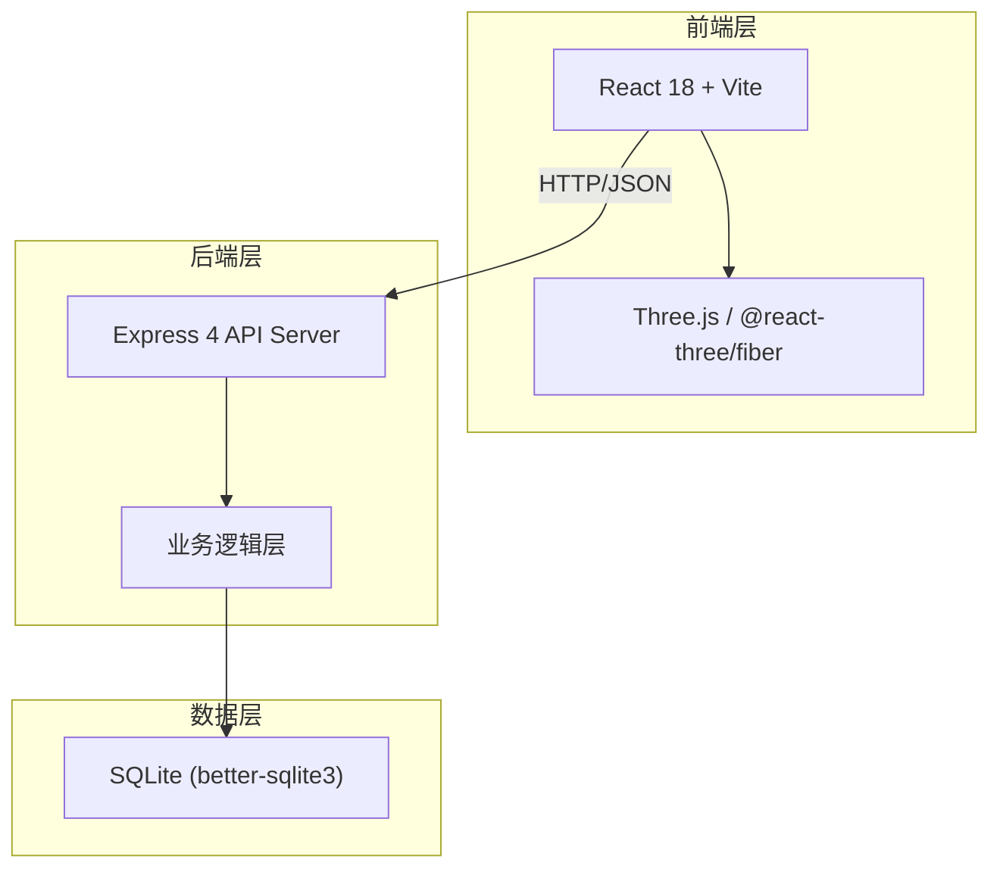
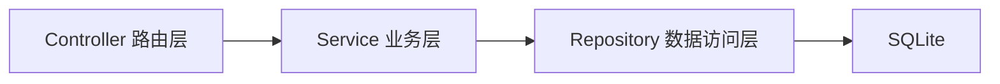

## 1. 架构设计



## 2. 技术说明

- **前端**：React@18 + tailwindcss@3 + Vite
- **初始化工具**：vite-init
- **3D 渲染**：three + @react-three/fiber + @react-three/drei + @react-three/postprocessing
- **后端**：Express@4
- **数据库**：SQLite (better-sqlite3)，轻量单文件，便于交接
- **动画**：framer-motion

## 3. 路由定义

| 路由 | 用途 |
|------|------|
| `/` | 方案比选列表页，含筛选条件面板和方案卡片 |
| `/plan/:id` | 方案详情页，含时间轴、侧边明细、3D走廊、撤回-结论关联 |
| `/exceptions` | 异常队列页，含条目列表和导出功能 |

## 4. API 定义

### 4.1 方案相关

```typescript
interface Plan {
  id: string;
  corridorCode: string;
  corridorName: string;
  status: "pass" | "supplement" | "exception" | "withdrawn";
  sensorSourceSummary: string;
  conclusionSummary: string;
  createdAt: string;
  updatedAt: string;
}

interface PlanDetail extends Plan {
  timeline: TimelineNode[];
  withdrawalLink: WithdrawalLink | null;
  conclusion: Conclusion | null;
  actionSummary: ActionItem[];
}

interface TimelineNode {
  id: string;
  planId: string;
  type: "created" | "sensor_collect" | "first_review" | "rejudge" | "withdrawn" | "final_review";
  title: string;
  timestamp: string;
  sensorRecordId?: string;
  corridorSegmentIndex?: number;
  detail: Record<string, unknown>;
}

interface WithdrawalLink {
  withdrawalRecordId: string;
  withdrawalReason: string;
  supplementedMaterialIds: string[];
  finalConclusionId: string;
  finalConclusionText: string;
}

interface Conclusion {
  id: string;
  planId: string;
  result: "pass" | "supplement" | "exception";
  basis: ConclusionBasis[];
  actionItems: ActionItem[];
  createdAt: string;
}

interface ConclusionBasis {
  sensorRecordId: string;
  sensorDeviceCode: string;
  sensorTimestamp: string;
  rawReading: number;
  interpretation: string;
}

interface ActionItem {
  id: string;
  type: "release" | "supplement";
  description: string;
  materialRef?: string;
}

// GET /api/plans?status=&corridorCode=&from=&to=&sensorType=
interface ListPlansResponse {
  plans: Plan[];
  total: number;
  filterSnapshot: Record<string, string>;
}

// GET /api/plans/:id
interface GetPlanDetailResponse {
  plan: PlanDetail;
}

// POST /api/plans/:id/rejudge
interface RejudgeRequest {
  reason: string;
  supplementedMaterials: string[];
  newStatus: "pass" | "supplement" | "exception";
}

interface RejudgeResponse {
  plan: PlanDetail;
}

// GET /api/plans/:id/history
interface GetPlanHistoryResponse {
  nodes: TimelineNode[];
}
```

### 4.2 传感器溯源

```typescript
interface SensorRecord {
  id: string;
  deviceCode: string;
  type: string;
  timestamp: string;
  rawReading: number;
  unit: string;
  corridorSegmentIndex: number;
  metadata: Record<string, unknown>;
}

// GET /api/sensors/:id
interface GetSensorRecordResponse {
  record: SensorRecord;
}

// GET /api/sensors?planId=&type=
interface ListSensorRecordsResponse {
  records: SensorRecord[];
}
```

### 4.3 异常队列

```typescript
// GET /api/exceptions?status=&corridorCode=
interface ListExceptionsResponse {
  exceptions: Plan[];
  filterSnapshot: Record<string, string>;
}

// GET /api/exceptions/export?format=csv|json&status=&corridorCode=
interface ExportExceptionsResponse {
  downloadUrl: string;
  filterSnapshot: Record<string, string>;
  exportedAt: string;
  statusEnum: Record<string, string>;
}
```

## 5. 服务端架构



- **Controller**：参数校验、请求分发、响应格式化
- **Service**：改判逻辑、撤回-结论关联、异常状态一致性校验
- **Repository**：SQL 查询封装、事务管理

## 6. 数据模型

### 6.1 数据模型定义

```mermaid
erdiag
    PLAN {
        string id PK
        string corridor_code
        string corridor_name
        string status
        string sensor_source_summary
        string conclusion_summary
        datetime created_at
        datetime updated_at
    }
    TIMELINE_NODE {
        string id PK
        string plan_id FK
        string type
        string title
        datetime timestamp
        string sensor_record_id FK
        int corridor_segment_index
        text detail_json
    }
    SENSOR_RECORD {
        string id PK
        string device_code
        string type
        datetime timestamp
        real raw_reading
        string unit
        int corridor_segment_index
        text metadata_json
    }
    WITHDRAWAL_LINK {
        string id PK
        string plan_id FK
        string withdrawal_record_id FK
        text withdrawal_reason
        text supplemented_material_ids_json
        string final_conclusion_id FK
    }
    CONCLUSION {
        string id PK
        string plan_id FK
        string result
        datetime created_at
    }
    CONCLUSION_BASIS {
        string id PK
        string conclusion_id FK
        string sensor_record_id FK
        string interpretation
    }
    ACTION_ITEM {
        string id PK
        string plan_id FK
        string type
        text description
        string material_ref
    }
    PLAN ||--o{ TIMELINE_NODE : "has"
    PLAN ||--o| WITHDRAWAL_LINK : "has"
    PLAN ||--o| CONCLUSION : "has"
    PLAN ||--o{ ACTION_ITEM : "has"
    CONCLUSION ||--o{ CONCLUSION_BASIS : "based_on"
    CONCLUSION_BASIS }o--|| SENSOR_RECORD : "traces_to"
    TIMELINE_NODE }o--o| SENSOR_RECORD : "references"
    WITHDRAWAL_LINK }o--|| TIMELINE_NODE : "withdrawal_event"
```

### 6.2 数据定义语言

```sql
CREATE TABLE plan (
  id TEXT PRIMARY KEY,
  corridor_code TEXT NOT NULL,
  corridor_name TEXT NOT NULL,
  status TEXT NOT NULL CHECK(status IN ('pass','supplement','exception','withdrawn')),
  sensor_source_summary TEXT DEFAULT '',
  conclusion_summary TEXT DEFAULT '',
  created_at TEXT NOT NULL DEFAULT (datetime('now')),
  updated_at TEXT NOT NULL DEFAULT (datetime('now'))
);

CREATE TABLE timeline_node (
  id TEXT PRIMARY KEY,
  plan_id TEXT NOT NULL REFERENCES plan(id),
  type TEXT NOT NULL CHECK(type IN ('created','sensor_collect','first_review','rejudge','withdrawn','final_review')),
  title TEXT NOT NULL,
  timestamp TEXT NOT NULL DEFAULT (datetime('now')),
  sensor_record_id TEXT REFERENCES sensor_record(id),
  corridor_segment_index INTEGER,
  detail_json TEXT DEFAULT '{}'
);

CREATE TABLE sensor_record (
  id TEXT PRIMARY KEY,
  device_code TEXT NOT NULL,
  type TEXT NOT NULL,
  timestamp TEXT NOT NULL DEFAULT (datetime('now')),
  raw_reading REAL NOT NULL,
  unit TEXT NOT NULL DEFAULT '',
  corridor_segment_index INTEGER NOT NULL DEFAULT 0,
  metadata_json TEXT DEFAULT '{}'
);

CREATE TABLE withdrawal_link (
  id TEXT PRIMARY KEY,
  plan_id TEXT NOT NULL REFERENCES plan(id),
  withdrawal_record_id TEXT NOT NULL REFERENCES timeline_node(id),
  withdrawal_reason TEXT NOT NULL DEFAULT '',
  supplemented_material_ids_json TEXT DEFAULT '[]',
  final_conclusion_id TEXT REFERENCES conclusion(id)
);

CREATE TABLE conclusion (
  id TEXT PRIMARY KEY,
  plan_id TEXT NOT NULL REFERENCES plan(id),
  result TEXT NOT NULL CHECK(result IN ('pass','supplement','exception')),
  created_at TEXT NOT NULL DEFAULT (datetime('now'))
);

CREATE TABLE conclusion_basis (
  id TEXT PRIMARY KEY,
  conclusion_id TEXT NOT NULL REFERENCES conclusion(id),
  sensor_record_id TEXT NOT NULL REFERENCES sensor_record(id),
  interpretation TEXT NOT NULL DEFAULT ''
);

CREATE TABLE action_item (
  id TEXT PRIMARY KEY,
  plan_id TEXT NOT NULL REFERENCES plan(id),
  type TEXT NOT NULL CHECK(type IN ('release','supplement')),
  description TEXT NOT NULL DEFAULT '',
  material_ref TEXT DEFAULT ''
);

CREATE INDEX idx_plan_status ON plan(status);
CREATE INDEX idx_plan_corridor ON plan(corridor_code);
CREATE INDEX idx_timeline_plan ON timeline_node(plan_id);
CREATE INDEX idx_timeline_type ON timeline_node(type);
CREATE INDEX idx_sensor_type ON sensor_record(type);
CREATE INDEX idx_sensor_corridor ON sensor_record(corridor_segment_index);
CREATE INDEX idx_conclusion_plan ON conclusion(plan_id);
CREATE INDEX idx_conclusion_basis_conclusion ON conclusion_basis(conclusion_id);
CREATE INDEX idx_conclusion_basis_sensor ON conclusion_basis(sensor_record_id);
CREATE INDEX idx_withdrawal_plan ON withdrawal_link(plan_id);
CREATE INDEX idx_action_plan ON action_item(plan_id);
```
