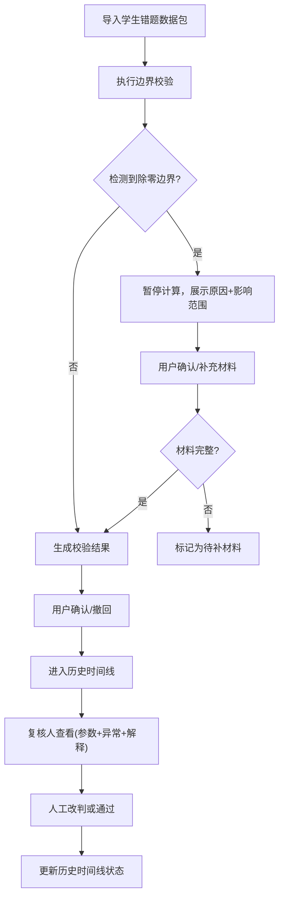

## 1. 产品概述

"最短路径边界校验"是一款面向投研团队的轻量级数据校验工具，用于处理学生错题等研究样本的边界情况检测与复核。通过导入、确认、撤回、历史时间线四大核心功能，确保边界样本不被忽视，让研究结论可追溯、可复核。

- **核心问题**：边界样本（如除零错误）常被隐藏在正常数据后，缺乏系统化的校验流程和历史追溯机制
- **目标用户**：投研助理、研究员、复核负责人
- **产品价值**：让异常数据可见、可解释、可追溯，避免"凭感觉"处理边界情况

## 2. 核心功能

### 2.1 用户角色

| 角色 | 注册方式 | 核心权限 |
|------|----------|----------|
| 投研助理 | 本地直接使用 | 导入数据、执行校验、确认/撤回结果 |
| 复核负责人 | 本地直接使用 | 查看参数版本、复核异常点、人工改判 |
| 其他使用者 | 本地直接使用 | 查看材料入口、理解异常出口 |

### 2.2 功能模块

1. **校验工作台**：数据导入、校验执行、结果确认/撤回
2. **复核详情页**：参数版本、异常点定位、解释说明（同页展示）
3. **历史时间线**：已处理、待补材料、人工改判三类状态清晰区分
4. **材料入口/异常出口**：标准化的导入导出机制，降低使用门槛

### 2.3 页面详情

| 页面名称 | 模块名称 | 功能描述 |
|---------|----------|----------|
| 校验工作台 | 数据导入区 | 支持拖拽/点击导入学生错题数据包，实时显示导入进度 |
| 校验工作台 | 校验执行区 | 点击开始校验，检测除零边界等异常，遇异常暂停并展示原因和影响范围 |
| 校验工作台 | 结果操作区 | 单条记录确认、批量确认、撤回操作，状态实时更新 |
| 复核详情页 | 参数版本区 | 展示当前校验使用的算法版本、参数配置、数据时间戳 |
| 复核详情页 | 异常点区 | 高亮显示异常记录，展示待确认原因和影响范围分析 |
| 复核详情页 | 解释说明区 | 研究员填写的解释、人工改判理由、后续处理建议 |
| 历史时间线 | 状态分类区 | 三类状态（已处理/待补材料/人工改判）分栏或标签展示 |
| 历史时间线 | 时间线列表 | 按时间倒序排列，显示操作人、时间、状态变更摘要 |
| 材料入口 | 导入引导 | 清晰的导入说明、示例数据包下载、格式要求 |
| 异常出口 | 导出面板 | 支持导出校验报告、异常清单、复核意见 |

## 3. 核心流程

用户导入学生错题数据包 → 系统执行最短路径边界校验 → 检测到除零边界时暂停，展示待确认原因和影响范围 → 用户确认或补充材料 → 系统继续处理或标记待补 → 复核人查看参数版本+异常点+解释 → 人工改判或通过 → 操作记录进入历史时间线。

## 4. 用户界面设计

### 4.1 设计风格

采用**专业数据研究**风格，偏向 editorial 杂志排版 + 极少量 brutalist 粗线条元素：

- **主色调**：深海军蓝 `#1a365d`（专业、稳重），搭配暖琥珀 `#d69e2e`（异常警示）
- **辅助色**：墨绿 `#2f855a`（已处理）、橙红 `#c05621`（待补材料）、靛蓝 `#553c9a`（人工改判）
- **按钮风格**：方形微圆角（2px），带细边框，hover 时背景轻微加深，active 时有像素级内阴影
- **字体**：标题使用 `Playfair Display`（学术感衬线），正文使用 `IBM Plex Sans`（清晰易读的等宽感无衬线）
- **布局**：卡片式网格布局，卡片间 24px 间距，左侧 200px 固定导航，右侧主内容区
- **视觉细节**：关键数据使用等宽字体 `JetBrains Mono`，异常数据旁添加细红边框 + 小三角形警示标记

### 4.2 页面设计概述

| 页面名称 | 模块名称 | UI 元素 |
|---------|----------|---------|
| 校验工作台 | 数据导入区 | 大虚线框拖拽区、文件列表、进度条、导入/重置按钮 |
| 校验工作台 | 校验执行区 | 大主按钮"开始校验"、状态指示器、异常暂停弹窗（原因+影响范围） |
| 校验工作台 | 结果操作区 | 数据表格（斑马纹）、行内操作按钮、批量操作栏 |
| 复核详情页 | 三栏同页 | 左：参数版本卡片，中：异常点高亮列表，右：解释说明富文本区 |
| 历史时间线 | 状态分类 | 三标签页切换（已处理/待补材料/人工改判），垂直时间线，状态色标 |
| 材料入口/出口 | 引导面板 | 左侧材料入口（导入说明+示例），右侧异常出口（导出选项） |

### 4.3 响应性

- 桌面端优先（1280px+），主内容区最小宽度 960px
- 平板端（768px-1279px）：左侧导航收缩为图标栏
- 移动端（<768px）：顶部导航，内容单列堆叠

### 4.4 动效设计

- 页面加载：卡片依次淡入（stagger 80ms），从下往上轻微位移 8px
- 异常检测：异常行红色边框脉冲动画（3s 循环）
- 确认/撤回操作：按钮点击后圆形进度波纹，完成后打钩/叉动画
- 时间线：滚动时节点依次点亮（使用 Intersection Observer）
