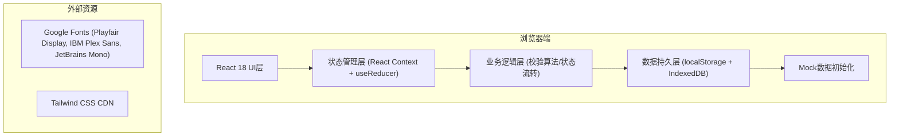
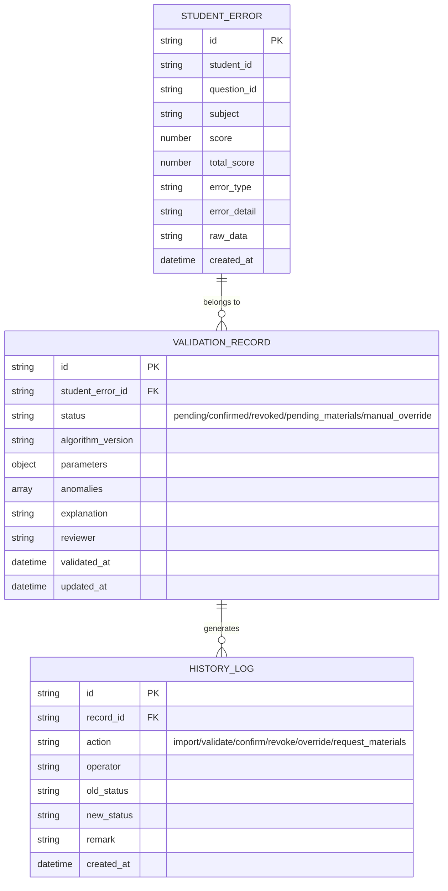

## 1. 架构设计

纯前端单页应用，使用 localStorage 作为本地数据存储，无需后端服务。所有数据操作在浏览器端完成，确保数据隐私和离线可用性。



## 2. 技术描述

- **前端框架**: React@18 + TypeScript + Vite@5
- **样式方案**: Tailwind CSS@3 + CSS 变量主题系统
- **状态管理**: React Context + useReducer（轻量级，适合小工具）
- **数据存储**: localStorage（主数据）+ IndexedDB（大文件缓存）
- **路由**: React Router DOM@6
- **图标**: Lucide React（简洁线性图标）
- **动画**: Framer Motion（复杂动效）+ CSS Transitions（基础动效）
- **包管理**: npm
- **构建工具**: Vite@5
- **Mock 数据**: 内置学生错题数据包（包含正常记录和除零边界样本）

## 3. 路由定义

| 路由路径 | 页面名称 | 核心功能 |
|----------|---------|----------|
| `/` | 校验工作台 | 数据导入、执行校验、结果确认/撤回 |
| `/review/:id` | 复核详情页 | 参数版本、异常点、解释说明同页展示 |
| `/timeline` | 历史时间线 | 已处理/待补材料/人工改判分类展示 |
| `/materials` | 材料入口/出口 | 导入说明、示例下载、报告导出 |

## 4. 数据模型

### 4.1 数据模型定义



### 4.2 TypeScript 类型定义

```typescript
// 学生错题数据
interface StudentError {
  id: string;
  studentId: string;
  questionId: string;
  subject: string;
  score: number;
  totalScore: number;
  errorType: string;
  errorDetail: string;
  rawData: Record<string, unknown>;
  createdAt: string;
}

// 异常检测结果
interface Anomaly {
  type: 'division_by_zero' | 'out_of_range' | 'missing_data' | 'pattern_mismatch';
  field: string;
  value: unknown;
  reason: string;
  impactScope: string[];
  severity: 'low' | 'medium' | 'high' | 'critical';
}

// 校验记录
type ValidationStatus = 'pending' | 'confirmed' | 'revoked' | 'pending_materials' | 'manual_override';

interface ValidationRecord {
  id: string;
  studentErrorId: string;
  studentError: StudentError;
  status: ValidationStatus;
  algorithmVersion: string;
  parameters: Record<string, unknown>;
  anomalies: Anomaly[];
  explanation: string;
  reviewer: string;
  validatedAt: string;
  updatedAt: string;
}

// 历史日志
interface HistoryLog {
  id: string;
  recordId: string;
  action: 'import' | 'validate' | 'confirm' | 'revoke' | 'override' | 'request_materials';
  operator: string;
  oldStatus: ValidationStatus | null;
  newStatus: ValidationStatus | null;
  remark: string;
  createdAt: string;
}

// 应用状态
interface AppState {
  studentErrors: StudentError[];
  validationRecords: ValidationRecord[];
  historyLogs: HistoryLog[];
  selectedRecordId: string | null;
  isValidating: boolean;
  currentAlgorithmVersion: string;
}
```

### 4.3 Mock 数据说明

内置学生错题数据包包含 12 条记录：
- 9 条正常记录（各科错题，分数/总分计算正常）
- 2 条除零边界记录（总分 = 0，导致得分率计算出现除零）
- 1 条缺失数据记录（必要字段为空）

数据文件路径: `src/data/mockStudentErrors.ts`

## 5. 核心算法

### 5.1 最短路径边界校验算法

```typescript
function validateBoundary(record: StudentError, params: ValidationParams): Anomaly[] {
  const anomalies: Anomaly[] = [];
  
  // 1. 除零边界检测
  if (record.totalScore === 0) {
    anomalies.push({
      type: 'division_by_zero',
      field: 'totalScore',
      value: 0,
      reason: '题目总分为0，无法计算得分率和最短路径权重',
      impactScope: ['得分率计算', '难度系数校准', '知识点关联分析'],
      severity: 'critical'
    });
  }
  
  // 2. 分数范围校验
  if (record.score < 0 || record.score > record.totalScore) {
    anomalies.push({
      type: 'out_of_range',
      field: 'score',
      value: record.score,
      reason: `得分 ${record.score} 超出有效范围 [0, ${record.totalScore}]`,
      impactScope: ['排名计算', '能力评估模型'],
      severity: 'high'
    });
  }
  
  // 3. 最短路径边界检测（基于错题关联图）
  const pathScore = calculateShortestPath(record, params);
  if (pathScore.isBoundary) {
    anomalies.push({
      type: 'pattern_mismatch',
      field: 'errorDetail',
      value: record.errorDetail,
      reason: `错题处于知识点关联图的边界节点，路径权重异常: ${pathScore.value}`,
      impactScope: ['错题归因', '推荐习题生成'],
      severity: 'medium'
    });
  }
  
  return anomalies;
}
```

## 6. 存储键名约定

| 键名 | 数据类型 | 说明 |
|------|---------|------|
| `spvc_student_errors` | StudentError[] | 学生错题原始数据 |
| `spvc_validation_records` | ValidationRecord[] | 校验记录 |
| `spvc_history_logs` | HistoryLog[] | 历史操作日志 |
| `spvc_algorithm_version` | string | 当前算法版本 |
| `spvc_last_operator` | string | 最后操作人员 |

## 7. 项目目录结构

```
src/
├── components/          # UI 组件
│   ├── layout/         # 布局组件 (Sidebar, Header)
│   ├── common/         # 通用组件 (Button, Modal, Table)
│   └── features/       # 业务组件 (ImportZone, ValidationPanel, Timeline)
├── contexts/           # React Context
│   └── AppContext.tsx
├── data/               # Mock 数据
│   └── mockStudentErrors.ts
├── hooks/              # 自定义 Hooks
│   ├── useValidation.ts
│   └── useLocalStorage.ts
├── pages/              # 页面组件
│   ├── Workbench.tsx
│   ├── ReviewDetail.tsx
│   ├── Timeline.tsx
│   └── Materials.tsx
├── types/              # TypeScript 类型定义
│   └── index.ts
├── utils/              # 工具函数
│   ├── validator.ts
│   ├── storage.ts
│   └── helpers.ts
├── App.tsx
├── main.tsx
└── index.css
```
