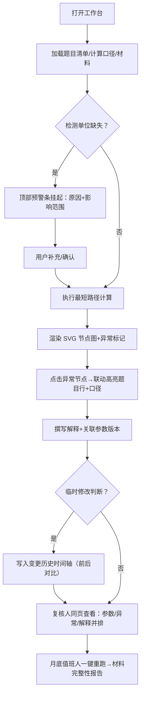

## 1. 产品概述

「最短路径图表解释」是面向数学教学复核场景的交互式可视化工具，解决老叶老师在最短路径算法教学中「图表好看但点不回明细」、「复核只剩结论无过程」、「临时修改无历史痕迹」三大核心痛点。目标用户为数学教师（编制题目、复核结果）和算法值班人（月底封账自查）。

产品核心价值：将「计算口径—题目清单—异常点—参数版本—变更历史—待确认事项」六要素在同一工作台闭环呈现，支持图表异常点一键下钻回题目明细，让交付材料自解释、自证清。

## 2. 核心功能

### 2.1 用户角色

| 角色 | 说明 | 核心权限 |
|------|------|----------|
| 数学老师（老叶） | 题目编制者、解释撰写者、临时判断修改者 | 全量操作：录入题目、调整参数、标记异常、修改判断、提交解释 |
| 复核人（下一班老师） | 交叉复核者 | 只读+下钻：查看图表、点击异常回题目、查看参数版本与历史 |
| 算法值班人 | 月底封账前自查 | 一键重跑：加载全部材料、执行计算、确认交付完整性 |

### 2.2 功能模块

1. **主工作台页**：最短路径可视化图表区、题目清单面板、计算口径面板（三栏并列，同屏可见）
2. **复核摘要卡**：参数版本、异常点列表、文字解释三段式，同页并排不翻页
3. **变更历史时间轴**：每次判断修改留痕，可切换查看「修改前 / 修改后」对比
4. **待确认预警条**：单位缺失等异常时中止计算，挂起原因 + 影响范围高亮
5. **材料归档区**：题目清单（含样例）、撤回记录条目、后补说明文档三类材料可视化
6. **一键重跑入口**：算法值班人月底自助执行，自检材料是否齐全

### 2.3 页面详情

| 页面名称 | 模块名称 | 功能描述 |
|----------|----------|----------|
| 主工作台 | 最短路径图表 | SVG 绘制节点-边图，节点可点击高亮，异常节点红色脉冲标记；hover 显示节点信息气泡 |
| 主工作台 | 题目清单面板 | 可折叠列表，每条题目含 ID、起点-终点、距离、单位列；单位缺失行橙色标注 |
| 主工作台 | 计算口径面板 | 参数版本号（带时间戳）、算法类型（Dijkstra/Floyd）、节点数/边数、权重处理规则 |
| 主工作台 | 复核摘要卡 | 固定在右侧：参数版本徽章、异常点条目（可点击下钻到图表节点和题目行）、文字解释富文本 |
| 主工作台 | 变更历史时间轴 | 底部横向时间轴，每次修改记录操作人、时间、字段、前后值，点击可回显当时状态 |
| 主工作台 | 待确认预警条 | 顶部横幅，单位缺失时显示：待确认原因 + 影响题目数量 + 涉及节点 + 「确认后继续」按钮 |
| 主工作台 | 材料归档区 | 三标签页：题目清单（附样例 3 条）、撤回记录（1 条）、后补说明（1 段） |
| 主工作台 | 一键重跑入口 | 右上角按钮，算法值班人点击后模拟重算，并校验材料完整性弹窗报告 |

## 3. 核心流程

主用户流程：老叶老师打开工作台 → 加载题目清单与计算口径 → 系统检测单位缺失 → 预警条挂起 → 补充单位后确认 → 计算执行生成图表 → 标记异常节点并写入解释 → 临时修改某节点判断（历史自动记录）→ 复核人打开同页查看（参数+异常+解释同屏）→ 月底值班人一键重跑校验。

## 4. 用户界面设计

### 4.1 设计风格

- **主色调**：墨绿 `#1B4332`（学科稳重感）+ 赭石橙 `#C8553D`（异常预警）+ 暖米底 `#F7F3E9`（纸质质感）
- **辅助色**：路径高亮用橄榄金 `#B08968`，正常节点用冷灰 `#495057`
- **按钮风格**：微立体圆角 8px，hover 上浮 2px + 阴影加深；危险/确认按钮用赭石橙实底
- **字体方案**：标题用「思源宋体 SemiBold」（学术感），正文与数据用「JetBrains Mono」等宽 + 「PingFang SC」混排
- **布局风格**：三栏不等宽栅格（左 26% 题目清单，中 44% 图表+口径，右 30% 复核卡）；顶部预警条 + 底部历史时间轴双横幅
- **装饰细节**：纸张细纹噪点背景、图表外框细双线、参数版本号用仿钢印圆形徽章、异常节点用红色脉冲环动画

### 4.2 页面设计概览

| 页面名称 | 模块名称 | UI 元素 |
|----------|----------|----------|
| 主工作台 | 顶部预警条 | 赭石橙渐变底+警告三角图标，分两行展示「待确认原因」和「影响范围：N题/M节点」，右侧「确认后继续」实心按钮 |
| 主工作台 | 最短路径图表 | SVG 画布带细双线边框和 8px 圆角，节点为圆点（正常灰/路径金/异常红脉冲），边为灰色细线（最短路径加粗描金），节点 hover 浮动卡片 |
| 主工作台 | 题目清单面板 | 卡片式白底阴影，每行题目 ID+起终点+距离+单位四列，单位缺失行左边界赭石橙竖条+斜纹背景 |
| 主工作台 | 复核摘要卡 | 三段分栏卡片：上段圆形徽章参数版本号+时间戳，中段异常点列表（每项带节点圆点+题目链接），下段富文本解释框 |
| 主工作台 | 变更历史时间轴 | 底部横向，圆形节点连虚线，每个节点悬停显示操作人/时间/修改字段，点击切换灰显对比（前值划掉+后值高亮） |
| 主工作台 | 材料归档区 | 标签页切换，题目清单样例/撤回记录（灰色删除线样式）/后补说明（楷体+黄色便利贴背景） |
| 主工作台 | 一键重跑按钮 | 右上角圆角实心墨绿按钮+旋转箭头图标，点击后模态框进度条+最终材料齐全/缺失报告 |

### 4.3 响应式

桌面端优先（≥1280px），三栏并列；960–1279px 复核卡折叠为底部抽屉；<960px 上下堆叠，图表先全屏显示，其余面板可展开。

### 4.4 动效与微交互

- 进入页面：三栏错峰淡入（左→中→右，各延迟 120ms），图表节点逐个弹出
- 异常节点：持续 CSS 脉冲环（缩放 1→1.4，透明度 1→0），每 1.8s 一次
- 点击异常节点：图表闪红→题目清单对应行滚入视口并橙色闪烁 2 次→计算口径高亮参数
- 修改判断提交：时间轴尾部新增节点，发光扩散动画
- 一键重跑：按钮内旋转箭头，进度条每 20% 切换状态文案

