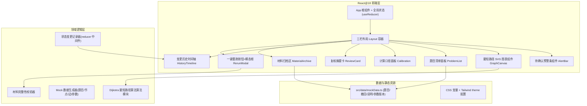

## 1. 架构设计



## 2. 技术选型说明

- **前端框架**：React@18 + TypeScript@5（严格类型，保障题目/参数/历史记录的类型安全）
- **构建工具**：Vite@5（冷启动快，HMR 稳定）
- **样式方案**：Tailwind CSS@3 + 自定义 CSS 变量（主色墨绿/赭石橙/暖米统一管理）+ 内嵌 CSS 动画（脉冲、闪烁、错峰淡入）
- **图表绘制**：原生 SVG（无第三方依赖，节点和边可精确交互，hover/click 事件绑定轻量）
- **状态管理**：React useReducer + Context（状态集中在全局 store，支持中间件记录每次修改 → 自动喂给历史时间轴）
- **图标方案**：内联 SVG 手绘风图标（警告三角、旋转箭头、钢印徽章），避免引入图标库
- **数据方案**：纯前端 Mock 数据（题目清单 5 条含 1 条单位缺失、撤回记录 1 条、后补说明 1 段、参数版本 2 条历史）

## 3. 路由定义

本产品为单页工作台（Single Workbench），无需多路由。所有模块在同一页面通过「状态切换」和「面板折叠」交互。

| 路由 | 用途 |
|------|------|
| / | 主工作台（唯一入口，含全部模块） |

## 4. 核心类型与数据结构（TypeScript）

```typescript
// 节点
interface GraphNode {
  id: string;
  label: string;
  x: number;
  y: number;
  isAbnormal?: boolean;     // 是否异常节点
  onShortestPath?: boolean; // 是否在最短路径上
}

// 边
interface GraphEdge {
  from: string;
  to: string;
  weight: number;
  onShortestPath?: boolean;
}

// 题目
interface Problem {
  id: string;
  start: string;      // 起点节点ID
  end: string;        // 终点节点ID
  distance: number | null;
  unit: 'km' | 'm' | '';   // 空表示缺失
  remark?: string;
}

// 参数版本
interface ParamVersion {
  version: string;    // 如 v1.2
  timestamp: string;  // ISO
  algorithm: 'Dijkstra' | 'Floyd';
  nodeCount: number;
  edgeCount: number;
  weightRule: string;  // 如 "无向图/正权/对称处理"
  operator: string;    // 老叶/值班人
}

// 异常点
interface AbnormalPoint {
  nodeId: string;
  problemId: string;
  description: string;
  severity: 'warn' | 'error';
}

// 历史记录
interface HistoryRecord {
  id: string;
  timestamp: string;
  operator: string;
  field: string;       // 修改字段
  before: string;
  after: string;
  reason?: string;     // 老叶临时判断原因
}

// 撤回记录
interface WithdrawnItem {
  id: string;
  title: string;
  withdrawnAt: string;
  operator: string;
  reason: string;
}

// 后补说明
interface AddendumNote {
  id: string;
  content: string;
  author: string;
  addedAt: string;
}

// 全局状态
interface AppState {
  nodes: GraphNode[];
  edges: GraphEdge[];
  problems: Problem[];
  paramVersion: ParamVersion;
  abnormalPoints: AbnormalPoint[];
  history: HistoryRecord[];
  withdrawn: WithdrawnItem[];
  addendum: AddendumNote[];
  pendingConfirmation: boolean;    // 是否挂起等待确认
  missingUnitProblems: string[];   // 单位缺失的题目ID
  selectedNodeId: string | null;
  selectedProblemId: string | null;
  shortestPath: string[] | null;   // 节点ID数组
  explanation: string;             // 复核解释文字
}
```

## 5. 状态转移规范（Reducer Actions）

```typescript
type AppAction =
  | { type: 'CONFIRM_UNITS' }                           // 确认单位缺失后继续
  | { type: 'SELECT_NODE'; payload: string }            // 点击图表节点
  | { type: 'SELECT_PROBLEM'; payload: string }         // 点击题目行
  | { type: 'UPDATE_EXPLANATION'; payload: string }     // 修改解释文字
  | { type: 'MODIFY_JUDGEMENT'; payload: Omit<HistoryRecord, 'id'|'timestamp'> }  // 老叶修改判断
  | { type: 'RESTORE_HISTORY_SNAPSHOT'; payload: string }  // 回显某历史时刻
  | { type: 'RERUN_START' }                             // 重跑开始
  | { type: 'RERUN_COMPLETE' }                          // 重跑完成
  | { type: 'HIGHLIGHT_ABNORMAL'; payload: string };    // 点击复核卡异常点
```

每次 `dispatch` 任意 action，中间件自动写入 `history`（除只读类 action 外），确保「修改必留痕」。

## 6. Dijkstra 算法模块伪接口

```typescript
/**
 * 计算最短路径
 * @param nodes 节点数组
 * @param edges 边数组
 * @param start 起点ID
 * @param end 终点ID
 * @returns 路径节点ID数组 + 总权重
 */
export function dijkstra(
  nodes: GraphNode[],
  edges: GraphEdge[],
  start: string,
  end: string
): { path: string[]; distance: number } {
  // 标准 Dijkstra 实现
}
```

## 7. 材料完整性校验规则（一键重跑用）

算法值班人点击「一键重跑」时，依次检查：
1. ✅ 题目清单 ≥ 3 条且全部有单位
2. ✅ 存在撤回记录 ≥ 1 条
3. ✅ 存在后补说明 ≥ 1 段
4. ✅ 参数版本号有时间戳
5. ✅ 历史变更记录 ≥ 1 条
6. ✅ 有文字解释 ≥ 20 字

全部通过返回「交付顺✓」，否则列出缺失项并定位按钮。

