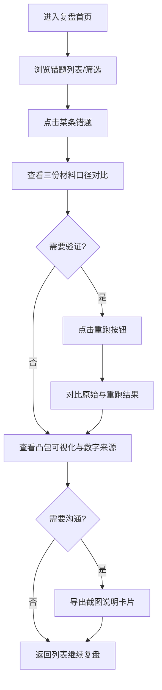

## 1. 产品概述

凸包面积错题复盘工具，面向建模助教小岑与排班评审场景，用于复盘凸包面积计算过程中的边界样本错题，支持样例展示、重跑计算、截图说明生成，并能识别材料口径变更、隔离除零等异常边界。

- 核心问题：历史答案中空集合被误当正常输入、重复提交重复计数、除零边界混入正常结果、口径变更无迹可寻
- 目标用户：建模助教、排班同事、评审会参会者（不看代码的业务人员）

## 2. 核心功能

### 2.1 用户角色

| 角色 | 使用场景 | 核心诉求 |
|------|----------|----------|
| 建模助教 | 日常复盘错题 | 快速放样例、重跑计算、看出口径差异 |
| 排班同事 | 数据审核 | 除零边界单独拎出、避免异常混入结果 |
| 评审听众 | 会议沟通 | 数字来源可追溯、截图说明直接可用 |

### 2.2 功能模块

1. **复盘首页**：错题列表概览、异常标签、口径变更标记
2. **样本详情页**：放样例展示、凸包可视化、计算重跑、截图说明
3. **异常隔离区**：除零边界、空集合等异常样本单独展示

### 2.3 页面详情

| 页面名称 | 模块名称 | 功能描述 |
|----------|----------|----------|
| 复盘首页 | 统计卡片 | 总错题数、除零异常数、口径变更数、待复盘数 |
| 复盘首页 | 错题列表 | 支持按异常类型/是否变更口径筛选，每条记录显示样本ID、输入摘要、异常标签 |
| 复盘首页 | 异常隔离区入口 | 突出展示除零边界和空集合样本数量 |
| 样本详情页 | 输入材料区 | 并排展示历史答案、边界样本、临时说明三份材料，标记口径变更差异 |
| 样本详情页 | 凸包可视化区 | 绘制点集与凸包多边形，显示面积计算过程与每步数字来源 |
| 样本详情页 | 重跑操作区 | 一键重跑按钮，显示原始结果与重跑结果对比 |
| 样本详情页 | 截图说明导出 | 生成可直接用于沟通的截图说明卡片（含样例、结果、关键线索） |
| 异常隔离区 | 除零边界列表 | 专门展示除零相关错题，标注触发位置 |
| 异常隔离区 | 空集合列表 | 专门展示空集合被误处理的错题 |

## 3. 核心流程

用户从首页选择一条错题 → 进入样本详情页查看三份材料的口径对比 → 点击重跑按钮验证计算 → 查看凸包可视化与数字来源 → 导出截图说明卡片用于沟通。

## 4. 用户界面设计

### 4.1 设计风格

- 主色：墨蓝 `#1e3a5f`（专业、严谨），辅色：琥珀橙 `#d97706`（异常警示）、翠绿 `#059669`（正常通过）
- 字体：标题用 Playfair Display（学术感衬线），正文用 JetBrains Mono（等宽便于数字对照）
- 卡片采用轻微阴影 + 1px 边框，圆角 6px，风格偏编辑室/学术报告
- 异常标签用高对比度色块，口径变更用虚线边框标注
- 图标风格：Lucide 线性图标

### 4.2 页面设计概览

| 页面名称 | 模块名称 | UI 元素 |
|----------|----------|---------|
| 复盘首页 | 统计卡片 | 四列等宽卡片，大号数字 + 小字标签，异常卡片用橙色边框 |
| 复盘首页 | 错题列表 | 表格布局，每行 hover 高亮，异常标签右对齐，变更口径行加浅黄底色 |
| 复盘首页 | 异常隔离区 | 顶部醒目入口条，橙底白字，数字脉冲动画 |
| 样本详情页 | 材料对比区 | 三列并排卡片，变更内容用黄色背景 + diff 样式标注 |
| 样本详情页 | 可视化区 | SVG 绘图画布，坐标轴、点集、凸包多边形，面积计算步骤在右侧分步展示 |
| 样本详情页 | 重跑区 | 左右对比面板，中间箭头，重跑按钮主色填充 |
| 样本详情页 | 截图导出区 | 固定右下角悬浮按钮，点击后生成可下载的 PNG 卡片 |

### 4.3 响应式

- 桌面端优先（≥ 1280px），三列材料对比完整展示
- 平板端（768-1279px）：材料对比改为上下堆叠
- 移动端（< 768px）：列表单列，可视化区自适应缩放
