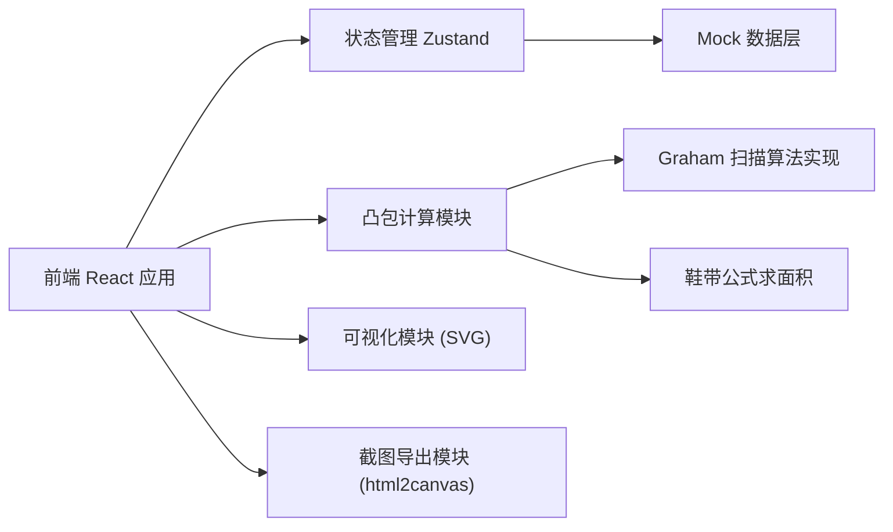

## 1. 架构设计



纯前端架构，无需后端服务。所有数据使用 Mock 数据模拟，凸包计算在浏览器端完成。

## 2. 技术描述

- 前端：React@18 + TypeScript + Vite
- 样式：TailwindCSS@3
- 状态管理：Zustand
- 图标：lucide-react
- 截图导出：html2canvas
- 凸包算法：Graham 扫描法 + 鞋带公式（自研实现）
- 初始化工具：vite-init（react-ts 模板）

## 3. 路由定义

| 路由 | 页面 | 用途 |
|------|------|------|
| `/` | 复盘首页 | 错题列表、统计概览、异常隔离入口 |
| `/sample/:id` | 样本详情页 | 材料对比、凸包可视化、重跑、截图导出 |
| `/anomaly` | 异常隔离区 | 除零边界、空集合等异常样本单独展示 |

## 4. 数据模型

### 4.1 核心数据结构

```typescript
interface Point {
  x: number;
  y: number;
}

interface Material {
  id: string;
  type: 'historical_answer' | 'boundary_sample' | 'oral_note';
  content: string;
  version: number;
  lastModified: string;
  changedFromPrevious: boolean;
}

interface CalculationStep {
  step: number;
  description: string;
  formula: string;
  values: Record<string, number>;
  result: number | string;
}

interface ErrorRecord {
  id: string;
  sampleId: string;
  title: string;
  inputPoints: Point[] | null;
  rawInput: string;
  expectedArea: number | null;
  actualArea: number | null;
  anomalyType: 'empty_set' | 'division_by_zero' | 'normal' | 'other';
  anomalyDetail?: string;
  materials: Material[];
  calculationSteps: CalculationStep[];
  has口径Change: boolean;
  submittedCount: number;
  status: 'pending' | 'reviewed';
  createdAt: string;
}
```

### 4.2 状态管理

```typescript
interface AppState {
  records: ErrorRecord[];
  selectedRecordId: string | null;
  filterAnomaly: 'all' | 'empty_set' | 'division_by_zero' | 'normal';
  filterChanged: 'all' | 'changed' | 'unchanged';
  rerunResult: Record<string, { area: number | null; steps: CalculationStep[] }>;
}
```

## 5. 凸包算法模块

### 5.1 Graham 扫描法
1. 找到 y 坐标最小的点（基准点）
2. 按极角排序其余点
3. 依次入栈，遇到非左转则弹出栈顶
4. 最终栈中顶点构成凸包

### 5.2 鞋带公式
多边形顶点按顺序排列 $(x_1,y_1),...,(x_n,y_n)$，面积为：
$$Area = \frac{1}{2}|\sum_{i=1}^{n}(x_i y_{i+1} - x_{i+1} y_i)|$$

### 5.3 异常检测
- 输入点集为空或 null → 标记 `empty_set`
- 共线点导致凸包退化为线段/点 → 面积为 0 时触发边界警告
- 计算过程中分母为零 → 标记 `division_by_zero`

## 6. 幂等性处理

重复提交同一样本时：
- 以 `sampleId` 作为唯一标识
- 已存在的记录只更新 `submittedCount`，不新增记录
- 列表展示时去重，不重复计数

## 7. 截图说明卡片结构

导出的 PNG 卡片包含：
1. 标题栏：样本 ID + 异常类型标签
2. 样例输入区：点集坐标或原始输入
3. 结果对比区：期望面积 vs 实际面积 vs 重跑面积
4. 关键线索区：口径变更标记、除零/空集合触发点、数字来源步骤
5. 页脚：生成时间戳
