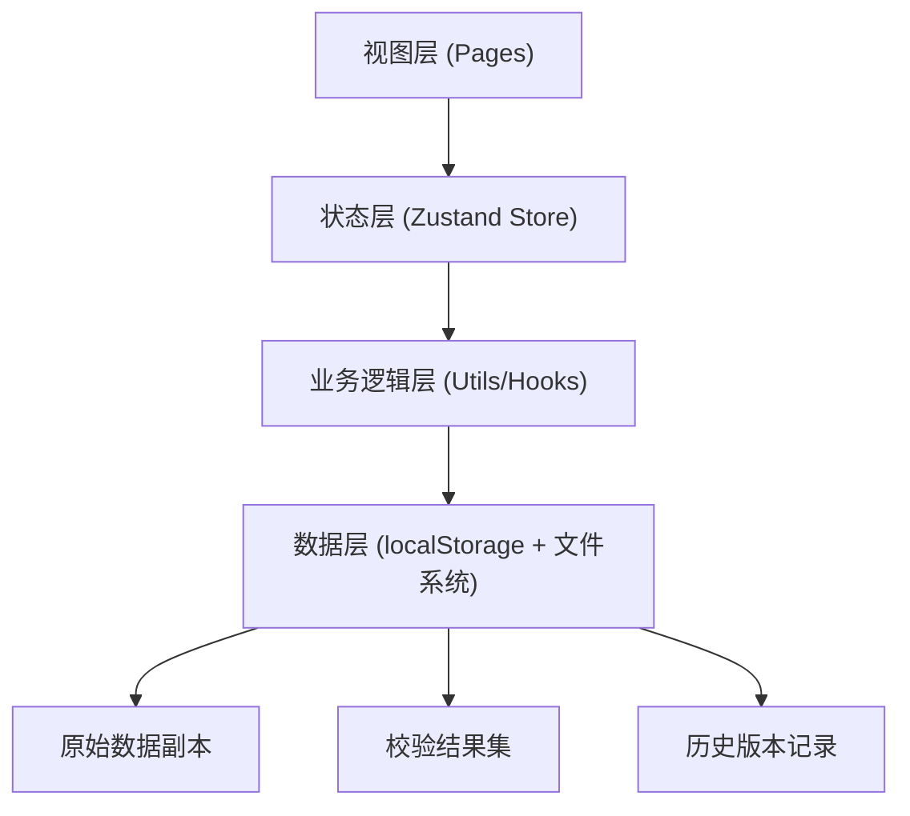
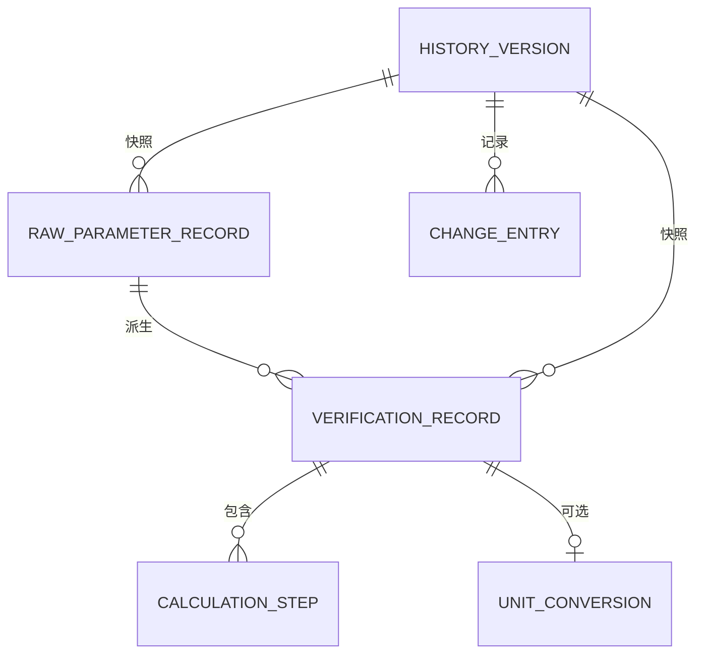

## 1. 架构设计

纯前端应用架构，数据存储在浏览器 localStorage 中，支持 CSV 文件导入导出。整体采用单页应用（SPA）模式，状态管理使用 zustand，保证统一数据源原则。



## 2. 技术描述

- **前端框架**：React 18 + TypeScript
- **构建工具**：Vite
- **样式方案**：Tailwind CSS 3
- **状态管理**：zustand
- **路由方案**：react-router-dom
- **图标库**：lucide-react
- **CSV 解析**：papaparse
- **数据存储**：localStorage（版本持久化）
- **无后端**：纯前端实现，所有计算在浏览器端完成

## 3. 路由定义

| 路由 | 页面 | 用途 |
|------|------|------|
| `/` | 校验工作台 | 参数上传、筛选、统计、明细、导出 |
| `/history` | 历史记录 | 版本列表、变更详情、临时判断 |
| `/compare` | 参数对照 | 两组参数并排对比、计算过程展开 |
| `/delivery` | 交付视图 | 参数表 + 处理记录 + CSV 明细 |

## 4. 数据模型

### 4.1 核心数据结构

```typescript
// 原始参数记录（保留原始数据，不做清洗）
interface RawParameterRecord {
  id: string;
  rowIndex: number;
  rawData: Record<string, string>; // 原始CSV行数据，完全保留
  sourceFile: string; // 来源文件名
  uploadedAt: number; // 上传时间戳
}

// 校验结果记录（从统一结果集生成）
interface VerificationRecord {
  id: string;
  rawRecordId: string;
  stateName: string; // 状态名称（马尔可夫链状态）
  weight: number; // 权重
  transitionProbability: number; // 转移概率
  boundaryStatus: 'normal' | 'boundary' | 'anomaly'; // 边界状态
  isZeroDivision: boolean; // 是否除零边界
  calculationSteps: CalculationStep[]; // 计算过程步骤
  unitConversion?: UnitConversion; // 单位换算（如有）
  tempJudgment?: string; // 临时判断备注
  judgedAt?: number;
  judgeName?: string;
}

// 计算步骤（中间过程透明化）
interface CalculationStep {
  stepName: string;
  formula: string;
  inputs: Record<string, number>;
  output: number;
  description: string;
}

// 单位换算记录
interface UnitConversion {
  fromUnit: string;
  toUnit: string;
  factor: number;
  valueBefore: number;
  valueAfter: number;
}

// 筛选条件
interface FilterCriteria {
  boundaryStatus: ('normal' | 'boundary' | 'anomaly')[];
  isZeroDivision: boolean | null; // null 表示不过滤
  weightRange: [number, number] | null;
  searchKeyword: string;
}

// 统计数据（从同一结果集派生）
interface Statistics {
  total: number;
  normalCount: number;
  boundaryCount: number;
  anomalyCount: number;
  zeroDivisionCount: number;
}

// 历史版本
interface HistoryVersion {
  id: string;
  version: string;
  createdAt: number;
  operatorName: string;
  description: string;
  rawRecords: RawParameterRecord[];
  verificationResults: VerificationRecord[];
  filterCriteria: FilterCriteria;
  changes: ChangeEntry[];
}

// 变更记录
interface ChangeEntry {
  field: string;
  oldValue: string | number;
  newValue: string | number;
  changeType: 'parameter' | 'weight' | 'judgment' | 'filter';
  reason?: string;
}
```

### 4.2 数据模型 ER 图



## 5. 状态管理设计

### 5.1 Store 分层

- **verificationStore**：校验核心状态（原始数据、结果集、筛选条件）
- **historyStore**：历史版本管理
- **compareStore**：两组参数对照状态

### 5.2 统一数据源原则

所有展示（筛选统计、明细表、CSV 导出）均从 `verificationResults` 这一个状态派生，确保数据一致性。

## 6. 核心算法

### 6.1 马尔可夫链边界校验

1. 计算状态转移矩阵的行和
2. 识别除零边界（分母为零或接近零的情况）
3. 按边界阈值分类：正常（偏差 < 5%）、边界（5% ≤ 偏差 < 20%）、异常（偏差 ≥ 20%）
4. 记录每一步计算过程，保留中间值

### 6.2 除零边界标记

- 权重为 0 或接近 0（< 1e-10）
- 转移概率分母为 0
- 用 `isZeroDivision` 字段标记，导出 CSV 时带独立列

## 7. 项目目录结构

```
src/
├── components/       # 可复用组件
│   ├── DataTable/    # 数据表格组件
│   ├── StatCard/     # 统计卡片
│   ├── FilterPanel/  # 筛选面板
│   ├── UploadZone/   # 文件上传区
│   └── Sidebar/      # 侧边导航
├── pages/            # 页面组件
│   ├── Workbench/    # 校验工作台
│   ├── History/      # 历史记录
│   ├── Compare/      # 参数对照
│   └── Delivery/     # 交付视图
├── store/            # zustand stores
├── utils/            # 工具函数
│   ├── csv.ts        # CSV 解析与导出
│   ├── markov.ts     # 马尔可夫链校验算法
│   ├── storage.ts    # localStorage 封装
│   └── id.ts         # ID 生成
├── types/            # TypeScript 类型定义
├── hooks/            # 自定义 hooks
└── App.tsx           # 应用入口
```
