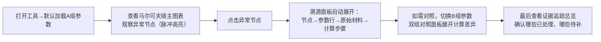
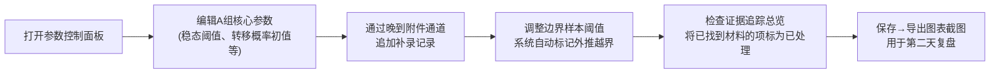

## 1. 产品概述

"马尔可夫链图表解释"是一款面向高中数学课堂复盘场景的交互式教学可视化工具。通过参数表驱动的状态转移图、异常点溯源链路、双参数对照组以及证据追踪面板，帮助数学老师（老叶）在第二天复盘时，不用再临时凭感觉解释边界样本过少的问题，让现场老师从图表一路追查到原始材料与计算过程。

- 目标用户：高中数学组老师（现场听课+复盘）
- 核心价值：将抽象的马尔可夫链计算过程具象化、可追溯、可对照，异常点不做"含糊警告"而是直连参数表原文
- 场景：第二天课堂复盘前提交版本，现场老师先看图表→再追明细→最后看已处理/待补证据状态

---

## 2. 核心功能

### 2.1 用户角色

| 角色 | 注册方式 | 核心权限 |
|------|----------|----------|
| 授课老师（老叶） | 本地使用，无需注册 | 编辑参数表、录入记录、标记证据状态、导出图表 |
| 现场听课老师 | 本地使用，无需注册 | 浏览图表、点击溯源、切换对照组、查看计算过程 |

### 2.2 功能模块

1. **主图表页（单页应用主视图）**：马尔可夫链状态转移图、节点状态面板、边概率标注、异常点高亮
2. **参数控制面板**：参数A组/参数B组切换、参数表编辑、晚到附件通道、边界阈值设置
3. **溯源链路面板**：异常点→原始记录→参数引用→计算步骤的线性回溯链条
4. **双组对照计算面板**：A/B两组参数并排列出，中间计算过程、单位换算全展开，标注差异
5. **证据追踪总览**：已处理/待补证据清单，三四条示例小数据（顺利/补录/异常）

### 2.3 页面详情

| 页面名称 | 模块名称 | 功能描述 |
|----------|----------|----------|
| 主图表页 | 马尔可夫链状态转移图 | SVG绘制状态节点，边标注转移概率，异常节点脉冲高亮，支持点击节点查看来源记录 |
| 主图表页 | 节点状态卡 | 悬浮/点击节点后弹出：稳态概率、初始分布、涉及原始记录编号 |
| 主图表页 | 异常点外推警示 | 非含糊警告，直接显示参数表中的"边界样本阈值"原文，附参数行号与引用依据 |
| 参数控制面板 | 参数表编辑器 | 8~12行关键参数，每行含：参数名、值、单位、来源记录ID、备注、是否为边界条件 |
| 参数控制面板 | 晚到附件通道 | 独立一行或独立区域，允许追加"晚到"记录，标记为补录数据，影响计算但视觉区分 |
| 参数控制面板 | 阈值调节器 | 边界样本数阈值、外推安全系数，实时调节后图表重新计算并标红越界 |
| 溯源链路面板 | 溯源时间线 | 从异常点出发：节点ID → 引用的参数行 → 原始材料（记录编号+摘要）→ 计算步骤展开 |
| 溯源链路面板 | 原始材料卡片 | 显示：记录类型（顺利/补录/异常）、采集时间、录入人、原始值、单位换算过程 |
| 双组对照计算面板 | A/B参数并排 | 左右两栏对应参数，差异行高亮背景色 |
| 双组对照计算面板 | 中间计算展开 | 稳态方程求解过程、矩阵乘法步骤、单位换算（如次/分钟→次/秒）逐项展开 |
| 证据追踪总览 | 状态清单 | 卡片式：已处理（绿）/待补证据（橙）/异常（红），每项可点跳转对应位置 |
| 证据追踪总览 | 示例小数据 | 3~4条内建数据：①顺利记录（正常样本）②补录记录（晚到附件通道录入）③异常记录（边界样本不足）④可选：外推越界记录 |

---

## 3. 核心流程

### 3.1 现场老师浏览流程

### 3.2 老叶录入流程（复盘前准备）

---

## 4. 用户界面设计

### 4.1 设计风格

**整体方向：学术·严谨·可追溯 —— 参考科研论文图表 + 刑侦证据板的混合美学**

- **主色调**：深靛蓝 `#1e2a5a`（学术权威感） + 米白 `#f5f1e8`（纸质阅读感）
- **辅助色**：
  - 顺利记录：墨绿 `#2d6a4f`
  - 补录记录：赭橙 `#c46a1b`（晚到附件用暖色调区分）
  - 异常记录：砖红 `#a4161a` + 脉冲动画
  - 对照差异：金黄底 `#ffe66d` 高亮
- **按钮风格**：微立体方角按钮，2px描边，按下有凹陷感；学术期刊风格
- **字体**：
  - 标题/数字：Noto Serif SC（衬线体，数学论文感）
  - 正文/参数：JetBrains Mono（等宽字体，计算过程对齐清晰）
- **布局风格**：左中右三栏式
  - 左栏：参数控制面板（固定宽度320px，可折叠）
  - 中栏：马尔可夫链主图表（自适应，占核心视觉区）
  - 右栏：溯源链路 + 证据追踪（固定宽度360px，Tab切换）
  - 底部浮层：双组对照计算面板（可展开/收起，高度可调）
- **图标风格**：线条简约学术风（节点用圆圈+罗马数字编号，边用箭头，证据用📄📌⚠️）
- **细节装饰**：
  - 背景：极淡坐标网格线（类似坐标纸）
  - 纸张纹理：米白区域加1%噪点
  - 异常点：红色脉冲环 + "边界样本不足"标签直接挂在节点旁（不是含糊提示）

### 4.2 页面设计概述

| 页面名称 | 模块名称 | UI元素 |
|----------|----------|--------|
| 主图表页 | 马尔可夫链状态转移图 | SVG节点（圆形/带环/罗马数字）、曲线箭头边、概率标签、异常节点脉冲环、背景坐标网格、悬停放大镜效果、节点拖拽微交互 |
| 主图表页 | 异常点外推标签 | 砖红标签气泡挂在节点右上，内容为"⚠️ 边界样本=3 < 阈值=5（见参数表P-07行）"，点击跳参数表 |
| 参数控制面板 | 参数表 | 斑马纹表格行，每行可点击高亮+同步高亮图表中引用处，晚到附件行底色赭橙浅，右侧"来源"列显示原始记录ID可点 |
| 溯源链路面板 | 时间线 | 竖线时间轴，每步一个卡片：异常节点→参数P-07→原始记录R-003→计算步骤④，卡片之间有箭头，可逐级展开 |
| 双组对照计算面板 | 并排展开 | 三栏布局：A组参数值\|中间计算步骤（公式渲染）\|B组参数值，差异行金黄高亮背景，单位换算处用`→`连接写明过程 |
| 证据追踪总览 | 状态卡片墙 | 三列卡片：已处理(绿边白卡)/待补(橙边)/异常(红边)，每张卡片顶部小色条，底部"跳转"按钮 |
| 全局 | 顶部状态栏 | 左侧标题"马尔可夫链图表解释 v1.0"，中间A/B组切换胶囊按钮，右侧"导出PNG"按钮 |

### 4.3 响应式

- Desktop优先（课堂用投影仪/大屏），最小支持宽度1280px
- 三栏在宽度<1280px时折叠为Tab切换（左参数/中图表/右溯源）
- 底部对照面板在窄屏时改为全屏抽屉
- 触摸优化：节点点击区域≥44px，参数表行高≥48px

---

## 5. 示例小数据规格（内建3~4条）

| 记录编号 | 类型 | 内容摘要 | 对应参数引用 | 证据状态 |
|----------|------|----------|-------------|----------|
| R-001 | 顺利记录 | 第1节课堂状态转移观察，样本量n=12，S₀→S₁概率0.35 | P-02, P-04 | ✅已处理 |
| R-002 | 补录记录（晚到附件） | 课间追加观察，n=8，S₁→S₂概率0.22，于复盘前1小时补录 | P-05 | 📌待补完整描述 |
| R-003 | 异常记录 | 边界样本n=3，远小于阈值θ=5，导致外推稳态π₂不稳 | P-07(阈值) | ⚠️需补样本 |
| R-004（可选） | 外推越界 | 外推至t=120min时概率溢出理论上界1.0 | P-09(安全系数) | ⚠️需修正参数 |

