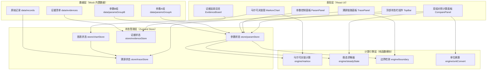

## 1. 架构设计



---

## 2. 技术选型说明

| 层级 | 技术 | 版本 | 选型理由 |
|------|------|------|----------|
| 前端框架 | React | 18.2.x | 组件化、生态成熟，适合复杂交互型可视化工具 |
| 构建工具 | Vite | 5.x | 启动快、HMR流畅，课堂调试效率高 |
| 样式方案 | TailwindCSS | 3.4.x | 原子化CSS，快速构建学术风格UI，响应式便捷 |
| 状态管理 | Zustand | 4.5.x | 轻量不繁琐，适合多面板状态同步，无Provider嵌套噩梦 |
| 图表绘制 | 原生 SVG + React | — | 节点/边/标签完全可交互，支持点击溯源，不引入重型D3依赖 |
| 数学公式 | KaTeX | 0.16.x | 轻量LaTeX渲染，用于稳态方程、矩阵乘法步骤展示 |
| 导出功能 | html-to-image | 1.11.x | 将图表区导出PNG，用于复盘PPT粘贴 |
| 语言 | TypeScript | 5.x | 参数表、计算引擎类型安全，避免计算出错 |

**无后端 / 无数据库**：全部数据内置Mock，本地localStorage持久化老师修改，满足课堂本地使用场景。

---

## 3. 路由定义

单页应用（SPA），不使用路由库，全部用组件Tab切换：

| 视图切换 | 触发方式 | 说明 |
|----------|----------|------|
| A组参数 / B组参数 | 顶部胶囊按钮切换 | 切换后图表与计算面板实时更新 |
| 溯源面板 / 证据面板 | 右栏Tab切换 | TracePanel ↔ EvidenceBoard |
| 对照面板展开 / 收起 | 底部把手拖拽或按钮 | ComparePanel高度可调 |
| 参数面板折叠 / 展开 | 左栏折叠按钮 | 节省大屏投影空间 |

---

## 4. 数据模型定义

### 4.1 核心类型

```typescript
// 参数行
interface ParamRow {
  id: string;           // P-01, P-02...
  name: string;         // 参数名，如"边界样本阈值θ"
  value: number;
  unit: string;         // "个"、"次/分钟"、"概率"
  sourceRecordId?: string;  // 来源记录 R-001...
  remark: string;
  isBoundary: boolean;  // 是否为边界条件
  isLateAttachment: boolean; // 是否为晚到附件补录
}

// 参数组
interface ParamGroup {
  id: 'A' | 'B';
  label: string;        // "A组：课堂实测" / "B组：含补录修正"
  rows: ParamRow[];
}

// 状态节点
interface MarkovNode {
  id: string;           // S0, S1, S2, S3
  romanLabel: string;   // Ⅰ, Ⅱ, Ⅲ, Ⅳ
  displayName: string;  // "未掌握"、"初步理解"、"掌握"、"熟练应用"
  steadyProb: number;   // 稳态概率 π
  initialProb: number;  // 初始分布
  sampleCount: number;  // 该节点样本量
  isAbnormal: boolean;  // 是否异常节点
  relatedParamIds: string[]; // 引用的参数ID
  relatedRecordIds: string[]; // 来源记录ID
}

// 转移边
interface MarkovEdge {
  from: string;
  to: string;
  probability: number;
  isCalcVisible: boolean; // 计算过程是否展开
}

// 原始记录
interface RawRecord {
  id: string;           // R-001...
  type: 'success' | 'late' | 'abnormal' | 'overflow';
  typeLabel: string;    // "顺利记录"、"补录记录"、"异常记录"、"外推越界"
  summary: string;
  collectTime: string;  // "6-12 09:15"
  recorder: string;     // 录入人
  originalValue: number;
  originalUnit: string;
  convertedValue: number;
  convertedUnit: string;
  conversionSteps: string[]; // 单位换算步骤
  relatedParamIds: string[];
  evidenceStatus: 'processed' | 'pending' | 'abnormal';
}

// 溯源链路步骤
interface TraceStep {
  id: string;
  stepType: 'node' | 'param' | 'record' | 'calc';
  title: string;
  content: string;
  refId?: string;       // 对应数据的ID
  expanded: boolean;
}

// 证据项
interface EvidenceItem {
  id: string;
  recordId: string;
  title: string;
  status: 'processed' | 'pending' | 'abnormal';
  statusLabel: string;
  summary: string;
  jumpTarget: string;   // 点击跳转的位置标识
}

// 对照差异行
interface CompareDiffRow {
  paramId: string;
  paramName: string;
  valueA: number;
  valueB: number;
  unit: string;
  isDiff: boolean;
  calcStepsA: string[];
  calcStepsB: string[];
  unitConvertNote?: string;
}
```

### 4.2 初始Mock数据（内嵌于 data/ 目录）

- `data/params.ts`：A组8条、B组8条（与A组有2~3条差异），含1条晚到附件标记
- `data/nodes.ts`：4个状态节点（S0~S3），其中S2标记为异常
- `data/edges.ts`：4×4转移矩阵（10条非零转移边）
- `data/records.ts`：4条原始记录（顺利/补录/异常/外推越界）
- `data/evidences.ts`：4条证据项对应4条记录

---

## 5. 计算引擎设计（engine/）

### 5.1 markov.ts — 马尔可夫链主计算

```
输入：初始分布向量π₀、转移矩阵P、迭代步数n
输出：n步后分布πₙ = π₀ × Pⁿ
  ├─ 逐次矩阵乘法，每步展开为可显示的中间步骤
  └─ 检测每步概率是否越界 (>1或<0)，标记overflow
```

### 5.2 steadyState.ts — 稳态求解

```
方法：线性方程组法 πP = π 且 Σπᵢ = 1
输出：
  ├─ 稳态概率向量 π̄
  ├─ 求解过程展开（消元步骤，KaTeX渲染）
  └─ 收敛性判断（若条件数过大则标异常）
```

### 5.3 boundary.ts — 边界检测

```
输入：节点样本量、参数表边界阈值θ
输出：
  ├─ 样本量 < θ 的节点标 isAbnormal=true
  ├─ 生成异常说明文本，引用参数ID（非含糊警告）
  └─ 外推越界检测：若t>t_max时概率变化>ε则标overflow
```

### 5.4 unitConvert.ts — 单位换算

```
支持换算：
  次/分钟 ↔ 次/秒 （×60 或 ÷60）
  百分比 ↔ 概率   （÷100 或 ×100）
  样本数 ↔ 频率   （÷总样本量）
输出：每步换算文字记录，用于溯源面板展示
```

---

## 6. 目录结构

```
/Users/mac/pro/solo/workspaces/y13138/
├── .trae/documents/          # PRD与技术文档
├── index.html
├── package.json
├── tsconfig.json
├── vite.config.ts
├── tailwind.config.js
├── postcss.config.js
└── src/
    ├── main.tsx              # 入口
    ├── App.tsx               # 主布局：三栏+底部
    ├── index.css             # Tailwind+全局学术风样式
    ├── types/
    │   └── index.ts          # 全部类型定义
    ├── data/                 # 内置Mock数据
    │   ├── params.ts
    │   ├── nodes.ts
    │   ├── edges.ts
    │   ├── records.ts
    │   └── evidences.ts
    ├── engine/               # 计算引擎（纯函数）
    │   ├── markov.ts
    │   ├── steadyState.ts
    │   ├── boundary.ts
    │   └── unitConvert.ts
    ├── store/                # Zustand状态
    │   ├── paramStore.ts
    │   ├── chartStore.ts
    │   ├── traceStore.ts
    │   └── evidenceStore.ts
    └── components/           # UI组件
        ├── TopBar.tsx
        ├── ParamPanel/
        │   ├── index.tsx
        │   ├── ParamTable.tsx
        │   ├── LateAttachmentRow.tsx
        │   └── ThresholdSlider.tsx
        ├── MarkovChart/
        │   ├── index.tsx
        │   ├── MarkovNode.tsx
        │   ├── MarkovEdge.tsx
        │   └── AbnormalTag.tsx
        ├── TracePanel/
        │   ├── index.tsx
        │   ├── TraceTimeline.tsx
        │   └── RawRecordCard.tsx
        ├── EvidenceBoard/
        │   ├── index.tsx
        │   └── EvidenceCard.tsx
        └── ComparePanel/
            ├── index.tsx
            ├── DiffRow.tsx
            └── CalcSteps.tsx
```

---

## 7. 性能与课堂场景注意事项

- **首屏加载 < 1.5s**：不引入重型库，SVG手写，KaTeX按需渲染
- **参数调整实时响应 < 200ms**：计算引擎为纯函数，Zustand细粒度订阅
- **投影仪适配**：最小字号14px，异常高亮对比度≥4.5:1（WCAG AA）
- **数据不丢失**：参数修改自动写入localStorage，提供"恢复出厂示例数据"按钮
- **导出PNG**：仅导出中栏图表区（含异常标签），DPR=2适配打印
