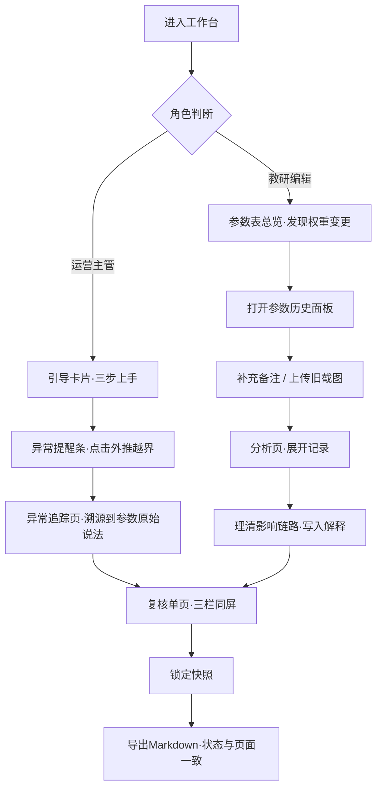

## 1. 产品概述

整数规划错题复盘系统是面向教研团队的错题分析与参数追踪工具。解决教研材料零散、权重变更无记录、异常原因不可追溯、复核时信息割裂等核心痛点。

- **核心目标**：让教研编辑"阿宁"能从参数表拼出完整主线，让运营主管接手时不用问就能找到材料、看懂异常、导出报告
- **目标用户**：教研编辑（日常录入维护）、运营主管（复核与导出）
- **产品价值**：将散落的参数版本、备注、截图串联为可追溯的历史链条，让每条结论都能回溯到原始依据

---

## 2. 核心功能

### 2.1 用户角色

| 角色 | 描述 | 核心权限 |
|------|------|----------|
| 教研编辑 | 日常录入参数、补充备注、上传截图 | 编辑参数表、新增历史记录、标记异常点 |
| 运营主管 | 复核结论、查看异常、导出报告 | 只读所有数据、查看版本对比、一键导出Markdown |

### 2.2 功能模块

1. **工作台首页**：参数表总览、异常点标记、快速入口引导
2. **参数历史面板**：版本时间轴、权重变更记录、备注追加、旧版截图留存
3. **分析页（朴素）**：记录逐条展开、影响链路说明、为什么这条"正常记录"改变了结论
4. **异常追踪页**：外推越界从警告→参数原始说法→变更历史的完整链路
5. **复核单页**：参数版本 + 异常点 + 解释同屏展示，不再只剩结论
6. **Markdown导出**：页面状态与导出文件严格一致，含版本号与时间戳

### 2.3 页面详情

| 页面名称 | 模块名称 | 功能描述 |
|----------|----------|----------|
| 工作台首页 | 引导卡片 | 运营主管接手引导："材料放这里→异常看这里→重新导出点这里" |
| 工作台首页 | 参数表总览 | 表格展示参数当前值，高亮被改过的权重，悬停显示变更次数 |
| 工作台首页 | 异常提醒条 | 外推越界等异常不只是"警告"文字，点击直接跳到原始参数依据 |
| 参数历史面板 | 版本时间轴 | 倒序展示所有版本，每条含操作人、时间、变更摘要 |
| 参数历史面板 | 权重变更对比 | 并排展示变更前后值，标注修改理由（可后补） |
| 参数历史面板 | 备注与截图区 | 每条版本可追加补记、上传旧版截图，永久留存不被覆盖 |
| 分析页 | 记录逐条展开 | 每条记录可展开查看输入参数、计算过程、对结论的贡献占比 |
| 分析页 | 影响链路说明 | 高亮"看似正常但实际改变结论"的那条记录，用箭头画出来龙去脉 |
| 异常追踪页 | 异常溯源链 | 警告卡片 → 参数原始值 → 哪次改权重导致 → 当时的备注 |
| 复核单页 | 同屏三栏 | 左：参数版本快照；中：异常点列表；右：结论解释文字 |
| 复核单页 | 锁定与解锁 | 锁定后形成不可编辑快照，作为导出基准版本 |
| Markdown导出 | 状态一致性 | 导出时写入页面上看到的所有展开/折叠状态、高亮、异常标记 |
| Markdown导出 | 元信息头 | 导出文件开头含版本号、锁定时间、操作人，防止歧义 |

---

## 3. 核心流程

### 3.1 教研编辑日常工作流

阿宁打开工作台 → 从参数表总览看到某权重被标红 → 点进去看历史时间轴 → 发现上次改权重没写理由 → 补备注并上传当时的旧版截图 → 回到分析页展开那条"看似正常"的记录 → 看清它如何通过权重改动影响了最终结论 → 写入解释文字

### 3.2 运营主管接手与复核流

运营主管首次进入 → 首页引导卡片三步：材料位置 / 异常入口 / 导出按钮 → 点异常提醒条上的"外推越界" → 自动跳转异常追踪页，从警告卡片一路看到原始参数说法 → 回复核单页，三栏同屏看参数版本+异常+解释 → 锁定当前快照 → 一键导出Markdown，页面状态全部写入文件

### 3.3 流程图

---

## 4. 用户界面设计

### 4.1 设计风格

- **主色**：深靛蓝 `#1e3a5f`（教研专业感），辅助色：琥珀黄 `#d4a24c`（异常/变更标记）
- **风格关键词**：克制的学术编辑感 / 朴素但信息密度高 / 不炫技但每处标记都有来历
- **按钮**：直角微圆角（2px），实心按钮用深靛蓝，次选用描边
- **字体**：标题用「思源宋体 SemiBold」体现教研质感，正文用「思源黑体 Regular」保证可读性，数字/参数用等宽字体「JetBrains Mono」
- **布局**：左侧固定导航 + 主内容区，数据密集区用细边框分栏，不强依赖卡片阴影
- **标记风格**：异常用琥珀黄对角条纹底纹（类似老式档案标签），变更记录用铅笔✏️图标，历史截图用胶片边框

### 4.2 页面设计概览

| 页面名称 | 模块名称 | UI元素 |
|----------|----------|--------|
| 工作台首页 | 引导卡片 | 三张并排卡片，图标+编号+一句话指引，悬停轻微上浮 |
| 工作台首页 | 参数表总览 | 斑马纹表格，被改动过的单元格左上角琥珀黄三角标 |
| 工作台首页 | 异常提醒条 | 全屏宽琥珀黄条纹底，右侧"去溯源 →"按钮 |
| 参数历史面板 | 版本时间轴 | 左侧竖线时间轴，节点为实心/空心圆，展开含前后对比 |
| 参数历史面板 | 备注与截图 | 便签风格备注块，截图用胶片边框+缩略图点击放大 |
| 分析页 | 记录逐条展开 | 默认折叠，点击展开显示计算过程与贡献占比条形图 |
| 分析页 | 影响链路 | 高亮行有虚线箭头连到结论区，箭头旁标"权重改动→占比+23%" |
| 异常追踪页 | 溯源链 | 水平步骤条：警告 → 原始参数 → 改权重 → 当时备注 |
| 复核单页 | 三栏同屏 | 25% / 40% / 35% 分栏，可拖拽调整宽度 |
| 复核单页 | 锁定条 | 顶部固定条，锁定前蓝底"编辑中"，锁定后绿底"已锁定·可导出" |
| Markdown导出 | 预览弹窗 | 左侧预览与页面一致的高亮标记，右侧文件名含版本号 |

### 4.3 响应式

- 桌面优先设计（≥1280px），复核单页三栏仅在大屏展示
- ≤1024px：复核单页改为上下堆叠，参数版本在上，异常在中，解释在下
- ≤768px：导航收为汉堡菜单，表格横向滚动

---
