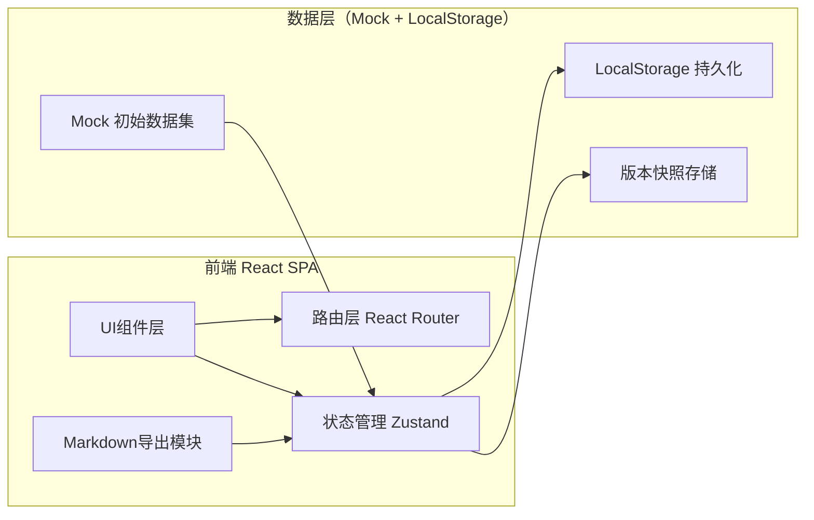

## 1. 架构设计



纯前端单页应用，无需后端服务。所有数据存储在浏览器 LocalStorage，内置完整 Mock 数据集供演示与验收。

---

## 2. 技术描述

- **前端框架**：React@18 + TypeScript
- **构建工具**：Vite@5
- **路由**：react-router-dom@6
- **状态管理**：Zustand（轻量，适合中后台数据密集场景）
- **样式方案**：TailwindCSS@3 + CSS Variables（主题色、标记色统一管理）
- **图标**：Lucide React（线性图标，克制不花哨）
- **Markdown导出**：自定义序列化器（保持页面状态→Markdown标记映射）
- **数据持久化**：LocalStorage + Zustand persist 中间件
- **字体**：Google Fonts 引入思源宋体/思源黑体/JetBrains Mono

---

## 3. 路由定义

| 路由 | 页面组件 | 用途 |
|------|----------|------|
| `/` | DashboardPage | 工作台首页：引导卡片、参数总览、异常提醒 |
| `/history/:paramId` | HistoryPage | 参数历史面板：版本时间轴、权重对比、备注/截图 |
| `/analysis` | AnalysisPage | 分析页：逐条展开记录、影响链路说明 |
| `/anomaly` | AnomalyPage | 异常追踪页：外推越界等异常溯源链 |
| `/review` | ReviewPage | 复核单页：三栏同屏、锁定快照、导出入口 |

---

## 4. 数据模型

### 4.1 核心数据结构

```mermaid
erDiagram
    PARAMETER {
        string id PK "参数ID"
        string name "参数名称"
        number currentValue "当前值"
        number currentWeight "当前权重"
        number changeCount "变更次数"
        string unit "单位"
    }
    VERSION {
        string id PK "版本ID"
        string paramId FK "关联参数"
        number version "版本号"
        number value "变更前值"
        number newValue "变更后值"
        number weight "变更前权重"
        number newWeight "变更后权重"
        string operator "操作人"
        string timestamp "变更时间"
        string reason "修改理由（可后补）"
    }
    NOTE {
        string id PK "备注ID"
        string versionId FK "关联版本"
        string content "备注内容"
        string timestamp "补记时间"
        string author "补记人"
    }
    SCREENSHOT {
        string id PK "截图ID"
        string versionId FK "关联版本"
        string dataUrl "Base64图片"
        string description "截图说明"
        string timestamp "上传时间"
    }
    RECORD {
        string id PK "错题记录ID"
        string title "记录标题"
        boolean isSeeminglyNormal "看似正常但影响结论"
        object inputParams "输入参数快照"
        object calculation "计算过程"
        number contributionToConclusion "对结论的贡献占比"
        string impactExplanation "影响链路说明"
    }
    ANOMALY {
        string id PK "异常ID"
        string type "类型：extrapolation/weight/etc"
        string title "异常标题（如：外推越界）"
        string rawStatement "参数表原始说法"
        string paramId FK "关联参数"
        string versionId FK "触发的版本"
        string traceNote "追踪说明"
    }
    SNAPSHOT {
        string id PK "快照ID"
        string lockTime "锁定时间"
        string lockedBy "锁定人"
        object paramsState "参数版本快照"
        object anomaliesState "异常状态"
        object reviewState "复核解释文字"
        string markdown "已导出的Markdown缓存"
    }
```



### 4.2 TypeScript 类型定义

```typescript
export interface Parameter {
  id: string;
  name: string;
  currentValue: number;
  currentWeight: number;
  changeCount: number;
  unit: string;
}

export interface Version {
  id: string;
  paramId: string;
  version: number;
  value: number;
  newValue: number;
  weight: number;
  newWeight: number;
  operator: string;
  timestamp: string;
  reason: string | null;
}

export interface Note {
  id: string;
  versionId: string;
  content: string;
  timestamp: string;
  author: string;
}

export interface Screenshot {
  id: string;
  versionId: string;
  dataUrl: string;
  description: string;
  timestamp: string;
}

export interface Record {
  id: string;
  title: string;
  isSeeminglyNormal: boolean;
  inputParams: Record<string, number>;
  calculation: {
    formula: string;
    steps: string[];
    result: number;
  };
  contributionToConclusion: number;
  impactExplanation: string;
}

export interface Anomaly {
  id: string;
  type: 'extrapolation' | 'weight' | 'other';
  title: string;
  rawStatement: string;
  paramId: string;
  versionId: string;
  traceNote: string;
}

export interface Snapshot {
  id: string;
  lockTime: string;
  lockedBy: string;
  paramsState: Parameter[];
  anomaliesState: Anomaly[];
  reviewState: {
    explanation: string;
    conclusion: string;
  };
  markdown: string;
}
```

---

## 5. Zustand Store 设计

```typescript
interface AppStore {
  // 数据
  parameters: Parameter[];
  versions: Version[];
  notes: Note[];
  screenshots: Screenshot[];
  records: Record[];
  anomalies: Anomaly[];
  snapshots: Snapshot[];

  // UI 状态
  expandedRecords: string[];
  highlightedParamId: string | null;
  selectedSnapshotId: string | null;
  isLocked: boolean;

  // Actions
  addNote: (versionId: string, content: string, author: string) => void;
  addScreenshot: (versionId: string, dataUrl: string, description: string) => void;
  toggleRecord: (recordId: string) => void;
  highlightParam: (paramId: string | null) => void;
  lockSnapshot: (lockedBy: string) => string; // 返回 snapshotId
  exportMarkdown: (snapshotId: string) => string;
}
```

---

## 6. Markdown 导出映射规则

页面状态 → Markdown 标记的一一对应，保证"页面上看到的"和"文件里写的"一致：

| 页面状态 | Markdown 标记 |
|----------|---------------|
| 展开的记录 | `## [展开] 记录标题` |
| 折叠的记录 | `## [折叠] 记录标题` |
| 高亮的异常行 | `> ⚠️ **外推越界**：原始参数说法：xxx` |
| 琥珀黄标记的变更单元格 | `- **参数名**（已变更${N}次）：当前值 / 上次值` |
| 锁定快照元信息 | 文件顶部 YAML Front Matter，含 `lock_time`, `locked_by`, `snapshot_id` |
| 影响链路箭头 | 有序列表编号 + 缩进，`(权重 0.3 → 0.53，导致贡献占比 +23%)` |
